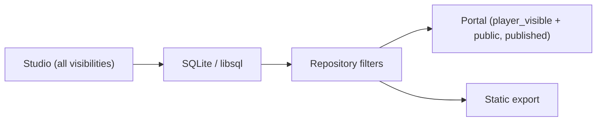

# UWE Architecture

## Core model

UWE is a pnpm + Turborepo monorepo with **thin Next.js apps** and **fat shared packages**.

| Surface | App | Port | Role |
|---------|-----|------|------|
| **Studio** | `apps/studio` | 3000 | DM write/admin — worlds, AI, Daily Admin OS |
| **Portal** | `apps/portal` | 3001 | Player read-only wiki — server-filtered content |
| **Export** | `packages/static-export` | CLI | Static HTML — only published player/public content |

**Golden rule:** Business logic lives in `packages/`, not in route handlers or React components.

## Package map

| Package | Responsibility |
|---------|----------------|
| `@uwe/database` | Prisma schema, repositories, domain services |
| `@uwe/auth` / `@uwe/security` | Sessions, RBAC, API guards, CSRF |
| `@uwe/ai-brain` | AI router, DnD generator, privacy guards |
| `@uwe/assets` | Upload paths, MIME validation, storage keys |
| `@uwe/shared-ui` | Cross-app React components (AppShell, nav) |
| `@uwe/wiki-engine` | Wikilink parsing (test package) |
| Feature packages | `backup`, `calendar`, `mail`, `dnd-api`, `image-studio`, `github-issues` |

Import apps from packages — **never cross-app** (`apps/studio` must not import from `apps/portal`).

## Where to put new code

```txt
Schema change     → packages/database/prisma/schema.prisma + migration
Domain logic      → packages/database/src/*-service.ts or feature package
Studio API        → apps/studio/app/api/**/route.ts
Studio UI         → apps/studio/app/**/page.tsx
Server Actions    → apps/studio/app/*-actions.ts
Portal UI/API     → apps/portal/app/**
Shared UI         → packages/shared-ui/src/
```

## Visibility and safety



- `dm_only` must **never** reach Portal, static export, or anonymous API responses.
- Filter in `packages/database/src/permissions.ts` — not only in UI.
- Cloud AI gets **no** campaign/brain context; Maschinenraum stays on LAN.

## Server entry points

| Import | Use when |
|--------|----------|
| `@uwe/database` | Client-safe types, enums, helpers |
| `@uwe/database/server` | Prisma, services, auth — **server only** |
| `@uwe/security` | `requireStudioApiAuth`, mutation guards |

The `@uwe/database/server` barrel (`packages/database/src/server.ts`) is large (~1080 lines). Prefer direct service imports when adding new code in packages; see `docs/engineering/TECHNICAL_ROADMAP.md` for split plan.

## Related skills

| Task | Skill |
|------|-------|
| Implement a feature | `uwe-feature-implementation` |
| API routes | `api-routes` |
| Auth / visibility | `auth-rbac-visibility` |
| Portal player safety | `portal-player-view` |
| DB migrations | `database-migration-review` |
| CI before PR | `ci-quality-gate` |

## Canonical docs

- [docs/ARCHITECTURE.md](../../../docs/ARCHITECTURE.md) — full product + runtime diagrams
- [docs/ARCHITECTURE.md](../../../docs/ARCHITECTURE.md) — module inventory
- [docs/ROADMAP.md](../../../docs/ROADMAP.md) — product maturity
- [docs/engineering/TECHNICAL_ROADMAP.md](../../../docs/engineering/TECHNICAL_ROADMAP.md) — refactor order

Details: [references/package-boundaries.md](references/package-boundaries.md)
