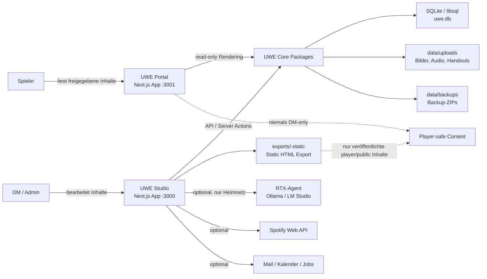
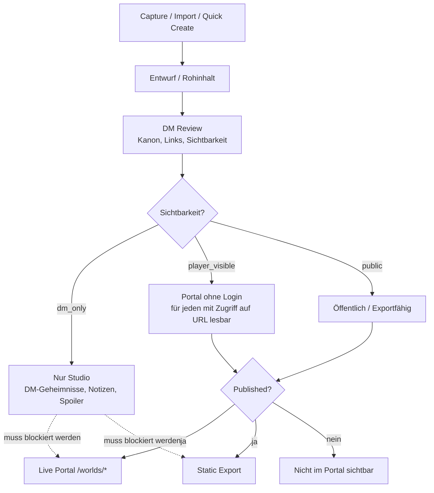
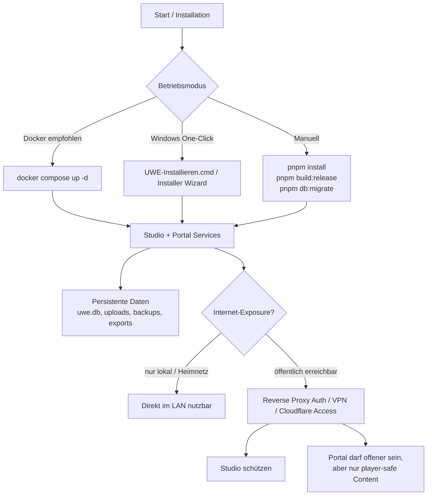
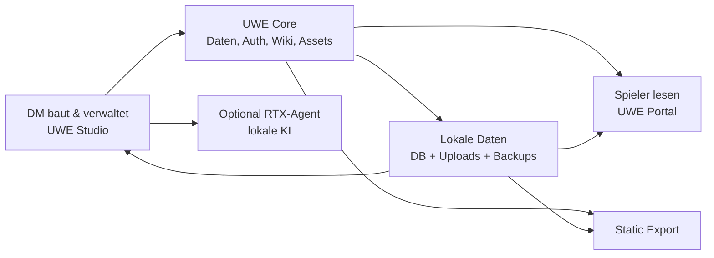

# UWE Architekturübersicht

Stand: 2026-06-18

Diese Datei beschreibt UWE auf drei Ebenen:

1. **Produkt-Hierarchie** — welche Teile UWE hat und wofür sie zuständig sind.
2. **Laufzeit-Flow** — wie Nutzer, Apps, Pakete, Daten und externe Dienste zusammenspielen.
3. **Repository-Hierarchie** — wo die wichtigsten Bausteine im Monorepo liegen.

UWE ist ein selbst gehostetes Kampagnen-Brain und Welt-Wiki für DnD/Tabletop. Der Kern ist bewusst getrennt in **DM-Bearbeitung**, **Player-Ausgabe**, **persistente Daten** und **optionale Inferenz/Integrationen**.

---

## 1. Produkt-Hierarchie

```mermaid
graph TD
  UWE["UWE<br/>Universeller Welten-Editor"]

  UWE --> Studio["UWE Studio<br/>DM-App / Admin-Cockpit"]
  UWE --> Portal["UWE Portal<br/>Spieler-Wiki / Handouts"]
  UWE --> Core["UWE Core<br/>Shared Packages / Datenlogik"]
  UWE --> Export["Static Export<br/>player-sichere HTML-Ausgabe"]
  UWE --> Integrations["Optionale Integrationen<br/>RTX-Agent, Spotify, Kalender, Mail, DnD-APIs"]

  Studio --> DMWorkflows["Welten, Seiten, Sessions, Inspector,<br/>Templates, Labels, Soundboard, Backups"]
  Studio --> AdminOS["Daily Admin OS<br/>Today, Capture, Projekte, Verträge,<br/>Hardware, Life-Brain"]
  Studio --> AIWorkflows["KI-Workflows<br/>DnD-Generator, Kanonprüfung,<br/>Session-Vorbereitung, Image Studio"]

  Portal --> PublicWiki["Öffentliche Weltseiten<br/>/worlds/* ohne Login"]
  Portal --> AuthPortal["Authentifizierte Spieleransichten<br/>/auth/worlds/*"]
  Portal --> SafeRender["Serverseitig gefiltertes Rendering<br/>keine DM-only Inhalte"]

  Core --> Database["@uwe/database<br/>Prisma, Repositories, Rendering"]
  Core --> Auth["@uwe/auth / @uwe/security<br/>Rollen, Rechte, Leak-Tests"]
  Core --> Wiki["@uwe/wiki-engine<br/>Wikilinks, Seitenlogik"]
  Core --> Assets["@uwe/assets<br/>Uploads, MIME, Pfade"]
  Core --> UI["@uwe/shared-ui<br/>gemeinsame React-Komponenten"]

  Export --> StaticSite["exports/<world>-static<br/>HTML, CSS, JS, Search Index"]
  Integrations --> RTX["RTX-Agent im Heimnetz<br/>lokale KI-Inferenz"]
  Integrations --> Spotify["Spotify Web API<br/>DM-seitiges Soundboard"]
  Integrations --> Calendar["Kalender / Mail / Jobs<br/>Admin- und Automationsfunktionen"]
```

---

## 2. Laufzeit-Flow

### Wichtigste Regeln im Flow

- **Studio ist die Schreib- und Admin-Oberfläche.** Hier entstehen Inhalte, Imports, Generator-Ausgaben, Inspector-Fixes, Backups und Exporte.
- **Portal ist die Spieler-Ausgabe.** Es rendert nur veröffentlichte und freigegebene Inhalte. DM-only Inhalte dürfen dort nicht erscheinen.
- **Persistente Daten bleiben auf dem UWE Host.** Datenbank, Uploads, Backups und Exporte liegen lokal/self-hosted.
- **RTX-Agent ist nur Inferenz-Worker.** Er soll keine UWE-Daten dauerhaft speichern und nicht öffentlich exposed werden.
- **Cloud-KI darf kein Brain/Weltwissen erhalten.** Cloud-Fallback ist nur für allgemeinen Chat ohne UWE-Kontext vorgesehen.

---

## 3. Content- und Sichtbarkeits-Flow

Diese Trennung ist zentral für UWE: Inhalte können im Studio sehr frei und spoilerlastig gepflegt werden, aber Portal und Export müssen konsequent player-safe bleiben.

---

## 4. Repository-Hierarchie

```mermaid
graph TD
  Repo["Nehmo101/UWE<br/>pnpm + Turborepo Monorepo"]

  Repo --> Apps["apps/"]
  Apps --> StudioApp["apps/studio<br/>@uwe/studio"]
  Apps --> PortalApp["apps/portal<br/>@uwe/portal"]

  Repo --> Packages["packages/"]
  Packages --> Config["config<br/>TypeScript / Shared Config"]
  Packages --> Env["env<br/>ENV Parsing / Guards"]
  Packages --> SharedUI["shared-ui<br/>gemeinsame UI"]
  Packages --> DatabasePkg["database<br/>Prisma, Schema, Repositories"]
  Packages --> AuthPkg["auth<br/>Rollen / Berechtigungen"]
  Packages --> SecurityPkg["security / security-tests<br/>Leak- und Authz-Tests"]
  Packages --> AssetsPkg["assets<br/>Uploads / Assettypen"]
  Packages --> WikiPkg["wiki-engine<br/>Wikilinks / Markdown-Logik"]
  Packages --> StaticExportPkg["static-export<br/>HTML-Export"]
  Packages --> SoundboardPkg["soundboard<br/>Audio, YouTube, Spotify"]
  Packages --> AIBrainPkg["ai-brain<br/>Router, Privacy, RTX-Agent"]
  Packages --> FeaturePkgs["Feature-Pakete<br/>backup, calendar, mail, dnd-api,<br/>image-studio, knoteforge-import, agent-jobs"]

  Repo --> Tools["tools/"]
  Tools --> WindowsInstaller["windows-installer<br/>One-Click Installation / Wartung"]

  Repo --> Scripts["scripts/"]
  Scripts --> Quality["Tests, Security Checks,<br/>Release Checks, Windows Scripts"]

  Repo --> Docs["docs/"]
  Docs --> Production["PRODUCTION.md"]
  Docs --> SecurityDocs["Security / Privacy / AI Docs"]
  Docs --> ThisDoc["ARCHITECTURE.md"]
```

---

## 5. Verantwortungsgrenzen

| Bereich | Darf schreiben? | Darf lesen? | Hauptverantwortung |
|---|---:|---:|---|
| **UWE Studio** | Ja | Alles, abhängig von Rolle/Schutz | DM-Editor, Admin-Cockpit, Generatoren, Exporte, Backups |
| **UWE Portal** | Nein / sehr begrenzt | Nur player-safe Inhalte | Spieler-Wiki, Handouts, öffentliche oder authentifizierte Ansicht |
| **Static Export** | Nein | Nur exportierte player-safe Inhalte | Statisches Hosting ohne Serverlogik |
| **UWE Core Packages** | Indirekt über Apps | Ja | Datenlogik, Auth, Rendering, Security, Assets |
| **RTX-Agent** | Nein in UWE-Daten | Nur explizit gesendeten Prompt/Kontext | Lokale KI-Inferenz im Heimnetz |
| **Cloud-KI** | Nein | Nur allgemeiner Chat ohne UWE-Kontext | Optionaler Fallback für nicht-sensitive Allgemeinfragen |

---

## 6. Deployment-Flow

---

## 7. Orientierung für neue Features

Neue Features sollten möglichst klar einer dieser Schichten zugeordnet werden:

1. **Studio Feature** — alles, was DM/Admin-Bearbeitung, Generierung, Import, Review oder Wartung betrifft.
2. **Portal Feature** — alles, was Spieler sehen oder nutzen sollen. Immer mit Sichtbarkeits- und Leak-Tests denken.
3. **Core Package** — wiederverwendbare Logik, die nicht direkt UI-spezifisch ist.
4. **Integration Package** — externe APIs, Agenten, Mail, Kalender, Spotify, DnD-APIs.
5. **Tooling/Installer** — Start, Update, Backup, Restore, Repair, Release.

Faustregel: Wenn ein Feature sowohl Studio als auch Portal betrifft, gehört die gemeinsame Logik in ein Package; Studio und Portal sollten dann nur ihre jeweilige UI und Route-Logik besitzen.

---

## 8. Kurzfassung

**UWE = Studio zum Erstellen, Core zum Absichern/Verwalten, Portal/Export zum sicheren Teilen, RTX-Agent für lokale KI.**
