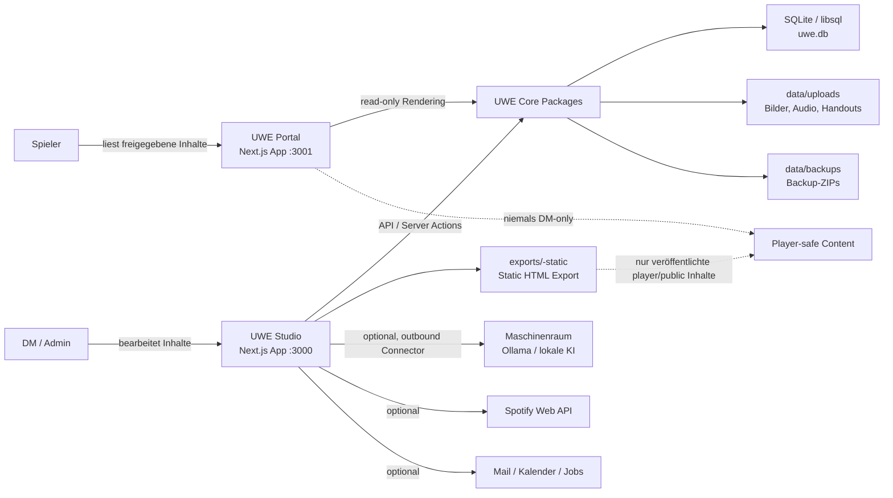
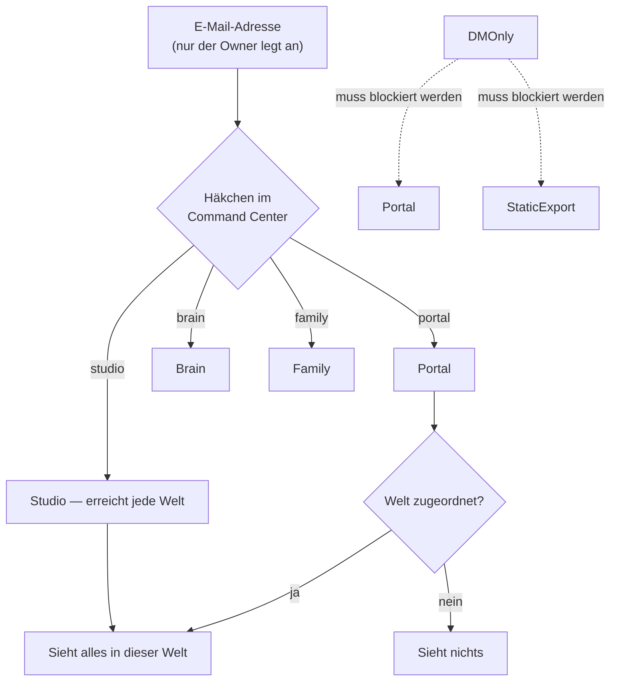
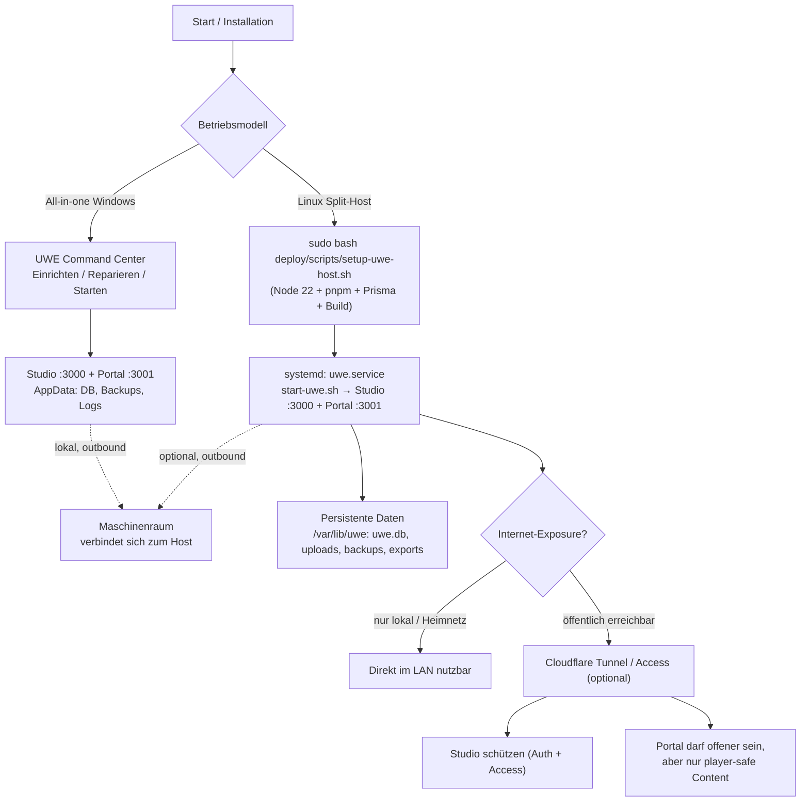
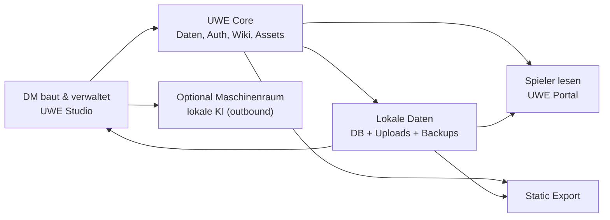

# UWE Architekturübersicht

Stand: 2026-06-29

> **Hinweis 2026-07-28:** Seit diesem Stand kamen `apps/brain` (Owner-Bereich,
> eigene `uwe-brain.db`), `apps/family` (geteilter Haushalt, `uwe-family.db`),
> `apps/landing` (Apex-Origin) und der Terra-Karteneditor (`terra/`, löst
> Atlas/Atlas-3D ab) hinzu; das Rollen-Enum wurde durch das Häkchen-Modell
> ersetzt. Für den aktiven Stand gilt [CURRENT_STATE.md](CURRENT_STATE.md).

Diese Datei beschreibt UWE auf drei Ebenen:

1. **Produkt-Hierarchie** — welche Teile UWE hat und wofür sie zuständig sind.
2. **Laufzeit-Flow** — wie Nutzer, Apps, Pakete, Daten und externe Dienste zusammenspielen.
3. **Repository-Hierarchie** — wo die wichtigsten Bausteine im Monorepo liegen.

UWE ist ein selbst gehostetes Kampagnen-Brain und Welt-Wiki für DnD/Tabletop. Der Kern ist bewusst getrennt in **DM-Bearbeitung**, **Player-Ausgabe**, **persistente Daten** und **optionale Inferenz/Integrationen**.

Die Trennung von Portal, Studio und dem owner-only Brain-Produkt ist inzwischen umgesetzt (der frühere Masterplan unter `docs/rework/` wurde nach Abschluss entfernt); aktuelle Wahrheit: [engineering/domain-contracts.md](engineering/domain-contracts.md).

---

## 1. Produkt-Hierarchie

```mermaid
graph TD
  UWE["UWE<br/>Universeller Welten-Editor"]

  UWE --> Studio["UWE Studio<br/>DM-App / Admin-Cockpit"]
  UWE --> Portal["UWE Portal<br/>Spieler-Wiki / Handouts"]
  UWE --> Core["UWE Core<br/>Shared Packages / Datenlogik"]
  UWE --> Export["Static Export<br/>player-sichere HTML-Ausgabe"]
  UWE --> Integrations["Optionale Integrationen<br/>Maschinenraum, Spotify, Kalender, Mail, DnD-APIs"]

  Studio --> DMWorkflows["Welten, Seiten, Sessions, Inspector,<br/>Templates, Labels, Soundboard, Backups"]
  Studio --> AdminOS["Daily Admin OS<br/>Today, Capture, Projekte, Verträge,<br/>Hardware, Life-Brain"]
  Studio --> AIWorkflows["KI-Workflows<br/>DnD-Generator, Kanonprüfung,<br/>Session-Vorbereitung, Image Studio"]

  Portal --> PublicWiki["Öffentliche Weltseiten<br/>/worlds/* ohne Login"]
  Portal --> AuthPortal["Authentifizierte Spieleransichten<br/>/auth/worlds/*"]
  Portal --> SafeRender["Serverseitig gefiltertes Rendering<br/>keine DM-only Inhalte"]

  Core --> Database["@uwe/database<br/>Prisma, Repositories, Rendering, Wikilinks"]
  Core --> Auth["@uwe/auth / @uwe/security<br/>Zugänge, Welt-Grenze, Guards"]
  Core --> Assets["@uwe/assets<br/>Uploads, MIME, Pfade"]
  Core --> UI["@uwe/shared-ui<br/>gemeinsame React-Komponenten"]

  Export --> StaticSite["exports/<world>-static<br/>HTML, CSS, JS, Search Index"]
  Integrations --> RTX["Maschinenraum<br/>optionaler outbound KI-Worker"]
  Integrations --> Spotify["Spotify Web API<br/>DM-seitiges Soundboard"]
  Integrations --> Calendar["Kalender / Mail / Jobs<br/>Admin- und Automationsfunktionen"]
```

---

## 2. Laufzeit-Flow

### Wichtigste Regeln im Flow

- **Studio ist die Schreib- und Admin-Oberfläche.** Hier entstehen Inhalte, Imports, Generator-Ausgaben, Inspector-Fixes, Backups und Exporte.
- **Portal ist die Spieler-Ausgabe.** Es rendert nur veröffentlichte und freigegebene Inhalte. DM-only Inhalte dürfen dort nicht erscheinen.
- **Persistente Daten bleiben auf dem UWE Host.** Datenbank, Uploads, Backups und Exporte liegen lokal/self-hosted.
- **Der Maschinenraum ist nur Inferenz-Worker.** Er verbindet sich **outbound** zum Host, soll keine UWE-Daten dauerhaft speichern und nicht öffentlich exposed werden. Der alte inbound `RTX-Agent` bleibt nur als **deprecated** Kompatibilität bestehen.
- **Es gibt keine Cloud-KI.** Jede KI-Aktion läuft über den RTX-Host (Notiz Lasse, N.3). Anbieter, Schlüssel und Fallback-Pfade sind entfernt — nicht abgeschaltet.

---

## 3. Zugangs- und Content-Flow

Zwei Achsen, mehr nicht: das **Häkchen** sagt, welche App; die **Welt-Zuordnung**
sagt, welche Welt. Sichtbarkeit pro Inhalt gibt es nicht mehr
(Notiz Lasse, 2026-07-26).

Diese Trennung ist zentral für UWE: Inhalte können im Studio sehr frei und spoilerlastig gepflegt werden, aber Portal und Export müssen konsequent player-safe bleiben.

---

## 4. Repository-Hierarchie

```mermaid
graph TD
  Repo["Nehmo101/UWE<br/>pnpm + Turborepo Monorepo"]

  Repo --> Apps["apps/"]
  Apps --> StudioApp["apps/studio<br/>@uwe/studio"]
  Apps --> PortalApp["apps/portal<br/>@uwe/portal"]
  Apps --> RtxClient["UWE Command Center<br/>apps/rtx-connector-client<br/>Tauri Desktop App + lokaler Host-Orchestrator"]

  Repo --> Packages["packages/"]
  Packages --> Config["config<br/>TypeScript / Shared Config"]
  Packages --> Env["env<br/>ENV Parsing / Guards"]
  Packages --> SharedUI["shared-ui<br/>gemeinsame UI"]
  Packages --> SharedUtils["shared-utils<br/>Slugs / Lookup-Keys"]
  Packages --> DatabasePkg["database<br/>Prisma, Schema, Repositories, Wikilinks"]
  Packages --> AuthPkg["auth<br/>Zugänge / Welt-Grenze"]
  Packages --> SecurityPkg["security / security-tests<br/>Leak- und Authz-Tests"]
  Packages --> AssetsPkg["assets<br/>Uploads / Assettypen"]
  Packages --> StaticExportPkg["static-export<br/>HTML-Export"]
  Packages --> SoundboardPkg["soundboard<br/>Audio, YouTube, Spotify"]
  Packages --> AIBrainPkg["ai-brain<br/>Router, Privacy, Connector/RTX"]
  Packages --> FeaturePkgs["Feature-Pakete<br/>backup, calendar, mail, dnd-api,<br/>image-studio, knoteforge-import, github-issues"]

  Repo --> Tools["tools/"]
  Tools --> RtxConnector["uwe-rtx-connector<br/>optionaler outbound Worker (aktiv)"]

  Repo --> Deploy["deploy/"]
  Deploy --> Systemd["systemd-Units + Setup-Scripts<br/>uwe.service, setup-uwe-host.sh"]

  Repo --> Scripts["scripts/"]
  Scripts --> Quality["Tests, Security Checks,<br/>Release Checks, Host-Scripts"]

  Repo --> Docs["docs/"]
  Docs --> Production["PRODUCTION.md"]
  Docs --> SecurityDocs["Security / Privacy / AI Docs"]
  Docs --> ThisDoc["ARCHITECTURE.md"]
```

### Paket-Map

| Paket | Zuständigkeit |
|---|---|
| `@uwe/database` | Prisma-Schema, Repositories, Kern-Services |
| `@uwe/auth`, `@uwe/security` | Sessions, RBAC, API-Guards, CSRF |
| `@uwe/product-contracts` | Datenklassen und Produktgrenzen, in CI erzwungen |
| `@uwe/ai-brain` | KI-Router, DnD-Generator, Privacy-Guards |
| `@uwe/shared-ui` | Geteilte React-Komponenten, Theme-System |
| `@uwe/shared-utils` | Framework-agnostische Utilities |
| `@uwe/mcp` | MCP-Server für Studio, Portal und Brain |
| `@uwe/assets` | Upload-Pfade, MIME-Validierung |

Fachliche Feature-Pakete: `backup`, `brain-assistant`,
`calendar`, `cloudflare-edge`, `connector`, `cookbook`, `daily-cockpit`,
`dnd-api`, `github-issues`, `host-cockpit`, `host-monitor`, `image-studio`, `kitchen`,
`knoteforge-import`, `mail`, `mail-core`, `passkeys`, `pdf-campaign-import`,
`pdf-ocr`, `player-hub`, `roll-tables`, `scan-inbox`, `soundboard`,
`static-export`, `theme-studio`, `web-search`.

Der Karteneditor **Terra** lebt als eigenständiges ES-Modul-Projekt unter
`terra/` (außerhalb des pnpm-Workspace) und wird per `scripts/copy-terra.mjs`
nach Studio und Portal kopiert. Die Atlas- und Atlas-3D-Editoren wurden am
2026-07-27 vollständig entfernt (siehe
[engineering/terra-runde-j-atlas-abbau.md](engineering/terra-runde-j-atlas-abbau.md)).

### Wohin neuer Code gehört

| Art der Änderung | Ort |
|---|---|
| Schema | `packages/database/prisma/schema.prisma` + Migration |
| Domain-Logik | Feature-Paket unter `packages/<domain>` |
| Studio-API | `apps/studio/app/api/**/route.ts` |
| Studio-UI | `apps/studio/app/**/page.tsx` |
| Formulare | Server Actions in `apps/studio/app/*-actions.ts` |
| Geteilte UI | `packages/shared-ui/src/` |

Die Modul-Disziplin (700-Zeilen-Budget, eingefrorene Baseline, `server.ts`-Barrel)
steht in [../CONTRIBUTING.md](../CONTRIBUTING.md#2-modul-disziplin-anti-monolith).

---

## 5. Verantwortungsgrenzen

| Bereich | Darf schreiben? | Darf lesen? | Hauptverantwortung |
|---|---:|---:|---|
| **UWE Studio** | Ja | Alles — das Studio-Häkchen erreicht jede Welt | DM-Editor, Admin-Cockpit, Generatoren, Exporte, Backups |
| **UWE Portal** | Nein / sehr begrenzt | Alles in den zugeordneten Welten | Spieler-Wiki, Handouts — Login immer erforderlich |
| **Static Export** | Nein | Was bewusst exportiert wurde | Statisches Hosting ohne Serverlogik |
| **UWE Core Packages** | Indirekt über Apps | Ja | Datenlogik, Auth, Rendering, Security, Assets |
| **Maschinenraum** | Nein in UWE-Daten | Nur explizit gesendeten Prompt/Kontext | Lokale KI-Inferenz (outbound Worker); alter inbound `RTX-Agent` nur deprecated |
| **Cloud-KI** | — | — | Entfällt: seit N.3 gibt es keinen Cloud-Anbieter mehr |

---

## 6. Deployment-Flow

Es gibt zwei aktive, bewusst getrennte Betriebsmodelle: Das **UWE Command
Center** betreibt Hosting und RTX auf einem Windows-PC; der **Linux-Split-Host**
bleibt für Always-on- und öffentliche Installationen erhalten. Beide verwenden
dieselben Apps, Datenregeln und den outbound-only Maschinenraum.

---

## 7. Orientierung für neue Features

Neue Features sollten möglichst klar einer dieser Schichten zugeordnet werden:

1. **Studio Feature** — alles, was DM/Admin-Bearbeitung, Generierung, Import, Review oder Wartung betrifft.
2. **Portal Feature** — alles, was Spieler sehen oder nutzen sollen. Immer die Welt-Grenze mitdenken (`scopeFromAccessContext`).
3. **Core Package** — wiederverwendbare Logik, die nicht direkt UI-spezifisch ist.
4. **Integration Package** — externe APIs, Agenten, Mail, Kalender, Spotify, DnD-APIs.
5. **Host-Tooling/Deploy** — Command-Center-Orchestrator für Windows oder `deploy/scripts/setup-uwe-host.sh` + systemd für Linux. Keine duplizierte Geschäftslogik in den Oberflächen.

Faustregel: Wenn ein Feature sowohl Studio als auch Portal betrifft, gehört die gemeinsame Logik in ein Package; Studio und Portal sollten dann nur ihre jeweilige UI und Route-Logik besitzen.

---

## 8. UI Stack und Shells

UWE verwendet seit Wave 0 einen einheitlichen UI-Stack und einen zentralen **Navigation Contract**.

### Zentraler Nav-Vertrag

Jede App definiert ihre Navigation in einer eigenen `*-nav.ts`-Datei:

| App | Nav-Datei |
|---|---|
| Studio | `apps/studio/src/navigation/studio-nav.ts` |
| Portal | `apps/portal/src/navigation/portal-nav.ts` |
| UWE Command Center | `apps/rtx-connector-client/src/navigation/connector-nav.ts` |

Alle drei nutzen `@uwe/shared-utils/navigation` für die Nav-Typen und `resolveNavGroups()`.

### Shell-Komponenten

| Shell | App | Beschreibung |
|---|---|---|
| `AppShell` | Studio, Portal | Basisshell mit Sidebar, Command Palette, Mobile Drawer |
| `StudioShell` | Studio | Daily Admin OS + globale Studio-Navigation |
| `WorldShell` | Studio | Welt-Routen (Wiki, Sessions, Dungeons, Labels) |
| `SystemShell` | Studio | Admin + System-Verwaltung |
| `SettingsShell` | Studio | Tab-Layout innerhalb von StudioShell (Einstellungen) |
| `PortalShell` | Portal | Login-first Portal-Navigation (`apps/portal/src/components/shell/`) |
| `ConnectorShell` | UWE Command Center | Tauri/Vite-Desktop-Shell mit Host- und Connector-IA |

Design V2 (`NEXT_PUBLIC_UWE_DESIGN_V2`, default **on**) setzt `data-uwe-design-v2="true"` auf
`<body>` und aktiviert `packages/shared-ui` `*V2`-Shells plus `legacy-bridge.css` für verbleibende
`.uwe-btn`/`.uwe-card`-Klassen. App-level Wrapper (`StudioAppShell`, `PortalAppShell`,
`PortalGuestShell`) delegieren an `*V2` und werden in Wave 3 C1/C2 durch die AppShell-Shells ersetzt.

### UI-Stack

- **Tailwind CSS v4** — utility-first, direkt in Studio und Portal
- **shadcn-style Primitives** — `@uwe/shared-ui`: `ButtonV2`, `CardV2`, `HealthBadge`, etc.
- **Lucide React** — Icon-Bibliothek (Studio, Portal, Command Center)
- **CSS Custom Properties** — `--uwe-accent`, `--uwe-bg`, `--uwe-fg`, etc.

Kanonischer visueller Style Guide (Tokens, 9 Themes, Komponenten, Studio/Portal-Nachbauten): [`design-system/`](../design-system/README.md).

---

## 9. Kurzfassung

**UWE = Studio zum Erstellen, Core zum Absichern/Verwalten, Portal/Export zum sicheren Teilen, Maschinenraum für lokale KI.** Läuft als Linux Host mit `systemd` (kein Docker, kein Windows-Installer).
