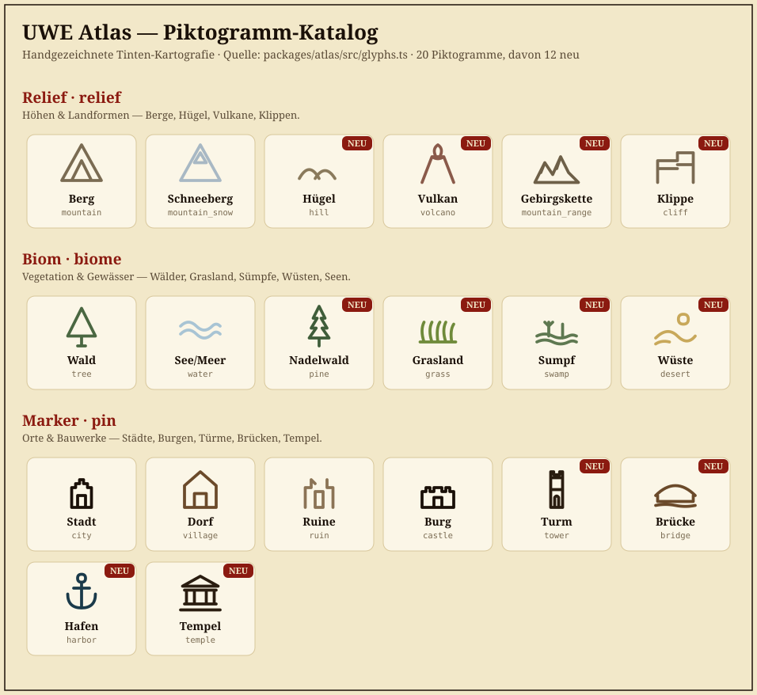

# Atlas — Piktogramm-Styleguide

Verbindlicher Styleguide für die **Karten-Piktogramme** (eingebaute Glyphen/Stempel)
des Atlas World Builders. Er ergänzt die übergeordnete Stil-Referenz
[atlas-style-reference.md](atlas-style-reference.md) (handgezeichnete Tinten-Kartografie)
um konkrete Regeln und einen Katalog für die Punkt-Symbole, die in der Palette,
im Portal-Viewer und im statischen Export erscheinen.

> Ziel: einheitliche, sofort wiedererkennbare Symbole im Tinten-Stil — und ein
> Prozess, bei dem ein **einziger Eintrag** ein neues Piktogramm überall verfügbar macht.

---

## Single Source of Truth

Alle eingebauten Piktogramme leben an genau **einer** Stelle:

```
packages/atlas/src/glyphs.ts   →   BUILTIN_GLYPHS
```

Diese kanonische Liste wird von allen Stellen importiert — es gibt **keine**
parallelen, von Hand gepflegten Kopien mehr:

| Konsument | Import | Nutzung |
|---|---|---|
| Studio-Editor (`AtlasEditor.tsx`) | `@uwe/atlas/glyphs` | Palette (nach Kategorie gruppiert), Canvas-Rendering |
| Portal-Viewer (`AtlasViewer.tsx`) | `@uwe/atlas/glyphs` | read-only Canvas-Rendering |
| DB-Seed (`atlas-service.ts`) | `@uwe/atlas/glyphs` | `BUILTIN_ATLAS_GLYPHS` → globale `AtlasPaletteItem`-Zeilen |
| Statischer Export (`export-atlas.ts`) | `@uwe/atlas/glyphs` | spielt die Liste als `data.builtinGlyphs` in `atlas/data.json` ein; der Viewer liest sie von dort |

**Folge:** Wird ein Piktogramm in `glyphs.ts` ergänzt, ist es automatisch in
Editor-Palette, Portal, Export **und** als seedbare Palette verfügbar — „wenn
weitere Piktogramme hinzukommen, kann direkt darauf zugegriffen werden".

Hilfsfunktionen aus `@uwe/atlas/glyphs`:
`getGlyphByKey`, `listGlyphsByCategory`, `groupGlyphsByCategory`,
`ATLAS_GLYPH_CATEGORIES`, `BUILTIN_GLYPH_KEYS`.

---

## Katalog



> Der Katalog (`atlas-pictograms.svg`) wird aus der kanonischen Registry erzeugt
> und ist damit immer aktuell. Mit „NEU" markierte Symbole wurden zuletzt ergänzt.

---

## Kategorien

Piktogramme gehören zu genau einer von drei Kategorien (Feld `kind`). Die Palette
gruppiert nach genau dieser Reihenfolge:

| Kategorie (`kind`) | Label | Inhalt |
|---|---|---|
| `relief` | Relief | Höhen & Landformen — Berge, Hügel, Vulkane, Klippen |
| `biome` | Biom | Vegetation & Gewässer — Wälder, Grasland, Sümpfe, Wüsten, Seen |
| `pin` | Marker | Orte & Bauwerke — Städte, Burgen, Türme, Brücken, Tempel |

---

## Design-Regeln

Jedes Piktogramm folgt denselben Regeln, damit das Set homogen wirkt:

1. **Nur Konturen, keine Flächen.** Die Renderer (Canvas2D) *stroken* den Pfad,
   sie füllen nicht. `fill="none"` im SVG-Preview.
2. **24×24 viewBox.** Gezeichnet wird zentriert in einem 24×24-Raster.
3. **Bodenlinie ~ y = 21.** „Stehende" Objekte (Turm, Tempel, Stadt …) sitzen auf
   ~`y=21`; Gelände-Glyphen dürfen den Rahmen ausfüllen.
4. **Strichstärke 1.5**, `stroke-linecap="round"`, `stroke-linejoin="round"`.
5. **Erlaubte Pfad-Befehle:** ausschließlich **absolute** `M L H V Q C Z`, und
   **ein Segment pro Befehl** (z. B. mehrere `L` statt eines `L` mit vielen Punkten).
   Grund: Der Pfad-Parser der Renderer ist bewusst minimal (siehe
   [Rendering-Details](#rendering-details)). Relative Befehle (`m l q …`),
   `S`/`A`/Arcs und Mehrfach-Koordinaten werden **nicht** unterstützt.
6. **Gedämpfte Erd-/Tinten-Farben.** `color` ist ein 6-stelliger Hex-Wert, der zum
   Pergament passt (Braun-, Grau-, Grün-, Blautöne; Tinte `#1a1008`).
7. **Stabile `key`s.** Der `key` wird als `builtinGlyphKey` persistiert und in
   gespeicherten Karten referenziert — **niemals umbenennen oder entfernen**
   (sonst verlieren bestehende Objekte ihr Symbol). Nur additiv erweitern.

---

## Aktuelle Piktogramme

Quelle der Wahrheit ist `glyphs.ts`; `pathData` und `color` stehen dort. Diese
Tabelle listet bewusst nur die stabilen Identifikatoren.

### Relief
| `key` | Name | Status |
|---|---|---|
| `mountain` | Berg | Bestand |
| `mountain_snow` | Schneeberg | Bestand |
| `hill` | Hügel | **neu** |
| `volcano` | Vulkan | **neu** |
| `mountain_range` | Gebirgskette | **neu** |
| `cliff` | Klippe | **neu** |

### Biom
| `key` | Name | Status |
|---|---|---|
| `tree` | Wald | Bestand |
| `water` | See/Meer | Bestand |
| `pine` | Nadelwald | **neu** |
| `grass` | Grasland | **neu** |
| `swamp` | Sumpf | **neu** |
| `desert` | Wüste | **neu** |

### Marker
| `key` | Name | Status |
|---|---|---|
| `city` | Stadt | Bestand |
| `village` | Dorf | Bestand |
| `ruin` | Ruine | Bestand |
| `castle` | Burg | Bestand |
| `tower` | Turm | **neu** |
| `bridge` | Brücke | **neu** |
| `harbor` | Hafen | **neu** |
| `temple` | Tempel | **neu** |

---

## Neues Piktogramm hinzufügen

1. **Eintrag ergänzen** in `packages/atlas/src/glyphs.ts` im passenden
   Kategorie-Block:

   ```ts
   {
     key: "lighthouse",      // stabil, einzigartig, snake_case
     name: "Leuchtturm",     // deutscher Anzeigename
     kind: "pin",            // relief | biome | pin
     pathData: "M10 22 L9 8 L15 8 L14 22 Z ...", // 24×24, nur M L H V Q C Z, absolut
     color: "#2a1d10",
   },
   ```

2. **Designregeln einhalten** (siehe oben). Tipp: zuerst in einem 24×24-SVG-Editor
   skizzieren, dann auf erlaubte Befehle reduzieren.

3. **Tests laufen lassen:** `pnpm --filter @uwe/atlas test`
   (prüft eindeutige Keys, gültige Kategorie/Pfad-Befehle, Kategorie-Mindestmengen)
   und `pnpm --filter @uwe/database test` (Seeding aller Glyphen).

4. **Fertig.** Editor-Palette, Portal-Viewer und statischer Export zeigen das Symbol
   automatisch. Bestehende Welten erhalten den neuen globalen Palette-Eintrag beim
   nächsten Öffnen des Atlas (idempotentes `ensureBuiltinPaletteItems`).

5. **Optional – Katalog aktualisieren:** `atlas-pictograms.svg` wird aus der
   Registry erzeugt; nach größeren Erweiterungen neu rendern und committen.

---

## Rendering-Details

Sowohl der Editor (`GlyphSvg`) als auch die Canvas-Renderer interpretieren
`pathData` identisch:

- **SVG-Preview (Palette):** `<path d={pathData} fill="none" stroke={color}
  stroke-width="1.5" stroke-linecap="round" stroke-linejoin="round" />` in einer
  `0 0 24 24`-viewBox.
- **Canvas (`drawSvgPath`):** ein minimaler Parser für `M L H V Q C Z`
  (absolut, ein Segment pro Befehl). Deshalb gelten die Pfad-Regeln oben strikt.

Größe/Drehung pro platziertem Objekt kommen aus `AtlasObject.scale` / `rotation`;
die Strichstärke wird gegen die Skalierung kompensiert, sodass Linien überall
gleich dünn wirken.

---

## Weiterführend

- [atlas-style-reference.md](atlas-style-reference.md) — Gesamt-Stil (Tinte/Pergament)
- [atlas-orchestrator.md](atlas-orchestrator.md) — Feature-Phasen & Plan
- `packages/atlas/src/glyphs.ts` — kanonische Registry
- `.cursor/skills/uwe-image-studio-assets/SKILL.md` — KI-Stempel (Quelle `ai`)
