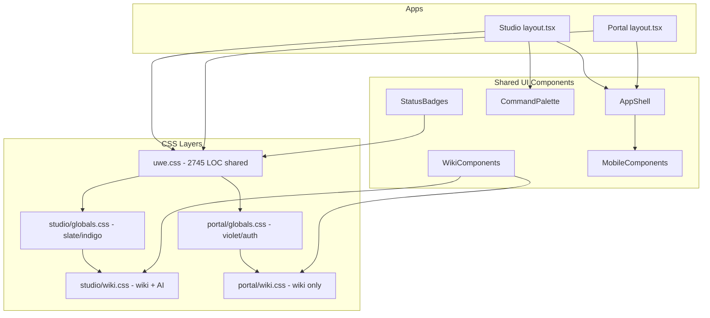

# UWE Design Audit — Ist-Zustand Themes & UI

**Datum:** 2026-06-18  
**Scope:** Read-only Analyse (keine Code-Änderungen)  
**Geprüfte Bereiche:** `packages/shared-ui`, Studio/Portal CSS, Layouts, Navigation, Kernkomponenten

---

## Executive Summary

UWE hat **kein formales Theme-Token-System**. Das visuelle Fundament ist eine große, monolithische CSS-Datei (`packages/shared-ui/src/uwe.css`, ~2.745 Zeilen) mit durchgängig **hartcodierten Hex-/RGBA-Werten**. Beide Apps (Studio & Portal) importieren dieselbe Shared-UI-Schicht, legen aber **app-spezifische Overrides** in `globals.css` und **Wiki-spezifische Styles** in `wiki.css` darüber.

**Kernproblem:** Studio (Slate/Indigo) und Portal (Violett) haben unterschiedliche Brand-Farben in `globals.css`, nutzen aber dieselbe `uwe.css`-Shell — wodurch Portal-Seiten mit `AppShell` optisch wie Studio aussehen, während Auth-/Login-Flows im Portal-Violett bleiben.

**Odysseus-Bezug:** Odysseus wird nicht parallel gehostet; Ideen fließen als UWE-Module ein (vgl. `docs/IMAGE_STUDIO.md`, `docs/ai-brain-mail/README.md`). Es gibt **kein separates Odysseus-Designpaket** im Repo — nur punktuelle „Odysseus-inspirierte“ Features (Image Studio, Mobile AI Prompt).

---

## 1. Architektur: Wie Themes & UI aufgebaut sind

### 1.1 CSS-Lade-Reihenfolge (beide Apps)

```
@uwe/shared-ui/uwe.css   → Shared Design System (Shell, Buttons, Cards, Mobile, Palette)
./globals.css            → App-spezifische Overrides (Studio vs. Portal divergieren stark)
./wiki.css               → Wiki-Content, Sidebar, Badges, AI-Brain-Panel (Studio-extra)
```

**Studio** (`apps/studio/app/layout.tsx`):

- Importiert `uwe.css`, `globals.css`, `wiki.css`
- Globale Client-Komponenten: `GlobalCaptureFab`, `StudioCommandPalette`
- `themeColor`: `#6366f1` (Indigo)

**Portal** (`apps/portal/app/layout.tsx`):

- Gleiche CSS-Imports
- Kein Command Palette, kein Capture FAB
- `themeColor`: `#7c3aed` (Violett)

### 1.2 CSS Custom Properties (einzige „Tokens“)

In `uwe.css` existieren nur **drei** semantische Variablen:

| Variable | Wert | Verwendung |
|----------|------|------------|
| `--uwe-touch-min` | `2.75rem` | Mindest-Touch-Target (Buttons, Nav, Formulare) |
| `--uwe-safe-bottom` | `env(safe-area-inset-bottom, 0px)` | iOS Safe Area |
| `--uwe-safe-top` | `env(safe-area-inset-top, 0px)` | iOS Safe Area |

**Keine Farb-Tokens**, keine Spacing-Skala, keine Typografie-Tokens, kein Dark/Light-Switch.

### 1.3 Komponenten-Schichten

| Schicht | Ort | Rolle |
|---------|-----|-------|
| **Shell & Layout** | `AppShell.tsx`, `MobileComponents.tsx` | 3-Spalten-Grid (Sidebar / Main / Context), Mobile Drawer, Bottom Nav, Sticky Actions |
| **Design System CSS** | `uwe.css` | `.uwe-*` Klassen: Shell, Buttons, Forms, Cards, Badges, Tables, Palette, Mobile |
| **Wiki UI** | `WikiComponents.tsx` + `wiki.css` | Content-Renderer, Sidebar, Visibility-Badges |
| **Status/Badges** | `StatusBadges.tsx` | Mappt DB-Enums auf `.uwe-badge-*` Klassen |
| **Portal-spezifisch** | `PortalNav.tsx` | Hero, typbasierte Navigation |
| **App-spezifisch** | `globals.css` je App | Auth, Capture FAB, Settings, Share Links |
| **Inline/Ad-hoc** | diverse Studio-Pages, `HealthBadge.tsx`, `GraphView.tsx` | Hardcoded Colors & Layout ohne CSS-Klassen |

### 1.4 Layout-Muster

#### AppShell (primäres Layout, Studio + Portal)

```
┌─────────────────────────────────────────────┐
│ uwe-topbar (Brand, Search, Actions)         │
├──────────┬──────────────────────┬───────────┤
│ uwe-     │ uwe-main             │ uwe-      │
│ sidebar  │ (PageHeader, Content)│ context   │
│ 16rem    │                      │ 18–22rem  │
└──────────┴──────────────────────┴───────────┘
│ uwe-bottom-nav (mobile ≤960px)              │
└─────────────────────────────────────────────┘
```

- Desktop: CSS Grid `16rem | 1fr | 18rem`
- Mobile: Sidebar als Fixed Drawer, Context als Collapsible Panel, Bottom Nav fixed

#### Wiki-Layout (Legacy CSS, **nicht aktiv genutzt**)

`.wiki-layout` existiert in beiden `wiki.css`-Dateien (3-Spalten-Grid), wird aber **in keiner TSX-Datei referenziert**. Wiki-Seiten nutzen stattdessen `AppShell` + `WikiContent`/`WikiSidebar`.

#### Auth-Layouts (Portal)

- Eigene Klassen: `.auth-page`, `.auth-header`, `.auth-card`, `.auth-form`
- Nur in `apps/portal/app/globals.css` definiert
- `AuthHeader.tsx` mit Mobile-Toggle (separates Pattern vs. `AppShell`)

#### Studio Auth

- `.studio-auth-*` in `apps/studio/app/globals.css`
- Login/Setup ohne `AppShell`

---

## 2. Komponenten-Inventar

### 2.1 Navigation

| Komponente | Datei | CSS-Klassen | Anmerkung |
|------------|-------|-------------|-----------|
| Sidebar Nav | `AppShell.tsx` → `SidebarNav` | `.uwe-sidebar-nav`, `.uwe-nav-badge` | Active State: Indigo-Border |
| Top Bar Brand | `TopBarBrand` | `.uwe-brand`, `.uwe-brand-mark` | ◆ Mark in `#818cf8` |
| Portal Nav | `PortalNav.tsx` | `.uwe-portal-nav-*` | Hover: Cyan `#38bdf8` |
| Bottom Nav | `MobileBottomNav` | `.uwe-bottom-nav` | Icons als Emoji-Strings |
| Breadcrumb | `Breadcrumb` | `.uwe-breadcrumb` | Mobile: horizontal scroll |
| Auth Header | `AuthHeader.tsx` | `.auth-header`, `.auth-mobile-toggle` | Portal-only, sticky mobile |
| Mobile Nav Config | `apps/studio/src/lib/mobile-nav.ts`, `apps/portal/src/lib/mobile-nav.ts` | — | Duplizierte Item-Shape |

### 2.2 Cards

| Variante | CSS | Verwendung |
|----------|-----|------------|
| Generic Card | `.uwe-card` | Dashboard, Module |
| Stat Card | `.uwe-stat-card` | Dashboard KPIs |
| Block Card | `.uwe-block-card` | Content-Blöcke |
| Template Card | `.uwe-template-card` | Quick Create |
| Page List Card | `.uwe-page-list-card` | Mobile Tabellen-Ersatz |
| Wiki World Card | `.wiki-world-card` | Welten-Übersicht |
| Legacy Card | `.card` | Disabled Portal, Fehlerseiten |
| Auth Card | `.auth-card` / `.studio-auth-card` | Login-Flows |

### 2.3 Buttons

| Variante | CSS | Primary Color |
|----------|-----|---------------|
| Default | `.uwe-btn` | Slate transparent |
| Primary | `.uwe-btn-primary` | Gradient `#6366f1 → #4f46e5` |
| Secondary | `.uwe-btn-secondary` | Slate |
| Ghost | `.uwe-btn-ghost` | Transparent + Indigo hover |
| Danger | `.uwe-btn-danger` | Red border/text |
| Small | `.uwe-btn-sm`, `.uwe-btn-small` | — |
| Auth (Portal) | `.auth-btn` | `#7c3aed` solid |
| Auth (Studio) | `.studio-auth-form button` | `#6366f1` solid |
| AI Brain | `.ai-brain-actions button` | Cyan `#7dd3fc` |

### 2.4 Modals / Overlays

Es gibt **kein generisches Modal-System**. Overlay-Patterns:

| Pattern | CSS | Komponente | Z-Index |
|---------|-----|------------|---------|
| Command Palette | `.uwe-palette-overlay`, `.uwe-palette` | `CommandPalette.tsx` | 100 |
| Filter Sheet (mobile) | `.uwe-filter-sheet-backdrop/panel` | `MobileFilterSheet` | 44–45 |
| Sidebar Backdrop | `.uwe-sidebar-backdrop` | `AppShell` | 25 |
| Share Gate | `.share-gate` | Portal share pages | — |

Alle nutzen `role="dialog"` nur bei Filter Sheet und Command Palette.

### 2.5 Badges

**Zwei parallele Systeme:**

1. **`.uwe-badge-*`** in `uwe.css` + `StatusBadges.tsx` (Studio/Shared)
2. **`.wiki-badge-*`** in `wiki.css` + `WikiComponents.tsx` (Wiki/Portal)

Farben sind nahezu identisch, Klassennamen und Border-Radius unterscheiden sich leicht.

**Bekannter CSS-Konflikt:** `.uwe-badge` ist in `uwe.css` **zweimal** definiert (Zeile ~487 und ~2019) — zweite Definition überschreibt Padding/Border-Radius der ersten.

### 2.6 Forms

| Pattern | CSS |
|---------|-----|
| Standard Form | `.uwe-form`, `.uwe-form-row-*` |
| Inline Input | `.uwe-input-inline` |
| Fieldset | `.uwe-fieldset`, `.uwe-checkbox` |
| Auth Form | `.auth-form` / `.studio-auth-form` |
| Mobile AI Prompt | `.mobile-ai-*` (nur Studio `wiki.css`) |
| Label Editor | `.uwe-label-editor-*` (weißer Canvas!) |

### 2.7 Command Palette

- **Shared:** `CommandPalette.tsx` + CSS ab Zeile 2400 in `uwe.css`
- **Studio-Wrapper:** `StudioCommandPalette.tsx` — statische Commands + `/api/command/search`
- Shortcut: `Ctrl/⌘ + K`
- Mobile: Bottom-Sheet-Style (border-radius oben, max-height 85vh)

### 2.8 Global Capture FAB

- **Datei:** `apps/studio/components/GlobalCaptureFab.tsx`
- **CSS:** `.uwe-capture-fab` in `apps/studio/app/globals.css`
- Fixed bottom-right, Gradient Indigo→Violett
- Mobile: `bottom: calc(4.5rem + safe-area)` — über Bottom Nav
- Versteckt auf `/capture`
- **Nur Studio**, nicht im Portal

### 2.9 Bottom Navigation

- Implementierung: `MobileBottomNav` in `MobileComponents.tsx`
- Nur sichtbar `@media (max-width: 960px)`
- Studio: `studioGlobalBottomNav`, `studioWorldBottomNav`
- Portal: `portalWorldBottomNav`, `portalAuthBottomNav` (Auth-Nav kaum genutzt)
- Label-Font: `0.62rem` (sehr klein, ab 430px: `0.58rem`)

### 2.10 Wiki-Renderer / Wiki-Layout

| Teil | Implementierung |
|------|-----------------|
| HTML-Rendering | `WikiContent` → `dangerouslySetInnerHTML` + `.wiki-content` |
| Read Mode | `.wiki-content-readmode` (mobile, größere Schrift) |
| Sidebar | `WikiSidebar` → Backlinks, Related, Broken Links |
| Links | `.wiki-link`, `.wiki-link-hidden`, `.wiki-link-broken` |
| Studio Extras | AI Brain Panel (`.ai-brain-panel`), Mobile AI Prompt (`.mobile-ai-*`) |

---

## 3. Hartcodierte Farben

### 3.1 Quantitative Übersicht

| Datei | Hex-Farben | RGBA-Werte |
|-------|------------|------------|
| `packages/shared-ui/src/uwe.css` | ~157 | ~159 |
| `apps/studio/app/wiki.css` | ~55 | ~50 |
| `apps/studio/app/globals.css` | ~24 | ~25 |
| `apps/portal/app/globals.css` | ~30 | ~37 |
| `apps/portal/app/wiki.css` | ~26 | ~18 |

### 3.2 Dominante Palette (Shared UI / Studio)

| Rolle | Hex | Vorkommen |
|-------|-----|-----------|
| Text muted | `#94a3b8`, `#64748b` | Sehr häufig |
| Text primary | `#e2e8f0`, `#f8fafc`, `#cbd5e1` | Häufig |
| Accent / Links | `#818cf8`, `#6366f1` | Indigo-Familie |
| Cyan Links (Wiki/Portal) | `#38bdf8`, `#7dd3fc` | Wiki-Navigation |
| Success | `#86efac`, `#6ee7b7` | Badges, Flash |
| Warning | `#fcd34d`, `#fbbf24` | Badges, Preview Banner |
| Error | `#fca5a5`, `#f87171` | Alerts, Broken Links |
| Shell Background | `#0b1220`, `#060a12` | Gradient Endpoints |

### 3.3 Portal-spezifische Palette (`globals.css`)

| Rolle | Hex |
|-------|-----|
| Body Gradient | `#312e81 → #1e1b4b → #0f0a2e` |
| Primary Button | `#7c3aed`, `#6d28d9` |
| Text | `#f5f3ff`, `#ddd6fe`, `#c4b5fd` |
| Muted | `#a78bfa`, `#7c3aed` |

### 3.4 Hardcoded Colors in TS/TSX (nicht in CSS)

| Datei | Farben |
|-------|--------|
| `GraphView.tsx` | 9 Kategorie-Farben (`CATEGORY_COLORS`) |
| `HealthBadge.tsx` | `#22c55e`, `#eab308`, `#ef4444` + inline styles |
| Diverse Studio-Pages | Inline `color: "#94a3b8"`, `"#818cf8"`, `"#fca5a5"`, `"#86efac"` |
| `LabelEditor.tsx` | Canvas `#fff`, Selection `#3b82f6`, DM-only `#f59e0b` |

### 3.5 Fehlende CSS-Definitionen (Ghost Classes)

Folgende Klassen werden in TSX **verwendet, aber nirgends in CSS definiert**:

- `.uwe-table`
- `.uwe-table-sub`
- `.uwe-table-wrap`

Betroffene Bereiche: Mail, Backup, Settings, Labels, Soundboard, Import. Tabellen fallen auf Browser-Defaults zurück — **visuell inkonsistent** mit `.uwe-page-table`.

---

## 4. Doppelt vorhandene Styles (Studio ↔ Portal)

### 4.1 `wiki.css` — ~70 % identisch

Gemeinsame Blöcke (beide Apps):

- `.wiki-layout`, `.wiki-nav`, `.wiki-main`, `.wiki-content`
- `.wiki-sidebar`, `.wiki-badge-*`, `.wiki-breadcrumb`
- `.wiki-world-grid`, `.wiki-broken-table`
- Mobile Media Queries

**Nur in Studio `wiki.css` (~500 Zeilen extra):**

- `.wiki-sidebar-stack`, `.ai-brain-panel`, `.ai-brain-*`
- `.ai-run-section`, `.ai-run-pre`
- `.mobile-ai-prompt`, `.mobile-ai-*` (vollständiges Mobile-KI-UI)
- `.uwe-detail-grid`

**Unterschiede in gemeinsamen Regeln:**

| Regel | Studio | Portal |
|-------|--------|--------|
| `.wiki-layout` sidebar width | `22rem` | `18rem` |
| `.wiki-world-card:hover` | nicht vorhanden | hover transform |
| `.wiki-badge` | kein `font-weight` | `font-weight: 600` |

### 4.2 `globals.css` — strukturell divergent

**Duplikat-Muster (gleiche Struktur, andere Farben):**

| Pattern | Studio | Portal |
|---------|--------|--------|
| `html/body` gradient | Slate `#1e293b → #020617` | Violett `#312e81 → #0f0a2e` |
| `.page`, `.card`, `.footer` | Slate-Töne | Violett-Töne |
| Auth-System | `.studio-auth-*` | `.auth-*` (umfangreicher) |
| Form Buttons | `#6366f1` | `linear-gradient(#7c3aed, #6d28d9)` |

**Nur Studio:**

- `.uwe-capture-fab`, `.uwe-settings-tabs`, `.uwe-brain-*`
- `.uwe-today-*`, `.uwe-system-ampel-*`
- `.share-link-*` (Share-Link-Verwaltung)

**Nur Portal:**

- `.auth-header`, `.auth-world-list`, `.auth-notes-*`
- `.share-gate`, `.share-password-form`
- Umfangreiche Mobile Auth Media Queries

### 4.3 Badge-Duplikation innerhalb des Systems

| Shared UI | Wiki CSS |
|-----------|----------|
| `.uwe-badge-secret` | `.wiki-badge-secret` |
| `.uwe-badge-player` | `.wiki-badge-player` |
| `.uwe-badge-public` | `.wiki-badge-public` |
| `.uwe-tag` | `.wiki-tag` (leicht unterschiedliche Farben!) |

`VisibilityBadge` existiert **zweimal**: in `StatusBadges.tsx` (`.uwe-badge-*`) und `WikiComponents.tsx` (`.wiki-badge-*`).

---

## 5. Komponenten, die Theme Tokens nutzen sollten

Priorisierte Kandidaten für Token-Migration:

| Priorität | Bereich | Aktuell | Sollte Tokens nutzen für |
|-----------|---------|---------|--------------------------|
| P0 | `uwe.css` gesamt | ~300+ hardcoded colors | `--color-bg`, `--color-surface`, `--color-accent`, `--color-text-*`, `--color-border` |
| P0 | `globals.css` (beide Apps) | App-spezifische Hex | `--theme-brand-*` Overrides pro App |
| P1 | `StatusBadges.tsx` / `WikiComponents.tsx` | Duplizierte Badge-Klassen | `--color-badge-{semantic}` |
| P1 | `GraphView.tsx` | `CATEGORY_COLORS` const | `--color-graph-{category}` |
| P1 | `HealthBadge.tsx` | Inline styles | `.uwe-health-badge` + Tokens |
| P2 | `wiki.css` | Hardcoded Wiki-Farben | `--color-wiki-link`, `--color-wiki-content` |
| P2 | Auth-Systeme | `.auth-*` / `.studio-auth-*` | `--color-auth-*` oder Shared Auth-Komponente |
| P2 | Inline styles in Pages | ~20+ Dateien | Utility-Klassen oder CSS-Module |
| P3 | Label Editor | `#fff` Canvas | `--color-canvas` (absichtlich hell) |
| P3 | Command Palette | Eigene Indigo-Werte | `--color-overlay`, `--color-palette-*` |

---

## 6. Kontrast- & Lesbarkeits-Risiken

| Stelle | Farben | Risiko | Schwere |
|--------|--------|--------|---------|
| `.uwe-bottom-nav-label` | `#64748b` auf `rgba(8,12,22,0.95)` | Sehr kleine Schrift (0.58–0.62rem) + muted | **Hoch** (Mobile) |
| `.wiki-link-hidden` | `#94a3b8` italic | Niedriger Kontrast, schwer unterscheidbar | Mittel |
| `.uwe-nav-badge` | `#94a3b8` auf `rgba(148,163,184,0.15)` | Badge fast unsichtbar | Mittel |
| Portal `.footer` | `#7c3aed` auf Violett-Gradient | Kontrast wahrscheinlich < 4.5:1 | **Hoch** |
| `.uwe-preview-banner` | `#fcd34d` auf `rgba(251,191,36,0.12)` | Gelb auf Gelb — schwach | Mittel |
| `.mobile-ai-hints` | `#fcd34d` auf `rgba(251,191,36,0.06)` | Warning-Text kaum lesbar | Mittel |
| `.ai-brain-checkbox` | `#fca5a5` at 0.75rem | Kleine Warning-Labels | Niedrig |
| Disabled Buttons | `opacity: 0.55` | Kann unter WCAG AA fallen | Mittel |
| `.wiki-content blockquote` | `#94a3b8` italic | Lange Zitate anstrengend | Niedrig |
| Graph edge labels | `fill: #cbd5e1` at 10px | SVG-Text sehr klein | Mittel |

**Positiv:** Primary Buttons (weiß auf Indigo/Violett) und `.uwe-btn-primary` haben generally good contrast.

---

## 7. Mobile Layout Risiken

| Risiko | Details |
|--------|---------|
| **FAB + Bottom Nav + Sticky Actions** | Capture FAB (z:40), Bottom Nav (z:40), Sticky Action Bar (z:35) — drei fixed Elemente konkurrieren. Padding-Kompensation existiert (`data-has-bottom-nav`), aber FAB und Nav teilen z-index 40. |
| **Doppelter Hintergrund** | `html/body` Gradient + `.uwe-shell` Gradient — unnötige GPU-Last, Farb-Inkonsistenz an Rändern. |
| **Context Panel versteckt** | Desktop-Context wird auf Mobile eingeklappt — wichtige Infos (Meta, AI) leicht übersehbar. |
| **Emoji Bottom Nav Icons** | Kein einheitliches Icon-Set; Darstellung OS-abhängig. |
| **Horizontales Scrollen** | Filter-Bar, Tabs, Breadcrumbs — gut gelöst, aber ohne Scroll-Indikatoren. |
| **`.wiki-layout` tot** | Legacy CSS ohne TSX-Nutzung — verwirrt bei Refactors. |
| **Portal Auth ohne AppShell** | Unterschiedliche Mobile-Patterns (Auth Header vs. AppShell Drawer). |
| **Safe Area** | Gut implementiert für Bottom Nav / FAB / Form Actions. Top Bar berücksichtigt `--uwe-safe-top`. |
| **Tabellen ohne `data-label`** | Fallback auf Horizontal-Scroll (`.uwe-page-table-scroll`) — nicht überall angewendet. |
| **Ghost `.uwe-table`** | Mobile Tabellen in Mail/Backup ohne responsive Card-Layout. |

---

## 8. UI-Stellen für Odysseus-Design

Basierend auf Repo-Dokumentation und Ist-UI — Bereiche, die von einem konsolidierten „Odysseus-Design“ (polierte Dark-UI, klare Hierarchie, Token-basiert) profitieren würden:

| Bereich | Warum | Odysseus-Bezug im Repo |
|---------|-------|------------------------|
| **Image Studio** | Form-lastig, wenig visuelles Feedback | Explizit „Odysseus-inspiriert" |
| **Command Palette** | Bereits stark — Vorbild für andere Overlays | — |
| **Dashboard / Today** | Stat Cards + Activity Log — könnte visuell reicher | Daily Admin OS |
| **Portal Hero** | `.uwe-portal-hero` existiert, wenig genutzt | Spieler-Erlebnis |
| **Mobile AI Prompt** | Bereits mobile-first, eigenes Design | Odysseus KI-Ideen |
| **Auth Flows** | Zwei komplett getrennte Systeme | Vereinheitlichung |
| **Wiki Read Mode** | Typografie ok, aber no theme cohesion | Spieler-Leseerlebnis |
| **Graph View** | Funktional, aber rohe SVG-Farben | Beziehungs-Visualisierung |
| **Soundboard Grid** | Basic Cards | Immersives Session-Tool |
| **Label Editor** | Print-WYSIWYG — absichtlich hell, aber abgekoppelt | Handout-Design |

---

## 9. Migrationsliste

### 9.1 Low-Risk Refactors

| # | Maßnahme | Dateien | Begründung |
|---|----------|---------|------------|
| L1 | CSS Custom Properties für Farben in `uwe.css` einführen (Werte 1:1 übernehmen) | `packages/shared-ui/src/uwe.css` | Kein visuelles Delta, ermöglicht App-Overrides |
| L2 | `.uwe-table`, `.uwe-table-sub`, `.uwe-table-wrap` definieren (Alias zu `.uwe-page-table`) | `uwe.css` | Behebt undefinierte Ghost-Klassen |
| L3 | Doppelte `.uwe-badge`-Definition mergen | `uwe.css` ~487 + ~2019 | Bugfix, kein Feature-Change |
| L4 | Inline `color: "#94a3b8"` etc. durch `.uwe-hint` / `.uwe-dashboard-muted` ersetzen | Studio pages | Reduziert Duplikate |
| L5 | `HealthBadge` von inline styles auf CSS-Klassen | `HealthBadge.tsx`, `uwe.css` | Konsistenz |
| L6 | Toten `.wiki-layout`-CSS markieren/entfernen (nach Verifikation) | beide `wiki.css` | Dead Code |
| L7 | Portal `wiki.css` Hover auf `.wiki-world-card` nach Studio angleichen | `apps/portal/app/wiki.css` | Kleines UX-Plus |

### 9.2 Medium-Risk Refactors

| # | Maßnahme | Dateien | Risiko |
|---|----------|---------|--------|
| M1 | Gemeinsame `wiki-base.css` extrahieren, App-Extensions trennen | beide `wiki.css` → `packages/shared-ui` | Import-Reihenfolge testen |
| M2 | `VisibilityBadge` vereinheitlichen (eine Komponente, eine Badge-Familie) | `StatusBadges.tsx`, `WikiComponents.tsx`, `wiki.css` | Portal + Studio Wiki-Pages |
| M3 | Auth-Styles konsolidieren (`.auth-*` + `.studio-auth-*` → Shared) | beide `globals.css`, Login-Pages | Zwei Auth-Flows visuell angleichen |
| M4 | `GraphView` Farben auf CSS-Variablen | `GraphView.tsx`, `uwe.css` | SVG Rendering testen |
| M5 | Portal Brand-Tokens (`--theme-brand: #7c3aed`) ohne Shell-Umbau | `apps/portal/app/globals.css` | Portal/AppShell-Farb-Clash bleibt teilweise |
| M6 | `.card`/`.page` aus beiden `globals.css` in Shared UI | `uwe.css` + Apps | Disabled-Portal-Page, Fehlerseiten |
| M7 | Bottom Nav Label-Größe auf min. 0.7rem + `--color-text-muted` | `uwe.css` | Mobile UX, leichtes Layout-Shift |
| M8 | Capture FAB z-index auf 45 + dokumentierte Stacking-Order | `globals.css`, `uwe.css` | Interaktion mit Bottom Nav |

### 9.3 High-Risk Refactors

| # | Maßnahme | Dateien | Risiko |
|---|----------|---------|--------|
| H1 | `uwe.css` in Module splitten (shell, forms, mobile, wiki, palette) | `packages/shared-ui` | Bundle-Größe, Import-Kette, visuelle Regression |
| H2 | AppShell Theme-Provider (Studio vs. Portal data-theme) | Layouts, `AppShell.tsx`, CSS | Alle Seiten both Apps |
| H3 | Label Editor in Dark-Shell integrieren (Canvas bleibt hell) | `LabelEditor.tsx`, `uwe.css` | WYSIWYG-Druck-Genauigkeit |
| H4 | Wiki von `dangerouslySetInnerHTML` + CSS zu sanitized Component Renderer | `WikiComponents.tsx`, Content Pipeline | Player-Safety, XSS, Layout |
| H5 | Unified Icon System statt Emoji Bottom Nav | `MobileComponents`, mobile-nav.ts | Cross-Platform Konsistenz |
| H6 | Mobile AI Prompt + AI Brain Panel aus `wiki.css` in Shared UI | Studio `wiki.css` → shared-ui | Studio-only Features, große CSS-Bewegung |
| H7 | Odysseus Design Token Set (Spacing, Typography, Elevation) | Gesamtes System | Full redesign scope |

### 9.4 Nicht anfassen (zu riskant)

| Bereich | Grund |
|---------|-------|
| **Label Editor Canvas** (`#fff` Hintergrund) | Druck-WYSIWYG — Farbänderung zerstört Print-Preview |
| **Wiki HTML Rendering Pipeline** | Player-Safety, XSS-Sanitizer — UI-Refactor ohne Security-Review |
| **Command Palette Keyboard-Handling** | Komplexe Event-Logik, gut getestet |
| **Mobile Sidebar Drawer + Body Scroll Lock** | Fein abgestimmte UX, Regression bei Touch-Geräten |
| **Table → Card Responsive Transform** (`.uwe-page-table` mobile) | Viele Seiten hängen an `data-label`-Konvention |
| **Share Gate / Share Password Flow** | Security-kritisch, Production-exposed |
| **Prisma/Content Visibility Badges Semantik** | Badge-Farben tragen Safety-Meaning (GM-only = rot) |

---

## 10. Empfohlene Refactor-Reihenfolge

Konkrete Dateien, **in dieser Reihenfolge** bearbeiten:

### Phase 1 — Fundament (1–2 PRs, low risk)

1. **`packages/shared-ui/src/uwe.css`**
   - CSS Variables Block am Anfang (`:root` / `.uwe-shell`)
   - Ghost-Klassen `.uwe-table*` ergänzen
   - `.uwe-badge` Duplikat fixen

2. **`packages/shared-ui/src/HealthBadge.tsx`**
   - Inline styles → CSS-Klassen

3. **Studio Pages mit Inline Colors** (höchste Dichte zuerst):
   - `apps/studio/app/search/page.tsx`
   - `apps/studio/app/worlds/[worldSlug]/[category]/[slug]/edit/page.tsx`
   - `apps/studio/app/settings/page.tsx`

### Phase 2 — Konsolidierung (2–3 PRs, medium risk)

4. **`packages/shared-ui/src/wiki-base.css`** (neu)
   - Gemeinsamen Inhalt aus beiden `wiki.css` extrahieren
   - `apps/studio/app/wiki.css` → nur AI/Mobile-AI Extensions
   - `apps/portal/app/wiki.css` → minimal oder nur Import

5. **`packages/shared-ui/src/StatusBadges.tsx` + `WikiComponents.tsx`**
   - Eine Badge-Komponenten-Familie

6. **`packages/shared-ui/src/GraphView.tsx`**
   - `CATEGORY_COLORS` → CSS variables

### Phase 3 — App-Theming (1–2 PRs, medium risk)

7. **`apps/portal/app/globals.css`**
   - Brand-Tokens definieren, `--theme-brand-*` Overrides

8. **`apps/studio/app/globals.css`**
   - Analog Studio-Tokens
   - Capture FAB auf Tokens umstellen

9. **Auth-Vereinheitlichung:**
   - `apps/studio/app/globals.css` (`.studio-auth-*`)
   - `apps/portal/app/globals.css` (`.auth-*`)
   - `apps/studio/app/login/page.tsx`, `apps/portal/app/login/page.tsx`

### Phase 4 — Odysseus-aligned Polish (größere PRs)

10. **`apps/studio/app/image-studio/page.tsx`** + zugehörige Components
11. **`packages/shared-ui/src/PortalNav.tsx`** + `.uwe-portal-hero` Styles
12. **`apps/studio/components/MobileAiPromptPanel.tsx`** + Mobile-AI CSS aus `wiki.css`

### Später / optional

- `uwe.css` Split (H1)
- AppShell Theme Provider (H2)
- Icon System (H5)

---

## 11. Architektur-Diagramm (Ist-Zustand)



---

## 12. Checkliste für Follow-up PRs

- [ ] `pnpm quality` nach jeder CSS-Änderung
- [ ] Visueller Smoke-Test: Studio Dashboard, Wiki Page, Portal World, Login (beide Apps)
- [ ] Mobile Test: Bottom Nav + FAB + Sticky Actions auf 390px Viewport
- [ ] Kontrast-Check auf `.uwe-bottom-nav-label` und Portal Footer
- [ ] Sicherstellen, dass GM-only Badges weiterhin rot/deutlich sind
- [ ] Keine Player-Safety-Regression bei Wiki-Rendering

---

*Erstellt vom UWE Design Audit Agent — reine Analyse, keine Code-Änderungen.*
