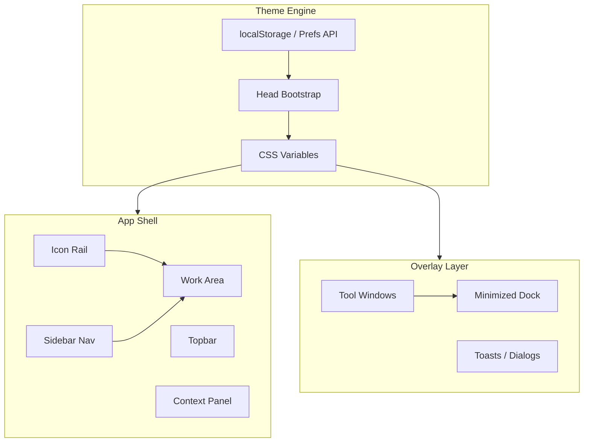
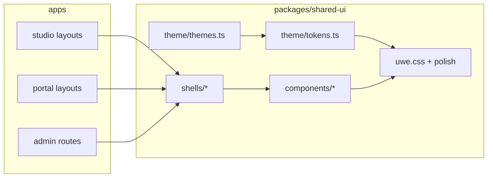

# Odysseus UI Architecture Analysis → UWE Native UI System

**Datum:** 2026-06-22  
**Referenz:** [pewdiepie-archdaemon/odysseus](https://github.com/pewdiepie-archdaemon/odysseus) (AGPL-3.0-or-later)  
**Lizenz-Policy:** [odysseus-license-risk.md](./odysseus-license-risk.md)  
**Bestehende Audits:** [odysseus-ui-audit.md](./odysseus-ui-audit.md), [uwe-current-design-audit.md](./uwe-current-design-audit.md)  
**Theme-Stand:** [uwe-theme-system.md](./uwe-theme-system.md)

Dieses Dokument analysiert Odysseus **architektonisch** als UI-Referenz und leitet daraus ein **UWE-natives** UI-System ab. Es kopiert keinen Odysseus-Code und ersetzt keine Business-Logik, APIs oder DB-Strukturen.

---

## Teil I — Odysseus-Analyse

### 1. Was macht Odysseus UI-architektonisch gut?

Odysseus ist keine Template-App (kein Tailwind/shadcn-Baukasten), sondern eine **handgebaute Workspace-Shell** aus FastAPI-Backend und statischem Frontend (HTML, CSS, ES-Module). Die Stärke liegt weniger in einzelnen Pixeln als in einer **konsistenten Shell-Architektur**, die viele Tools unter einem Dach vereint.

#### 1.1 Token-first Theming

- Farben, Typografie, Dichte und Effekte laufen über **CSS Custom Properties** (`--bg`, `--fg`, `--panel`, `--border`, `--red` als Akzent).
- Presets (dark, light, midnight, terminal, …) sind reine Token-Sets; Runtime-Optionen (Font, Density, Background, Frosted Glass) greifen auf dieselbe Variable-Schicht zu.
- Ein **Inline-Bootstrap im `<head>`** verhindert Theme-Flash vor dem ersten Paint.
- Persistenz in `localStorage` (optional Server-Sync) — Nutzer-Einstellungen überleben Reloads ohne Layout-Sprung.

**Warum das gut funktioniert:** Die gesamte Oberfläche liest aus einer kleinen Menge semantischer Tokens. Neue Views brauchen keine neuen Farb-Hex-Werte.

#### 1.2 Zentrale App-Shell

- Eine **einheitliche Shell** rahmt Chat, Dokumente, E-Mail, Galerie, Einstellungen ein.
- Feste Zonen: **Sidebar** (Navigation), **Hauptarbeitsfläche**, optional **Kontext-Spalte**, **Topbar**.
- Mobile: Sidebar als Drawer mit Backdrop, Body-Scroll-Lock, Escape-Schließen.
- Die Shell ist das **Layout-Gerüst** — Feature-Module pluggen sich ein, statt eigene Vollbild-Layouts zu bauen.

#### 1.3 Sidebar + Icon-Rail

- Primäre Navigation in der Sidebar; eine schmale **Icon-Rail** bietet Schnellzugriff auf Kern-Tools ohne die Sidebar zu öffnen.
- Aktive Zustände, Badges und Gruppierung sind visuell konsistent.
- Auf Mobile: Gesten und Toggle-Button; Safe-Area-Padding (`100dvh`, `env(safe-area-inset-*)`).

#### 1.4 Tool-Window / Modal-System

- Schwere Werkzeuge (Editor, Galerie, Einstellungen, Theme-Editor) öffnen als **überlagerte Arbeitsfenster**, nicht als harte Seitenwechsel.
- Fenster sind **verschiebbar**, **größenänderbar**, teils **minimierbar** und in einem **Dock** wiederherstellbar.
- Toasts und kleine Dialoge nutzen ein separates, leichtgewichtiges Overlay-Layer.
- **Weniger Überlappungs-Chaos:** Jedes Tool hat klare Z-Index-Stufen und Fokus-Management.

#### 1.5 Atmosphäre: Background Patterns & Frosted Glass

- Dekorative Hintergründe (Dots, Synapse, Constellation, …) sind **opt-in** und über Intensität/Farbe steuerbar.
- `theme-frosted` blurrt Panel-Flächen — Tiefe ohne harte Kanten.
- Canvas-Effekte sind `aria-hidden`; `theme-color` Meta folgt `--bg`.

#### 1.6 Font, Density, UI-Scale

- **Font-Familie** (mono/sans/serif) und **Density** (compact/comfortable/spacious) wirken global über Root-Klassen und `font-size`-Skalierung.
- Touch-Targets und Lesbarkeit skalieren indirekt mit — ein Hebel für Desktop- und Mobile-Nutzung.

#### 1.7 Dunkle Workspace-Atmosphäre

- Standard ist ein **ruhiger, dunkler Arbeitsraum** mit klarer Hierarchie: Hintergrund → Panel → Surface → interaktive Elemente.
- Akzentfarbe sparsam; semantische Farben (Error/Success) nur dort, wo Bedeutung trägt.
- Kein „gekauftes SaaS-Template“-Look — eher **Werkzeug-Cockpit**.

#### 1.8 Architektur-Überblick (konzeptionell)



---

### 2. Welche Prinzipien sind für UWE übertragbar?

| Odysseus-Prinzip | UWE-Relevanz | Bereits vorhanden | Noch offen |
|------------------|--------------|-------------------|------------|
| CSS-Variable Theme Tokens | Studio + Portal + Admin einheitlich steuerbar | `packages/shared-ui/src/theme/*`, `--uwe-*` in `uwe.css` | Vollständige Token-Abdeckung (sidebarBg, cardBg, inputBg, focusRing, radius, spacing, shadow) |
| Preset + User Preferences | DM-Cockpit vs. Spieler-Portal unterschiedlich | 9 Presets, `ThemeProvider`, DB-Sync | Feintuning Presets für „Campaign Brain“-Stimmung |
| No-flash Bootstrap | SSR/Hydration ohne Flackern | `ThemeBootstrapScript` | — |
| Zentrale App-Shell | Weniger Ad-hoc-Layouts | `AppShell.tsx` | Spezialisierte `StudioShell`, `PortalShell`, `AdminShell` |
| Sidebar + Mobile Drawer | Daily Admin OS + Wiki-Navigation | `AppShell` + `MobileComponents` | Icon-Rail optional; Gesten verfeinern |
| PageHeader / Arbeitsfläche | Klare Seitenhierarchie | `PageHeader`, `EmptyState` | Konsistente Nutzung auf allen Kernseiten |
| Background Patterns + Glass | Atmosphäre ohne Ablenkung | `BackgroundEffect`, `uwe-visual-polish.css` | Portal: dezenter; Studio: optional stärker |
| Font / Density / Scale | Accessibility + Power-User | `ThemeSettingsPanel` | Density in Komponenten-Spacing durchziehen |
| Tool-Overlays statt Vollbild-Sprünge | Generator, Medien, AI, Import | `CommandPalette` als Vorbild | `ToolWindow`-System (Phase 5) |
| Semantische Farben | GM-only / Player-visible / Status | `--uwe-dm-only`, Badges | Badge-Vereinheitlichung Wiki ↔ Studio |
| Dunkles Cockpit | Markenidentität UWE | Studio Slate/Indigo | Portal bewusst ruhiger; Admin statusorientiert |

#### 2.1 Strategische Entscheidung: Kein Tailwind Plus / shadcn als Pflicht

UWE nutzt bereits ein **CSS-Klassen-Designsystem** (`uwe.css`, ~2.700 Zeilen) und React-Komponenten in `@uwe/shared-ui`. Tailwind/shadcn wären ein **paralleles System** mit:

- doppelter Token-Schicht (Tailwind-Config vs. `--uwe-*`),
- Abhängigkeit von externen Template-Konventionen,
- höherem Migrationsaufwand ohne Gewinn für Player-Safety oder Domain-Logik.

**Empfehlung:** Tailwind nur dort belassen, wo es bereits sinnvoll eingebettet ist (falls überhaupt). Neue UI-Arbeit geht über **UWE Theme Tokens + Shared React Components + CSS-Module oder `uwe-*` Utilities**.

#### 2.2 Domänen-spezifische Übersetzung

| UWE-Domäne | Odysseus-Analog | UI-Ziel |
|------------|-----------------|---------|
| **Studio** | AI Workspace / Tools | Dunkles DM-Cockpit, dichte Navigation, Tool-Overlays |
| **Portal** | — (Odysseus hat kein Player-Portal) | Ruhiger Lesebereich, einfache Welt-Nav, keine Admin-Chaos-Optik |
| **Admin** | Settings / System Health | Status-Karten, Owner-Zugang prominent |
| **Life Brain / Capture** | Notes / Inbox | Studio-Shell, persönliche Daten nie im Portal-Stil |

---

### 3. Welche Teile sind wegen Architektur/Lizenz nicht direkt übertragbar?

#### 3.1 Lizenz (AGPL-3.0-or-later)

| Verboten | Erlaubt |
|----------|---------|
| Copy-Paste aus `theme.js`, `style.css`, Canvas-Skripten | Idee: Token-Modell, Picker-UX, Shell-Zonen |
| 1:1 Hex-Paletten oder Theme-IDs | Eigenständige Paletten in `themes.ts` |
| AGPL-Bootstrap-Skript transkribieren | Minimaler eigener `bootstrapScript.ts` |
| Odysseus-Branding in Produkt-UI | UWE-native Namen (`uwe-dark-fantasy`, …) |

Siehe [odysseus-license-risk.md](./odysseus-license-risk.md).

#### 3.2 Architektur-Mismatch

| Odysseus | Warum nicht 1:1 in UWE |
|----------|-------------------------|
| Vanilla JS + direkte DOM-Manipulation (`ui.js`) | UWE ist React 19 / Next.js 15 App Router — State gehört in Komponenten/Context |
| ES-Module ohne Framework | Kein Nachbau von `document.createElement`-Fenstern |
| Monolithisches `index.html` + `static/` | UWE: Server Components, Layouts, Route Groups |
| Chat-zentrierte Advanced Color Keys | UWE braucht Wiki-, Visibility- und Campaign-Semantik statt Chat-Bubbles |
| Server-Sync Theme API `/api/prefs/theme` | UWE hat `settings.app.themePreferences` + Studio Actions |
| Vollständiger Dock/Minimize-Stack sofort | Zu komplex für Phase 1 — schrittweise in Phase 5 |
| Custom Font Upload Pipeline | Nicht prioritär; System-Fonts reichen |
| Harmony Generator / Theme Import-Export | Optional später; nicht MVP |

#### 3.3 Produkt-Inhalt

Odysseus optimiert auf **Chat, Agents, E-Mail, Dokumente**. UWE optimiert auf **Welten, Canon, Visibility, Generator, Portal, Daily Admin OS**. UI-Patterns übernehmen, Feature-Oberflächen nicht imitieren.

---

### 4. Wie sollte UWE ein eigenes UI-System daraus ableiten?

UWE baut ein **React-natives, token-getriebenes Designsystem** in `@uwe/shared-ui`, das Odysseus-**Prinzipien** ohne Odysseus-**Code** umsetzt.

#### Leitplanken

1. **Eine Token-Schicht** — alle Farben/Abstände/Radien aus `--uwe-*`.
2. **Drei Shell-Varianten** — Studio (dicht), Portal (ruhig), Admin (status).
3. **Schichtenmodell** — Shell → Page → Komponenten → Overlays (ToolWindow).
4. **CSS + React** — Komponenten mit `className` auf `uwe-*` / `uwe-{component}`; kein Parallel-Framework.
5. **Inkrementelle Migration** — bestehende Seiten behalten Funktion; Optik wandert seitenweise.
6. **Player-Safety unangetastet** — Visibility-Filter in Packages, nicht nur UI.



---

## Teil II — UWE Native UI System (Konzept)

### 5. UWE Theme Tokens

Erweiterung der bestehenden `ThemeColorTokens` in `packages/shared-ui/src/theme/tokens.ts` und `:root`-Defaults in `uwe.css`.

#### 5.1 Farb-Tokens

| Token | CSS-Variable | Semantik |
|-------|--------------|----------|
| `bg` | `--uwe-bg` | Seitenhintergrund, tiefste Ebene |
| `fg` | `--uwe-fg` | Primärtext |
| `panel` | `--uwe-panel` | Topbar, Sidebar, feste Chrome-Flächen |
| `border` | `--uwe-border` | Standard-Rahmen |
| `accent` | `--uwe-accent` | Primär-Aktionen, aktive Nav |
| `danger` | `--uwe-danger` | Fehler, GM-only-Warnung, destruktiv |
| `success` | `--uwe-success` | Erfolg, player_visible |
| `muted` | `--uwe-fg-muted` | Sekundärtext, Hints |
| `sidebarBg` | `--uwe-sidebar-bg` | Sidebar-Hintergrund (leicht von `panel` abweichend) |
| `cardBg` | `--uwe-card-bg` | Karten, Stat-Blöcke |
| `inputBg` | `--uwe-input-bg` | Formularfelder |
| `focusRing` | `--uwe-focus-ring` | `:focus-visible` Outline |

Bereits vorhanden und beizubehalten: `surface`, `bgElevated`, `borderMuted`, `fgSubtle`, `accentHover`, `accentMuted`, `warning`, `info`, `wikiLink*`, `dmOnly`, `playerVisible`, Shell-Gradienten.

#### 5.2 Nicht-Farb-Tokens (neu zu ergänzen)

| Token | CSS-Variable | Werte (Beispiel) |
|-------|--------------|------------------|
| `radius` | `--uwe-radius-sm/md/lg` | 6px / 10px / 14px |
| `spacing` | `--uwe-space-1…8` | 4px-Skala × `densityScale` |
| `shadow` | `--uwe-shadow-sm/md/lg` | Panel- und Card-Elevation |
| `density` | `--uwe-density-scale` | 0.92 / 1 / 1.08 (existiert) |

**Anwendung:** `applyTheme.ts` setzt Farb-Tokens pro Preset; `html.uwe-density-*` und `--uwe-ui-scale` skalieren Spacing/Typo. Komponenten referenzieren nur Variablen, nie Roh-Hex.

#### 5.3 Scope-Defaults

| Scope | Default-Preset | Stimmung |
|-------|----------------|----------|
| Studio | `uwe-default` | Slate/Indigo Cockpit |
| Portal | `uwe-portal-purple` | Ruhiger, lesbar |
| Admin | `uwe-charcoal-desk` oder `uwe-default` | Sachlich, Status-Karten |

---

### 6. StudioShell

**Zweck:** DM-Arbeitsplatz — Navigation, Welten, Daily Admin OS, Generatoren.

**Basis:** Evolution von `AppShell.tsx` → `StudioShell.tsx` (Wrapper mit Studio-Defaults).

```
┌──────────────────────────────────────────────────────────┐
│ Topbar: Brand · Suche · Command (⌘K) · User/Settings    │
├──┬───────────────────────────────────────────┬───────────┤
│R │ Sidebar (Welten, Module, Life Brain)     │ Context   │
│a │                                           │ (Meta,    │
│i │ Main: PageHeader + Arbeitsfläche          │  AI,      │
│l │                                           │  Details) │
├──┴───────────────────────────────────────────┴───────────┤
│ Mobile: Bottom Nav · Drawer Sidebar · Context Sheet     │
└──────────────────────────────────────────────────────────┘
```

| Element | Verhalten |
|---------|-----------|
| **Sidebar** | `SidebarNav`, `SidebarSection`; auf Mobile Drawer + Backdrop |
| **Icon-Rail** (optional) | Schmale Spalte (48–56px) für Today, Capture, Search, Image Studio — nur Desktop, `data-rail-collapsed` |
| **Topbar** | `TopBarBrand`, `SearchField`, Aktionen; sticky, `panel`-Hintergrund |
| **PageHeader** | Titel, Summary, Meta, Actions — auf jeder Kernseite |
| **Arbeitsfläche** | `main` mit max-width optional pro Route |
| **Mobile** | Bestehende `MobileBottomNav`, `StickyActionBar`, FAB-Stacking-Order dokumentieren |

**Nicht ändern:** Auth-Routen ohne Shell; Wiki-HTML-Pipeline; API-Aufrufe in Pages.

---

### 7. PortalShell

**Zweck:** Spieler-Wiki — ruhig, lesbar, ohne Admin-Dichte.

| Unterschied zu Studio | Umsetzung |
|-----------------------|-----------|
| Weniger Nav-Einträge | Kurze `portalWorldBottomNav` |
| Kein Command Palette / Capture FAB | Bereits so |
| Weicher Hero | `PortalWorldHero`, `PortalNavByType` |
| Hellere bzw. violett-warme Tokens | Portal-Preset + `--uwe-accent` Override |
| Kein Context-Panel-Zwang | Context optional, auf Mobile eingeklappt |

```
┌────────────────────────────────────────┐
│ Topbar: Weltname · Suche · Login       │
├──────────┬─────────────────────────────┤
│ Sidebar  │ Wiki-Content (lesbar)       │
│ (Nav)    │                             │
├──────────┴─────────────────────────────┤
│ Mobile Bottom Nav (3–4 Items)          │
└────────────────────────────────────────┘
```

**Sicherheit:** Shell ändert keine Visibility — nur Präsentation.

---

### 8. AdminShell

**Zweck:** Owner/Admin — Systemstatus, Host, Integrations.

Aktuell: `apps/studio/app/admin/layout.tsx` prüft nur `requireAdminAccess()` — **keine eigene Shell**.

**Ziel-Layout:**

```
┌────────────────────────────────────────┐
│ Admin PageHeader + Zurück zu Studio    │
├────────────────────────────────────────┤
│ Status-Grid (Karten)                   │
│  Host · Cloudflare · Auth · SMTP       │
│  Users · Welten · Backups · Health     │
├────────────────────────────────────────┤
│ Detail-Sektionen / Tabs                │
└────────────────────────────────────────┘
```

| Status-Karte | Datenquelle (bestehend) |
|--------------|-------------------------|
| Host | Health / System-API |
| Cloudflare | Deployment-Config |
| Auth | Session, 2FA-Status |
| SMTP | Mail-Settings |
| Users | User-Liste |
| Welten | World-Count |

**Navigation:** Prominenter Link in Studio-Sidebar („Admin“ / „System“), Badge bei Warnung (`HealthBadge`-Pattern).

---

### 9. ToolWindow-System (React)

**Zweck:** Schwere Werkzeuge als Overlay-Arbeitsfläche — Generator, Medien, Import, AI-Preview — ohne Odysseus-Dock sofort nachzubauen.

#### Phase 5 MVP

```tsx
// Konzept — API-Oberfläche (noch nicht implementiert)
<ToolWindow
  title="Bild-Generator"
  open={open}
  onClose={() => setOpen(false)}
  size="lg"           // sm | md | lg | fullscreen
  initialFocusRef={…}
>
  {children}
</ToolWindow>
```

| Aspekt | Entscheidung |
|--------|--------------|
| State | React Context `ToolWindowProvider` oder kontrollierte Props pro Page |
| Fokus | Focus trap, Escape schließt, `role="dialog"`, `aria-modal` |
| Z-Index | Unter Command Palette definieren: Palette > ToolWindow > Sidebar Drawer |
| Mobile | Vollbild-Sheet (`size="fullscreen"`) |
| Minimize/Dock | **Später** — erst ein stabiles Modal-Fenster |
| Styling | `--uwe-panel`, `--uwe-shadow-lg`, `--uwe-radius-lg` |

**Kandidaten-Seiten:** Image Studio, Import-Assistent, AI-Run-Preview, Medien-Picker.

---

### 10. Shared UI Components (`@uwe/shared-ui`)

Ziel-Inventar — evolutionär aus bestehenden Bausteinen, nicht Big-Bang.

| Komponente | Status | Datei / Aktion |
|------------|--------|----------------|
| `Button` | CSS `.uwe-btn-*` | `components/Button.tsx` — Varianten: primary, secondary, ghost, danger |
| `Card` | CSS `.uwe-card` | `components/Card.tsx` |
| `Input` | CSS `.uwe-form` | `components/Input.tsx` |
| `Textarea` | Teilweise | `components/Textarea.tsx` |
| `Select` | Teilweise | `components/Select.tsx` |
| `Badge` | `StatusBadges` | Vereinheitlichen mit Wiki-Badges |
| `Tabs` | CSS in Settings | `components/Tabs.tsx` |
| `Dialog` / `ToolWindow` | Nur CommandPalette | `components/Dialog.tsx`, `components/ToolWindow.tsx` |
| `Table` | `.uwe-page-table` | `components/Table.tsx` + Ghost-Klassen fix |
| `Toast` | — | `components/Toast.tsx` + Provider |
| `PageHeader` | ✅ | `AppShell.tsx` |
| `EmptyState` | ✅ | `AppShell.tsx` |
| `LoadingState` | `LoadingPage` | Alias `LoadingState` |
| `ErrorState` | `ErrorAlert` | `components/ErrorState.tsx` |
| `SidebarItem` | Inline in `SidebarNav` | Extrahieren |
| `RailButton` | — | Neu für Icon-Rail |

**Export:** alles über `packages/shared-ui/src/index.ts`.

**Komponenten-Regeln:**

- Props: `variant`, `size`, `className` — kein inline `color: "#…"`.
- Semantik über Tokens (`danger` für destruktiv, nicht willkürliches Rot).
- Server Components: primitive Komponenten ohne `"use client"` wo möglich; interaktive mit Client-Boundary.

---

### 11. Design-Zielbild

| Kriterium | Studio | Portal | Admin |
|-----------|--------|--------|-------|
| Atmosphäre | Dunkles DM-Cockpit | Ruhige Leseumgebung | Sachlich, Status |
| Dichte | Höher, mehr Nav | Niedriger | Karten-Grid |
| Akzent | Indigo | Violett/Cyan Links | Neutral + Ampeln |
| Mobile | Bottom Nav + FAB | Bottom Nav | Studio-Shell |
| Überlappungen | ToolWindow geordnet | Minimal | Keine |
| Template-Look | Vermeiden | Vermeiden | Vermeiden |

---

## Teil III — Umsetzungsphasen

### Phase 1 — Analyse + Dokumentation ✅

- [x] Odysseus-Architektur analysieren
- [x] UWE-Ableitung konzipieren
- [x] Phasenplan festhalten

### Phase 2 — Theme Tokens + Shared UI Basis ✅

- [x] Token-Erweiterung (`sidebarBg`, `cardBg`, `inputBg`, `focusRing`, `radius`, `shadow`)
- [x] `resolveThemeColorTokens` + Bootstrap-Sync
- [x] Primitives: `Button`, `Card`, `Input`, `Textarea`, `Select`, `Badge`, `Tabs`, `Dialog`, `Table`, `Toast`, `ErrorState`, `LoadingState`, `SidebarItem`, `RailButton`
- [x] `uwe-components.css`

### Phase 3 — StudioShell / PortalShell / AdminShell ✅

- [x] `StudioShell` mit optionaler Icon-Rail
- [x] `PortalShell` für Spielerbereich
- [x] `AdminShell` + `AdminStatusGrid` / `AdminStatusCard`
- [x] `AppShell` Rail-Support

### Phase 4 — Wichtigste Seiten migriert ✅

- [x] Studio Dashboard (`/studio`)
- [x] Today (`/today`)
- [x] Admin-Übersicht (`/admin`)
- [x] Portal Welt-Home
- [x] Image Studio (Chrome)

### Phase 5 — ToolWindow ✅ (MVP)

- [x] React `ToolWindow` + `Dialog`
- [x] Pilot: `ImageStudioWorkspace` — Generator als Arbeitsfenster
- [ ] Dock/Minimize (bewusst zurückgestellt)

---

## Verwandte Dokumente

| Dokument | Inhalt |
|----------|--------|
| [odysseus-ui-audit.md](./odysseus-ui-audit.md) | Detailliertes Theme-File-Audit |
| [odysseus-license-risk.md](./odysseus-license-risk.md) | AGPL-Grenzen |
| [uwe-current-design-audit.md](./uwe-current-design-audit.md) | Ist-Zustand UWE UI |
| [uwe-theme-system.md](./uwe-theme-system.md) | Implementiertes Theme-Modul |
| [theme-migration-notes.md](./theme-migration-notes.md) | Offene Hardcodes |
| [theme-a11y-checklist.md](./theme-a11y-checklist.md) | A11y bei Migration |

---

## PR-Checkliste (folgende Phasen)

- [ ] `pnpm quality`
- [ ] Kein Odysseus-Quellcode in Diff
- [ ] GM-only / player_visible Badges kontrastreich in allen Presets
- [ ] Portal leak tests (`pnpm test:security`)
- [ ] Mobile Smoke: 390px Viewport, Bottom Nav + FAB
- [ ] Keine API/DB-Schema-Änderungen in UI-only PRs

---

*UWE-native UI architecture — Odysseus als Inspirationsquelle, nicht als Code-Lieferant.*
