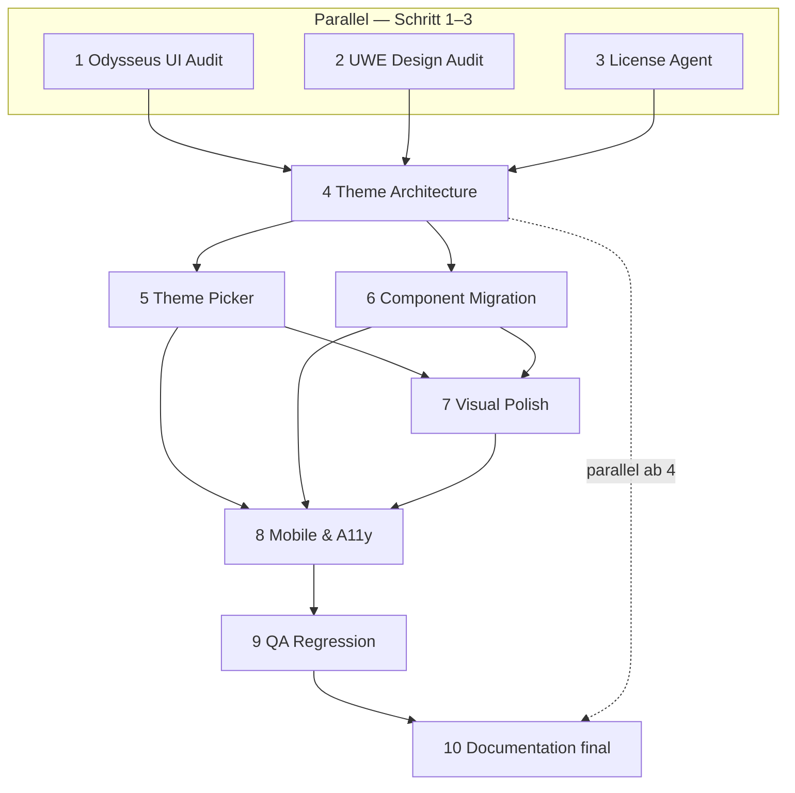

# Theme-System Orchestrierung (Subagent-Reihenfolge)

Dieses Dokument definiert die **verbindliche Ausführungsreihenfolge** für Cloud-Agents und Subagents beim UWE-Theme-System. Odysseus dient nur als **UX-Referenz** (AGPL-3.0) — kein Code-Copy, keine Odysseus-Lizenz im Produkt-UI.

## Status auf `main` (Stand: nach Orchestrierung #123–#127)

| Schritt | Agent | Artefakt | Status |
|---------|-------|----------|--------|
| 1 | Odysseus UI Audit | `docs/design/odysseus-ui-audit.md` | ✅ merged (#107) |
| 2 | UWE Design Audit | `docs/design/uwe-current-design-audit.md` | ✅ merged (#123) |
| 3 | License Agent | `docs/design/odysseus-license-risk.md` | ✅ merged (#107) |
| 4 | Theme Architecture | `packages/shared-ui/src/theme/*` | ✅ merged (#107) |
| 5 | Theme Picker | `ThemeSettingsPanel`, Settings-Tab | ✅ merged (#107) |
| 6 | Component Migration | Token-Migration in CSS/Komponenten | ✅ merged (#124) |
| 7 | Visual Polish | Patterns, Glass, Scrollbars, Preview | ✅ merged (#125) |
| 8 | Mobile & A11y | `ThemePicker`, Touch-Targets, Checklist | ✅ merged (#126) |
| 9 | QA Regression | `docs/design/theme-qa-report.md` | ✅ merged (#127) |
| 10 | Documentation | Finale Docs + diese Orchestrierung | ✅ merged (#128) |

## Ausführungsgraph



## Subagent-Anweisungen

### Schritt 1 — Odysseus UI Audit (parallel)

**Ziel:** Konzepte dokumentieren (Farben, Dichte, Patterns, Theme-Picker-UX), **ohne** Code oder Assets zu kopieren.

**Output:** `docs/design/odysseus-ui-audit.md`

**Branch-Vorlage:** `cursor/odysseus-ui-audit-9484`

**Gate:** Nur Docs, kein Code. AGPL-sauber.

---

### Schritt 2 — UWE Design Audit (parallel)

**Ziel:** Ist-Zustand von Studio/Portal erfassen: hardcodierte Farben, Komponenten-Inventar, Migrationsliste.

**Output:** `docs/design/uwe-current-design-audit.md`, Ergänzungen in `theme-migration-notes.md`

**Branch-Vorlage:** `cursor/uwe-design-audit-ce5c`

**Gate:** Keine Implementierung — nur Audit.

---

### Schritt 3 — License Agent (parallel)

**Ziel:** AGPL-Risiko bewerten, erlaubte vs. verbotene Übernahmen, keine Odysseus-Lizenz im privaten Deploy-UI nötig.

**Output:** `docs/design/odysseus-license-risk.md`

**Branch-Vorlage:** `cursor/odysseus-license-risk-d716`

**Gate:** Rechtliche Klarheit vor Architektur.

---

### Schritt 4 — Theme Architecture (nach 1/2/3)

**Ziel:** Token-System, Presets, SSR-Bootstrap, `ThemeProvider`, Storage pro App-Scope.

**Output:** `packages/shared-ui/src/theme/*`, `uwe.css` Token-Layer

**Branch-Vorlage:** `cursor/uwe-theme-system-3a6e` → **merged als #107**

**Gate:** `pnpm quality`, keine `odysseus-*` Theme-IDs im Code.

---

### Schritt 5 — Theme Picker (nach 4)

**Ziel:** Settings-UI für Theme, Font, Density, Background, Frosted Glass, UI-Scale.

**Output:** `ThemeSettingsPanel`, Studio `/settings?tab=appearance`

**Gate:** SSR-safe, `localStorage` pro Scope (`studio` / `portal`).

---

### Schritt 6 — Component Migration (nach 4, teilweise parallel zu 5)

**Ziel:** Hardcodierte `rgba`/`#hex` in `uwe.css`, `globals.css`, `wiki.css` und Komponenten durch `--uwe-*` ersetzen.

**Output:** Migrierte CSS/Komponenten, optional `scripts/migrate-theme-colors.mjs`

**Branch-Vorlage:** `cursor/theme-migration-9075`

**Gate:** Keine visuellen Regressionen; Lint sauber.

---

### Schritt 7 — Visual Polish (nach 4/5)

**Ziel:** Scrollbars, Motion, erweiterte Patterns, `VisualThemePreview`, `uwe-visual-polish.css`.

**Branch-Vorlage:** `cursor/visual-polish-d347`

**Gate:** `prefers-reduced-motion` respektieren.

---

### Schritt 8 — Mobile & Accessibility (nach 5/6/7)

**Ziel:** Kompakter `ThemePicker`, Touch-Targets ≥44px, Fokus-Ringe, `theme-a11y-checklist.md`.

**Branch-Vorlage:** `cursor/theme-mobile-a11y-f8d7`

**Gate:** WCAG 2.2 AA Ziel für Theme-UI.

---

### Schritt 9 — QA Regression (am Ende)

**Ziel:** Manueller + automatisierter Smoke-Check aller Presets, Portal/Studio, Hydration.

**Output:** `docs/design/theme-qa-report.md`

**Branch-Vorlage:** `cursor/theme-qa-report-4d71`

**Gate:** `pnpm quality` grün, Checkliste in `theme-migration-notes.md` abgehakt.

---

### Schritt 10 — Documentation (parallel ab 4, final nach 9)

**Ziel:** `uwe-theme-system.md` aktualisieren, Orchestrierung finalisieren, Verweise auf QA-Report.

**Output:** `docs/design/uwe-theme-system.md`, `theme-orchestration.md` (dieses Dokument)

**Gate:** Docs spiegeln tatsächlichen Code auf `main`.

---

## PR-Merge-Reihenfolge (abgeschlossen)

| # | PR | Schritt |
|---|-----|---------|
| #107 | `cursor/uwe-theme-system-3a6e` | 4 + 5 + Basis-Docs |
| #123 | `cursor/uwe-design-audit-merge-3a6e` | 1–3 (Design Audit + Orchestrierung) |
| #124 | `cursor/theme-migration-merge-3a6e` | 6 Component Migration |
| #125 | `cursor/visual-polish-merge-3a6e` | 7 Visual Polish |
| #126 | `cursor/theme-mobile-a11y-merge-3a6e` | 8 Mobile & A11y |
| #127 | `cursor/theme-qa-report-merge-3a6e` | 9 QA Regression |
| #128 | `cursor/theme-docs-final-3a6e` | 10 Documentation final |

**Bereits merged (separat):** #106 (Feature-Porting-Orchestrator)

**Nicht in dieser Pipeline:** Odysseus Feature Ports (#114–#120) — separater Track mit AGPL-Native-Review.

## Quality Gate (jede PR)

```bash
pnpm install --frozen-lockfile
pnpm quality
```

Siehe `.cursor/skills/ci-quality-gate/SKILL.md` und `AGENTS.md`.

## AGPL-Regeln (alle Agents)

- Odysseus = Produkt-/UX-Inspiration, **kein** Copy-Paste
- UWE-native Theme-IDs (`uwe-default`, nicht `odysseus-dark`)
- Palette-Werte bewusst abweichend dokumentieren
- Keine Odysseus-Lizenz im privaten Website-UI erforderlich (siehe License-Doc)
