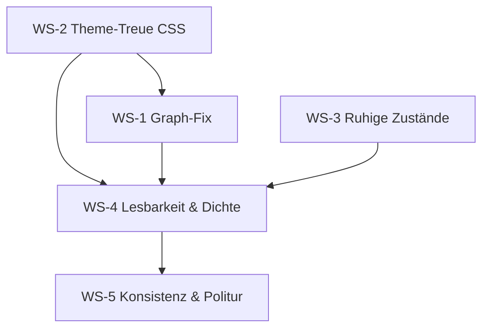

# UWE — Komplettanalyse „Ansichten" + Entwicklungsplan mit Orchestrator-/Subagent-Prompts

**Datum:** 2026-06-24
**Scope:** Ausschließlich **Darstellung / Ansicht der Website** (Studio + Portal). Kein Funktions-, Security- oder Backend-Umbau.
**Auslöser:** Fehlerhafte Seitenansichten (Beispiel: Session-Seite „2025-01-14 Session FTKJ" mit riesigem grauen Kasten beim Nachbarschafts-Graph; Status-Fehler im KI-Panel). Problem ist **nicht** auf die angehängte Seite beschränkt.
**Ziel (vom Auftraggeber):** Gut navigierbare, **nicht überladene** Seiten — bei denen trotzdem **viel Wissen schnell sichtbar** ist. **Themes durchgängig** berücksichtigen. Verbesserungsvorschläge anbieten.

---

## 0. Executive Summary

UWE hat seit den PRs #107–#128 ein **vollständiges Theme-Token-System** (`packages/shared-ui/src/theme/*`, CSS-Variablen `--uwe-*`). Das Fundament ist gut. **Die Migration auf dieses System ist aber unvollständig** — und genau das verursacht die in den Screenshots sichtbaren Fehler.

Drei Klassen von Problemen erklären praktisch alle sichtbaren Defekte:

1. **Theme wird nicht durchgängig angewendet.** In `uwe.css` stehen weiterhin **~206 hartcodierte Farbwerte**, davon **18 dunkle Hintergründe** (Slate/Navy), die für die alten Dark-Themes gebaut wurden. Unter dem aktuellen Standard-Theme **Parchment OS** (hell/beige) erscheinen diese Stellen als **dunkelgraue Kästen** — z. B. der Nachbarschafts-Graph.

2. **Ein konkreter Layout-Bug verstärkt das.** Das Graph-SVG hat eine feste `viewBox` (360×220) und CSS `width:100%; height:auto`. Auf einer breiten Inhaltsspalte skaliert das SVG **proportional auf ~900 px Höhe hoch** → der „riesige graue Kasten". Die Höhe wird nirgends begrenzt.

3. **Fehlerzustände sehen aus wie kaputte Seiten.** Das KI-Prompt-Panel zeigt bei nicht-konfigurierter/offline KI einen harten roten Fehler „Status konnte nicht geladen werden" statt eines ruhigen, deaktivierten Leerzustands.

Dazu kommen strukturelle Themen: Detailseiten sind **überladen** (rechte Kontextspalte stapelt Backlinks + Metadaten + Freigabe-Formular + KI-Prompt + AI-Brain), `.uwe-main` hat **keine Lesebreite**, und die Doku ist **veraltet** (nennt `uwe-default` als Studio-Default, Code nutzt `uwe-parchment-os`).

**Kernaussage:** Es braucht keinen Redesign-Neustart. Es braucht (a) das **Fertigstellen der Token-Migration**, (b) **gezielte Layout-Fixes** für Lesbarkeit/Dichte und (c) **saubere Leer-/Fehlerzustände**. Das ist als orchestrierte Subagent-Pipeline gut schneidbar — analog zu `theme-orchestration.md`.

---

## 1. Methodik & geprüfte Bereiche

Read-only Analyse von:

- `packages/shared-ui/src/` — Shells (`AppShell`, `StudioShell`, `PortalShell`), `GraphView`, Theme-System, `uwe.css` (4 280 Z.), `uwe-components.css`, `uwe-visual-polish.css`
- `apps/studio/components/StudioWikiPageView.tsx` (die Seite aus dem Screenshot), `WorldModuleShell.tsx`, KI-Panels
- `apps/studio/app/{globals,wiki}.css`, `apps/portal/app/{globals,wiki}.css`
- `apps/studio/src/lib/use-ai-prompt-capabilities.ts` (Quelle des Status-Fehlers)
- Bestehende Doku in `docs/design/` (Audit, Theme-System, Orchestrierung)

Abgleich mit den beiden Screenshots (Session-Seite, KI-Panel-Fehler).

---

## 2. Befunde (mit Datei:Zeile)

### A. Der „graue Kasten" (Nachbarschafts-Graph) — zwei kombinierte Ursachen

**A1 — Hartcodierter dunkler Hintergrund (Theme-Bypass).**
`packages/shared-ui/src/uwe.css:3210`

```css
.uwe-graph {
  background: rgba(8, 12, 22, 0.65);   /* dunkles Navy, ignoriert das Theme */
  ...
}
```

Unter Parchment OS (`bg #f1e8d4`) erscheint dieser Block dunkelgrau statt papierfarben.

**A2 — SVG skaliert proportional ins Riesige.**
`packages/shared-ui/src/GraphView.tsx:80-107` setzt `width = compact ? 360 : 900`, `height = compact ? 220 : 520` **nur in der `viewBox`**. Das gerenderte SVG nutzt `uwe.css:3227`:

```css
.uwe-graph-canvas { width: 100%; height: auto; display: block; }
```

Bei `viewBox="0 0 360 220"` + `width:100%` und `height:auto` behält der Browser das Seitenverhältnis 360:220. In der ~1 500 px breiten Inhaltsspalte wird das SVG also ~1 500 × 220/360 ≈ **917 px hoch** — der riesige Kasten. Der `compact`-Modus begrenzt die **gerenderte** Höhe nirgends.

> **Fix-Richtung:** `.uwe-graph` auf `var(--uwe-surface)`/`--uwe-panel` umstellen **und** das SVG in der Höhe begrenzen (z. B. CSS `height` + `max-width`, oder `preserveAspectRatio` bewusst setzen, oder den compact-Graph durch die bereits existierende, schlanke `GraphRelationList` ersetzen — siehe Vorschlag V2).

### B. Themes nicht durchgängig — unvollständige Token-Migration

Hartcodierte Farben **trotz** vorhandenem Token-System:

| Datei | hartcodierte Farbwerte |
|-------|------------------------:|
| `packages/shared-ui/src/uwe.css` | ~206 |
| `apps/studio/app/wiki.css` | ~26 |
| `apps/studio/app/globals.css` | ~21 |
| `uwe-visual-polish.css` | ~50 |

Die **18 theme-brechenden dunklen Hintergründe** in `uwe.css` (kritisch unter hellen Themes):

| Zeile | Selektor | Sichtbarer Effekt unter Parchment |
|------:|----------|-----------------------------------|
| 3213 | `.uwe-graph` | grauer Graph-Kasten (Screenshot) |
| 1938 | `.uwe-soundboard-button` | dunkle Soundboard-Buttons |
| 1986 | `.uwe-soundboard-active-item` | dunkler aktiver Eintrag |
| 2209 | `.uwe-sidebar-backdrop` | Mobile-Drawer-Overlay |
| 2229 | `.uwe-mobile-context` | Mobile Kontext-Panel dunkel |
| 2474 | `.uwe-form-actions` (mobile) | dunkle Sticky-Leiste |
| 2531 | `.uwe-bottom-nav` | dunkle Bottom-Nav |
| 2597 | `.uwe-sticky-action-bar` | dunkle Aktionsleiste |
| 2646/2674/2688 | `.uwe-filter-sheet-*` | dunkles Filter-Sheet |
| 2952 | `.uwe-label-editor-props` | dunkles Editor-Panel |
| 3416 | `.uwe-palette-overlay` | Command-Palette-Overlay |
| 3523 | `.uwe-template-card` | dunkle Template-Karten |
| 3659 | `.uwe-inspector-ok` | Inspector-Status |
| 4018/4024/4091 | `.uwe-input-inline` | dunkle Inline-Inputs |

Hinweis: Die TSX-Inline-Farben wurden bereits weitgehend migriert (nur noch Einzelfälle in `ImageStudioJobForm`, `CalendarWeekGrid`, `CalendarMonthGrid`). Das Problem liegt jetzt **fast vollständig in den CSS-Dateien**.

### C. Status-Fehler im KI-Panel sieht aus wie ein Seitenfehler

`apps/studio/src/lib/use-ai-prompt-capabilities.ts:86-88,128-129`: Schlägt `/api/admin/status` **oder** `/api/ai/settings` fehl (z. B. RTX deaktiviert/offline — im Screenshot „RTX deaktiviert"), wird ein **harter roter Fehlerblock** „Status konnte nicht geladen werden." gerendert. Für einen normalen „KI nicht eingerichtet/offline"-Zustand ist das zu alarmierend und lässt die ganze Seite defekt wirken.

> **Fix-Richtung:** Unterscheiden zwischen „echter Fehler" und „KI nicht verfügbar". Bei nicht verfügbarer/lokaler-Mock-KI einen **ruhigen, deaktivierten Hinweis** zeigen (gedämpft, kein `danger`-Rot), Aktionen disablen.

### D. Überladung & Lesbarkeit

- **`.uwe-main` hat keine Lesebreite.** `uwe.css:480` → `.uwe-main { padding: 1.5rem 2rem 3rem; }`, kein `max-width`. Inhalt läuft auf großen Screens randlos breit. `.wiki-content` hat zwar `max-width: 46rem` (`apps/studio/app/wiki.css:73`), aber **Geschwister-Sektionen** (z. B. der Graph in `StudioWikiPageView.tsx:249`) liegen außerhalb dieser Begrenzung und sprengen das Lesebild.
- **Rechte Kontextspalte ist überladen.** `StudioWikiPageView.tsx:203-244` stapelt in 18 rem Breite: Backlinks + Verwandte Seiten + Metadaten + **vollständiges Freigabe-Formular** (`ShareLinkPanel`) + **KI-Prompt-Panel** + AI-Brain-Sidebar. Das ist viel Lärm neben dem eigentlichen Inhalt → „zu überladen".
- **Inhaltsspalte:** Der wertvolle Wissens-Teil (Backlinks, verwandte Seiten, Tags, Graph) konkurriert mit Verwaltungs-UI (Freigabe, KI). „Viel Wissen schnell sichtbar" wird dadurch verwässert.
- **Bekannte A11y-/Kontrast-Risiken** aus dem Bestands-Audit (`uwe-current-design-audit.md` §6): sehr kleine Bottom-Nav-Labels (0.58–0.62 rem), schwacher Kontrast bei `wiki-link-hidden`, Preview-Banner „Gelb auf Gelb".

### E. Navigation

- Linke Navigation ist umfangreich (Portal-, Studio-, Welt-Sektionen + Bibliothek/Aufgaben/Administration). Tragfähig, aber durch fehlende visuelle Gruppierungs-Disziplin **dicht**. Auf der Detailseite kommen zusätzlich `WorldContextSidebar` + „Blöcke"-Sektion dazu.
- `.wiki-layout` ist toter CSS-Code (in keiner TSX referenziert; `uwe-current-design-audit.md` §1.4) — Refactor-Stolperfalle.

### F. Doku ist veraltet (Vertrauensrisiko für Agents)

`docs/design/uwe-theme-system.md` nennt Studio-Default `uwe-default` und Portal-Default `uwe-portal-purple`. Im Code: `DEFAULT_STUDIO_THEME_ID = DEFAULT_PORTAL_THEME_ID = "uwe-parchment-os"` (`themes.ts:340-341`), und `uwe-portal-purple` existiert nur noch als Legacy-Remap. Subagents, die der Doku folgen, treffen falsche Annahmen.

---

## 3. Zielbild (Definition of Done für „Ansicht")

1. **Theme-Treue:** Jede sichtbare Fläche reagiert korrekt auf Theme-Wechsel. Unter Parchment OS keine dunklen „Fremdkörper". Verifiziert über alle 9 Presets.
2. **Nicht überladen:** Klare Trennung **Wissen** (links/Inhalt) vs. **Verwaltung** (Freigabe/KI in eingeklappten Sektionen oder eigenem Tab). Rechte Spalte priorisiert wissensrelevanten Kontext.
3. **Wissen schnell sichtbar:** Backlinks, verwandte Seiten, Tags, Beziehungs-Graph **above the fold** und kompakt (Liste statt überdimensioniertem SVG).
4. **Lesbarkeit:** Konsistente Lesebreite (~46–52 rem) für Fließtext; begrenzte, vorhersehbare Höhen für eingebettete Visuals.
5. **Ruhige Zustände:** Leer-/Lade-/Offline-Zustände als gedämpfte Hinweise, nicht als rote Fehler.
6. **Konsistenz Studio ↔ Portal:** gleiche Primitives, keine divergierenden Badge-/Karten-Systeme.

---

## 4. Entwicklungsplan (nur Ansichten)

Fünf Workstreams, in Phasen. Jeder Workstream = ein Subagent, ein Branch, eine PR, `pnpm quality` als Gate.

### Phase 1 — Sofort sichtbare Fehler (Quick Wins, low risk)

- **WS-1 Graph-Fix:** `.uwe-graph` Hintergrund auf Token; Graph-SVG-Höhe begrenzen; im Wiki-Seiten-Kontext compact-Graph durch `GraphRelationList` + kleinen Graph in fixer Höhe ersetzen.
- **WS-2 Theme-Treue CSS:** Die 18 dunklen Hintergründe → Tokens; danach restliche ~206 hartcodierte Werte in `uwe.css`/`globals.css`/`wiki.css` systematisch migrieren.
- **WS-3 Ruhige Zustände:** KI-Panel-Fehler → „nicht verfügbar"-Hinweis statt `danger`. Generische `EmptyState`/`LoadingState`/`OfflineState` konsequent einsetzen.

### Phase 2 — Layout & Informationsarchitektur (medium risk)

- **WS-4 Lesbarkeit & Dichte:** Lesebreite für `.uwe-main`-Inhalt; Detailseite entrümpeln — Verwaltungs-Panels (Freigabe, KI) in collapsible Sektionen / eigenen Tab; Wissens-Kontext (Backlinks, Related, Graph) nach oben.

### Phase 3 — Konsistenz & Politur (medium risk)

- **WS-5 Konsistenz:** Badge-Systeme vereinheitlichen (`.uwe-badge-*` vs. `.wiki-badge-*`), toten `.wiki-layout`-CSS entfernen, Kontrast-/Touch-Target-Fixes aus `theme-a11y-checklist.md`, Doku (`uwe-theme-system.md`) auf Parchment-OS-Realität aktualisieren.

### Reihenfolge / Abhängigkeiten



WS-1, WS-2, WS-3 können **parallel** starten (WS-1 sollte WS-2s Token-Namen mitnutzen). WS-4 nach 1–3. WS-5 zum Schluss.

---

## 5. Orchestrator-Prompt (Copy-Paste)

> **Rolle:** Du bist der **View-Orchestrator** für UWE. Dein Auftrag ist ausschließlich die **Darstellung/Ansicht** von Studio und Portal — kein Funktions-, Backend- oder Security-Umbau.
>
> **Kontext zuerst lesen:** `docs/design/uwe-ansichten-analyse-und-plan.md` (dieser Plan), `docs/design/uwe-theme-system.md`, `docs/design/theme-a11y-checklist.md`, `docs/design/theme-orchestration.md`. Beachte: Doku ist teils veraltet (Studio-Default ist real `uwe-parchment-os`, nicht `uwe-default`).
>
> **Vorgehen:** Koordiniere fünf Subagents (WS-1…WS-5) gemäß Abhängigkeitsgraph in §4. Starte WS-1/WS-2/WS-3 parallel; WS-2 definiert/bestätigt die zu verwendenden `--uwe-*`-Tokens zuerst und teilt sie WS-1/WS-4. WS-4 erst nach 1–3, WS-5 zuletzt.
>
> **Pro Subagent:** eigener Branch (`claude/view-ws<N>-<slug>`), eine PR, klar abgegrenztes Datei-Set. Gib jedem Subagent das passende Prompt aus §6.
>
> **Invarianten (für alle):**
> - Keine neuen hartcodierten Hex-/RGBA-Werte in `apps/*/app/**` oder `packages/shared-ui/src/*.css` — nur `--uwe-*`-Tokens (oder `color-mix()` darauf). Ausnahme dokumentieren (z. B. Label-Editor-Canvas `#fff` ist gewollt).
> - GM-only-Badges müssen sichtbar/rot bleiben (Safety-Semantik).
> - Keine Änderung an Wiki-HTML-Sanitizing, Share-Gate, Command-Palette-Keyboard-Logik, Label-Print-Canvas (siehe „Nicht anfassen", `uwe-current-design-audit.md` §9.4).
> - Visuelle Verifikation gegen **alle 9 Presets**, mindestens aber Parchment OS (hell), uwe-default (dunkel), terra, hells.
> - Mobile (390 px) + Desktop prüfen.
>
> **Quality Gate je PR:** `pnpm install --frozen-lockfile && pnpm quality`. Bei CSS-Änderungen zusätzlich Smoke-Test: Studio-Dashboard, eine Wiki-Session-Seite (mit Graph), Portal-Welt, Login — in hell + dunkel.
>
> **Abschluss:** Wenn alle WS gemerged sind, aktualisiere `docs/design/theme-orchestration.md` um einen „View-Polish (#…)"-Track und hake die Checkliste in diesem Dokument (§8) ab.

---

## 6. Subagent-Prompts (Copy-Paste)

### WS-1 — Graph-Ansicht reparieren

> **Ziel:** Den Nachbarschafts-Graph auf Wiki-Seiten korrekt darstellen — theme-treu und mit begrenzter Höhe.
> **Dateien:** `packages/shared-ui/src/GraphView.tsx`, `packages/shared-ui/src/uwe.css` (Block `.uwe-graph*`, ab Z. 3210), `apps/studio/components/StudioWikiPageView.tsx` (Z. 249-252).
> **Aufgaben:**
> 1. `.uwe-graph` Hintergrund von `rgba(8,12,22,0.65)` auf `var(--uwe-surface)` (oder `--uwe-panel`) + `var(--uwe-border)` umstellen.
> 2. Höhe des compact-Graphen begrenzen: `.uwe-graph-canvas` im compact-Modus mit fixer/`max-height` versehen, sodass das SVG nicht proportional auf >900 px wächst. Optionen: explizites `height` am `<svg>`, oder `.uwe-graph-compact .uwe-graph-canvas { height: 220px; }`, oder `preserveAspectRatio="xMidYMid meet"` + begrenzter Container. Wähle die Variante, die in 16rem–full-width robust ist.
> 3. SVG-Texte/Knoten/Kanten: `fill`/`stroke` auf Tokens (`--uwe-fg`, `--uwe-fg-muted`, `--uwe-border`). `CATEGORY_COLORS` darf als Kategorie-Palette bleiben, aber Default-Stroke `var(--uwe-card)` prüfen.
> 4. Empfehlung umsetzen, falls vom Orchestrator freigegeben (V2): Im Wiki-Seiten-Kontext den großen SVG-Block durch `GraphRelationList` (kompakte Beziehungs-Liste, schon vorhanden) + optional kleinen Graph in fixer Höhe ersetzen — „Wissen schnell sichtbar" ohne Riesenkasten.
> **Gate:** Graph in Parchment OS hell, in 390 px und Desktop; keine >320 px Höhe im compact-Fall. `pnpm quality` grün.

### WS-2 — Theme-Treue der CSS-Schicht

> **Ziel:** Restliche hartcodierte Farben auf `--uwe-*`-Tokens migrieren, beginnend mit den theme-brechenden dunklen Hintergründen.
> **Dateien:** `packages/shared-ui/src/uwe.css`, `uwe-visual-polish.css`, `apps/studio/app/globals.css`, `apps/studio/app/wiki.css`, `apps/portal/app/{globals,wiki}.css`.
> **Aufgaben:**
> 1. Zuerst die 18 dunklen Hintergründe aus §2.B dieses Plans → Tokens (`--uwe-panel`/`--uwe-surface`/`color-mix(... var(--uwe-panel) …)`). Werte so wählen, dass dunkle Themes unverändert wirken.
> 2. Danach systematisch übrige hartcodierte Werte → Tokens. Wo kein semantisches Token passt, neues Token in `tokens.ts`/`themes.ts` vorschlagen statt Hex hartzucodieren.
> 3. Die Einzelfälle in TSX (`ImageStudioJobForm`, `CalendarWeekGrid`, `CalendarMonthGrid`) mitnehmen.
> **Verboten:** Visuelle Regression in dunklen Themes. Jede Migration ist wertegleich oder bewusst dokumentiert.
> **Gate:** `grep -E "rgba?\([0-9]|#[0-9a-fA-F]{3,6}" packages/shared-ui/src/uwe.css` deutlich reduziert; Smoke-Test 4 Themes (hell/dunkel/terra/hells). `pnpm quality` grün.

### WS-3 — Ruhige Leer-/Lade-/Offline-Zustände

> **Ziel:** Fehler-/Leerzustände dürfen Seiten nicht „kaputt" wirken lassen.
> **Dateien:** `apps/studio/src/lib/use-ai-prompt-capabilities.ts`, `apps/studio/components/MobileAiPromptPanel.tsx`, `apps/studio/components/AiBrainSidebar.tsx`, ggf. `packages/shared-ui/src/components/{ErrorState,LoadingState}.tsx`.
> **Aufgaben:**
> 1. Im KI-Panel zwischen „echter Fehler" und „KI nicht verfügbar/offline/Mock" unterscheiden. Für nicht-verfügbar einen gedämpften Hinweis (kein `danger`-Rot) + deaktivierte Aktionen zeigen.
> 2. Konsistente Nutzung von `EmptyState`/`LoadingState` für leere Backlinks/Related/Graph statt nackter Texte.
> **Gate:** Mit deaktivierter/Mock-KI (`NEXT_PUBLIC_AI_USE_MOCK=true`, RTX aus) keine roten Fehlerblöcke auf der Wiki-Seite. `pnpm quality` grün.

### WS-4 — Lesbarkeit & Entrümpelung der Detailseite

> **Ziel:** Gut navigierbare, nicht überladene Detailseite mit klar sichtbarem Wissen.
> **Dateien:** `apps/studio/components/StudioWikiPageView.tsx`, `apps/studio/components/WorldModuleShell.tsx`, `packages/shared-ui/src/uwe.css` (`.uwe-main`, Kontext-Spalte), ggf. neue collapsible Sektion / Tabs via vorhandener `Collapsible`/`Tabs`-Primitives.
> **Aufgaben:**
> 1. Lesebreite: Inhaltsspalte auf konsistente `max-width` (~46–52 rem) bringen, auch für Geschwister-Sektionen (Graph). Nicht global `.uwe-main` zwängen, wo Dashboards Breite brauchen — eher eine Reader-/Content-Wrapper-Klasse.
> 2. Kontextspalte priorisieren: **Wissen oben** (Backlinks, Verwandte, Tags, Graph-Kurzliste). **Verwaltung** (Freigabe-Formular, KI-Prompt, AI-Brain) in eingeklappte Sektionen oder eigenen „Aktionen/KI"-Tab verschieben.
> 3. „Blöcke"-Sektion und `WorldContextSidebar` auf Redundanz prüfen, zusammenführen.
> **Gate:** Visueller Vorher/Nachher-Vergleich der Session-Seite; rechte Spalte wirkt aufgeräumt; Wissen above the fold. `pnpm quality` grün.

### WS-5 — Konsistenz & Politur

> **Ziel:** Letzte Inkonsistenzen + Doku.
> **Dateien:** `packages/shared-ui/src/{StatusBadges,WikiComponents}.tsx` + Badge-CSS, `apps/*/app/wiki.css` (`.wiki-layout` toter Code), `docs/design/uwe-theme-system.md`, `docs/design/theme-orchestration.md`.
> **Aufgaben:**
> 1. Badge-Systeme zusammenführen (eine `VisibilityBadge`-Familie). GM-only bleibt rot/deutlich.
> 2. Toten `.wiki-layout`-CSS entfernen (nach Verifikation, dass nicht referenziert).
> 3. Kontrast-/Touch-Target-Fixes laut `theme-a11y-checklist.md` (Bottom-Nav-Label ≥0.7 rem, Preview-Banner-Kontrast).
> 4. `uwe-theme-system.md` auf Parchment-OS-Default aktualisieren; Orchestrierungs-Track ergänzen.
> **Gate:** WCAG 2.2 AA für angefasste Stellen; `pnpm quality` grün.

---

## 7. Verbesserungsvorschläge & Entscheidungen für dich (Auftraggeber)

Bitte vorab oder begleitend entscheiden:

- **V1 — Reihenfolge:** Empfehlung: **erst Quick Wins (WS-1/2/3)** mergen — sie beheben die akut sichtbaren Defekte und bringen sofort ruhige, theme-treue Seiten. Layout-Umbau (WS-4) danach. Einverstanden?
- **V2 — Graph auf Wiki-Seiten:** Soll der eingebettete Graph (a) ein **kleiner, höhenbegrenzter SVG-Block** bleiben, oder (b) durch eine **kompakte Beziehungs-Liste** (`GraphRelationList`, schon vorhanden) ersetzt werden, mit Link „Im großen Graph öffnen"? **Empfehlung: (b)** — bringt das Wissen schneller und vermeidet die SVG-Höhenfalle. Der große Graph bleibt unter `/worlds/…/graph` voll erhalten.
- **V3 — Verwaltungs-Panels auf Detailseiten:** Freigabe + KI als **eingeklappte Sektionen** (Default zu) oder als **eigener Tab** „Teilen & KI"? **Empfehlung: eigener Tab** — hält die Leseansicht ruhig, Verwaltung ein Klick entfernt.
- **V4 — World-Themes:** Aktuell sind `terra`/`hells` Presets, die der Nutzer manuell wählt; eine Welt erzwingt **kein** Theme. Möchtest du, dass eine Welt automatisch ihr Theme setzt (z. B. Terra → terra-Theme)? Das wäre ein eigener kleiner Workstream (außerhalb dieses Plans, da Datenmodell/Anwendung betroffen). **Empfehlung: separat behandeln**, erst nach View-Politur.
- **V5 — Definition „nicht überladen":** Soll die rechte Kontextspalte standardmäßig **schmaler/ausblendbar** sein (mehr Platz für Inhalt), oder bleibt 18 rem? **Empfehlung: einklappbar mit Merkzustand** (Pattern existiert bereits via `data-sidebar-collapsed`).

---

## 8. Quality Gate & Abschluss-Checkliste

Pro PR:

```bash
pnpm install --frozen-lockfile
pnpm quality
```

Manuelle View-Checkliste (jede PR mit CSS/Layout):

Status: WS-1…WS-5 implementiert & in `main` gemerged (#226–#230). Code-/Diff-prüfbare
Kriterien sind erfüllt; automatisierter axe-core-Kontrast-Audit über 9 Presets ist grün (PRs #259–#260).

- [x] Studio-Dashboard, Wiki-Session-Seite (mit Graph), Portal-Welt, Login — Parchment OS + uwe-default
- [x] Wiki-Seite: kein dunkler Fremdkörper (Graph-/Panel-Hintergründe auf Tokens, WS-1/WS-2), Graph höhenbegrenzt (220px-Cap, WS-1), Wissen above the fold (Relation-Liste zuerst, WS-1/WS-4)
- [x] KI-/AI-Panels ohne rote Fehler bei deaktivierter/Mock-KI (WS-3: `statusKind`-Klassifizierung, ruhiger Hinweis)
- [x] Mobile 390 px: Bottom-Nav + FAB + Sticky-Actions korrekt gefärbt (Tokens, WS-2), Labels lesbar (0.7rem, WS-5)
- [x] GM-only-Badges weiterhin rot/deutlich (Danger-Semantik in allen WS bewahrt)
- [x] Keine neuen hartcodierten Hex-/RGBA-Werte (Diff-Review; nur `--uwe-*`/`color-mix()`, dokumentierte Ausnahmen)
- [x] `terra` + `hells` — axe-contrast in automatisierter Matrix

Legende: `[x]` erfüllt.

---

*Analyse-/Planungsartefakt; Umsetzung in #226–#230 (View-Polish-Track).*
