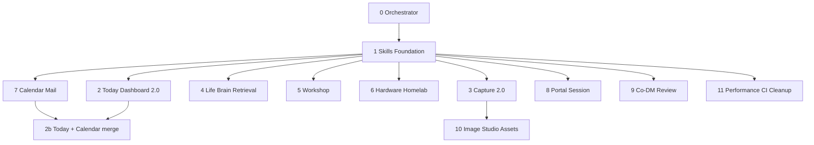

# UWE Product Orchestrator Plan

Stand: 2026-06-19

Dieses Dokument koordiniert die Evolution von UWE: vom DnD-/Campaign-Brain zum privaten, self-hosted **Alltags- und Hobby-Betriebssystem** (Daily Admin OS + DnD Studio + Spielerportal).

## Annahmen (Orchestrator)

| Annahme | Begründung |
|---------|------------|
| **SQLite bleibt Prod-Default** | `docs/postgresql.md` — Postgres dual-client vorhanden, Migration optional später |
| **Daily Admin OS bleibt Studio-only** | Kein Portal-Leak persönlicher Admin-Daten |
| **Kein Familien-/Meal-/Haushalts-Modul** | `docs/prompts/UWE_DAILY_ADMIN_OS_CURSOR_PROMPTS.md` |
| **KI-Outputs immer Proposal/Draft** | Kein Auto-Apply auf Kanon oder Life Brain |
| **Cloud-KI ohne Brain/Welt/Life-Kontext** | `packages/ai-brain/src/router/privacyGuard.ts` |
| **RTX nur LAN, nie öffentlich** | `tools/uwe-rtx-connector`, `packages/security/src/security/rtx-boundary.ts`, `DEPLOYMENT_SECURITY.md` |
| **Mobile-first für Capture, Today, Portal, Werkstatt** | `apps/studio/src/lib/mobile-nav.ts` |
| **Kleine PRs, sequenzielle Konfliktvermeidung** | Ein Subagent pro Domäne, getrennte Dateipfade wo möglich |

## Ist-Stand (Kurz)

Siehe `docs/FEATURE_MATURITY_MATRIX.md` und `docs/REPO_AUDIT.md`.

| Domäne | Status | Hauptlücken |
|--------|--------|-------------|
| Today / Daily Admin OS | ✅ Basis | Kalender auf `/today`, `nextActionDate`, Ampel-Details |
| Capture | ✅ Basis | ~~`file_image` ohne Upload~~ (überholt — Upload implementiert: `/api/capture/upload` + `CaptureImageUpload`); keine Triage-Workflows |
| Life Brain | ✅ CRUD + Retrieval | ~~Kein Embedding/Retrieval~~ (überholt — implementiert: RTX-Embeddings + Keyword-Fallback, `/api/life-brain/search`) |
| Workshop | ✅ CRUD | Status-Workflow, Material-Tracking, DnD-Links |
| Hardware/Homelab | ✅ Registry | Runbooks, Security-Cockpit erweitern |
| DnD Studio + Portal | ✅ Kern | Session Experience, Co-DM, Review-UI |
| Kalender | 🔶 Teilweise | `/today`-Aggregation, CalDAV write-back UI |
| Mail Center | ✅ Kern | Session-/System-Templates, Brain-Integration (docs only) |
| Image Studio | 🔶 Phase 2 | Canvas, Cloud-Policy, Capture-Pipeline |
| Performance/CI | ❌ Fehlt | Testwelt 10k+, Tag-Cleanup, Package-Split |

## Subagent-Arbeitspakete

### 0 — Orchestrator (dieses Dokument)

**Scope:** Koordination, Reihenfolge, Skill-Pflege, PR-Schnittstellen.

**Dateien:** `docs/engineering/product-orchestrator-plan.md`, `.cursor/skills/uwe-orchestrator/`

**Deliverables:** Plan, Subagent-Prompts, Fortschritt in PR-Bodies.

---

### 1 — Skills & Architecture Foundation

**Scope:** Cursor Rules/Skills aktualisieren; `uwe-project.mdc` um Daily Admin OS erweitern; fehlende Skills anlegen.

**Primäre Dateien:**

- `.cursor/rules/uwe-project.mdc`
- `.cursor/skills/*` (neu: `daily-admin-os`, `life-brain-retrieval`, `image-studio-workflows`, `uwe-orchestrator`)
- `docs/engineering/cursor-workflow.md`
- `.cursor/skills/ci-quality-gate/references/failure-patterns.md`

**Nicht anfassen:** App-Code, Prisma-Schema.

**Tests:** `pnpm docs:check`

**PR-Größe:** Klein (~10 Dateien).

---

### 2 — Today Dashboard / Daily Admin OS 2.0

**Scope:** `/today` als zentrales Cockpit — Kalender-Snippets, Capture-Inbox-Zähler, Vertrags-Alerts, Workshop-Next-Actions, mobile Layout.

**Primäre Dateien:**

- `apps/studio/app/today/**`
- `apps/studio/src/lib/today-dashboard.ts`
- `packages/database/src/life-admin-service.ts` (`getTodaySummary`)
- `apps/studio/src/lib/today-dashboard.test.ts`

**Abhängigkeiten:** Subagent 8 (Kalender) kann parallel starten; Today integriert Kalender-Events in Folge-PR.

**Tests:** `today-dashboard.test.ts`, `life-admin-service.test.ts`

---

### 3 — Capture 2.0 & Triage

**Scope:** Inbox-Triage (status: new/triaged/archived), `file_image` Upload-Pipeline, Verknüpfung zu Projects/Workshop/Image Studio.

**Primäre Dateien:**

- `packages/database/prisma/schema.prisma` (`CaptureEntry` — ggf. `triageStatus`)
- `packages/database/src/life-admin-service.ts`
- `apps/studio/app/capture/**`
- `apps/studio/app/capture-actions.ts`
- `apps/studio/components/GlobalCaptureFab.tsx`

**Abhängigkeiten:** Nach Subagent 1; Image-Upload optional mit Subagent 11 koordinieren.

**Tests:** Capture service tests, MIME/upload security wenn Upload.

---

### 4 — Life Brain Retrieval

**Scope:** Embeddings + semantisches Retrieval für `PersonalBrainDocument`/`PersonalBrainFact` — analog DnD Brain, strikt RTX-only.

**Primäre Dateien:**

- `packages/database/src/personal-brain-service.ts` (neu oder erweitern)
- `packages/ai-brain/src/brain/` (Retrieval-Patterns wiederverwenden)
- `packages/ai-brain/src/router/privacyGuard.ts`
- `apps/studio/app/life-brain/**`
- `docs/life-brain-privacy.md`

**Abhängigkeiten:** Nach Subagent 1; keine parallelen Änderungen an `privacyGuard.ts` mit Mail/AI Subagents.

**Tests:** `personal-brain-privacy.test.ts` erweitern, Retrieval smoke.

---

### 5 — Workshop / Miniaturen / Terrain / 3D-Druck

**Scope:** Status-Workflow, Material-/Druck-Parameter, DnD-Welt-Links, mobile Listenansicht.

**Primäre Dateien:**

- `packages/database/prisma/schema.prisma` (`WorkshopProject`)
- `packages/database/src/life-admin-service.ts`
- `apps/studio/app/workshop/**`

**Abhängigkeiten:** Unabhängig von Brain; Capture-Link optional nach Subagent 3.

---

### 6 — Hardware / Homelab / Security / Runbooks

**Scope:** Runbook-Felder, Security-Warnungen, RTX/eGPU-Status, Setup-Checklisten, `/admin/status` Integration.

**Primäre Dateien:**

- `apps/studio/app/hardware/**`
- `apps/studio/app/admin/status/**`
- `packages/database/src/life-admin-service.ts` (`HardwareDevice`)
- `apps/studio/src/lib/hardware-utils.ts`
- `packages/cookbook/` (Diagnostics, Hardware-Fit)

**Abhängigkeiten:** Nach Subagent 1 (Security-Skill).

---

### 7 — Kalender & Mail Center

**Scope:** Kalender → Today; Mail-Templates für Sessions/System; SSRF/ENV-Gates; optional CalDAV write-back UI.

**Primäre Dateien:**

- `packages/calendar/**`, `packages/mail/**`
- `apps/studio/app/calendar/**`, `apps/studio/app/mail/**`
- `packages/database/src/calendar-service.ts`, mail services

**Abhängigkeiten:** Kalender-Snippet für Today (Subagent 2) als Folge-PR; Mail weitgehend unabhängig.

**Referenz:** `docs/ai-brain-mail/`, `docs/CALENDAR_INTEGRATION.md`

---

### 8 — Spielerportal / Session Experience

**Scope:** Session-Handouts, Soundboard mobile, Share-Links, Player-Notes UX; keine Admin-Leaks.

**Primäre Dateien:**

- `apps/portal/**`
- `packages/database/src/permissions.ts`
- `packages/security-tests/**`

**Abhängigkeiten:** Unabhängig von Daily Admin OS.

**Tests:** `pnpm test:security`, `pnpm test:leaks`

---

### 9 — Admins / Co-DMs / Review Workflow

**Scope:** `WorldMembership`-Rollen, Co-DM-Berechtigungen, AI Review/Apply UI, Secrets/Reveal-UI.

**Primäre Dateien:**

- `packages/auth/src/roles.ts`
- `packages/database/src/permissions.ts`
- `apps/studio/app/worlds/**/review` (falls vorhanden)
- AI Runs/Proposals UI

**Abhängigkeiten:** Nach Security-Foundation; Schema-Änderungen mit `database-migration-review` Skill.

---

### 10 — Image Studio / Assets / Labels

**Scope:** Provider-Routing, failed-Status, Capture→Image Studio Pipeline, Label-Workflows.

**Primäre Dateien:**

- `packages/image-studio/**`
- `apps/studio/app/image-studio/**`
- `packages/assets/**`
- `docs/IMAGE_STUDIO.md`, `docs/LABELS.md`

**Abhängigkeiten:** Capture Upload (Subagent 3) für Pipeline.

---

### 11 — Performance / Tags / CI / Cleanup

**Scope:** Performance-Testwelt, Tag-Dedupe-Tool, Package-Cleanup, Service-Splitting wo sinnvoll.

**Primäre Dateien:**

- `scripts/` (seed performance world)
- `packages/database/` (tag utilities)
- `docs/CODE_CLEANUP_REPORT.md`
- `package.json`, `turbo.json`

**Abhängigkeiten:** Zuletzt — vermeidet Konflikte mit Feature-PRs.

---

## Empfohlene Ausführungsreihenfolge



### Phase A — Foundation (sequenziell)

1. **Orchestrator** — Plan + Koordination
2. **Skills & Architecture Foundation** — Rules, Skills, Doku

### Phase B — Daily Admin Kern (parallel, getrennte Pfade)

3. **Today Dashboard 2.0** — `today-dashboard.ts`, `/today`
4. **Capture 2.0 & Triage** — `capture-actions.ts`, `CaptureEntry`
5. **Workshop** — `workshop/`, `WorkshopProject`
6. **Hardware / Homelab** — `hardware/`, `hardware-utils.ts`

### Phase C — Intelligence & Integration

7. **Life Brain Retrieval** — `ai-brain`, `life-brain/` (exklusiv `privacyGuard.ts`)
8. **Kalender & Mail** — `calendar/`, `mail/` → danach **Today + Calendar** Folge-PR

### Phase D — DnD & Media (parallel zu C möglich)

9. **Spielerportal / Session Experience** — `apps/portal`
10. **Admins / Co-DMs / Review** — `permissions.ts`, AI Review UI

### Phase E — Assets & Hardening (zuletzt)

11. **Image Studio / Assets / Labels** — nach Capture Upload
12. **Performance / Tags / CI / Cleanup** — abschließend

## Konflikt-Matrix (nicht parallel bearbeiten)

| Ressource | Subagents |
|-----------|-----------|
| `privacyGuard.ts`, AI router | 4, 7, 10 |
| `life-admin-service.ts` | 2, 3, 5, 6 — sequenzieren oder kleine PRs |
| `schema.prisma` | 3, 4, 5, 9 — eine Migration pro PR |
| `today-dashboard.ts` | 2, 7 (Kalender-Folge) |
| `packages/security-tests` | 8, 9 |

## Subagent-Standard-Prompt (Vorlage)

```text
Du bist Subagent N für UWE: [Domäne].

1. Lies docs/engineering/product-orchestrator-plan.md Abschnitt Subagent N.
2. Lies den passenden Skill in .cursor/skills/ (daily-admin-os, life-brain-retrieval, …).
3. Finde bestehende Dateien per Grep/Read — respektiere Konventionen.
4. Kleine, reviewbare PR auf cursor/<name>-adcf.
5. Tests ergänzen; pnpm quality vor Push.
6. Kurze Ergebniszusammenfassung: Dateien, Entscheidungen, Risiken, nächster Schritt.
```

## Fortschritt

| Subagent | Status | PR |
|----------|--------|-----|
| 0 Orchestrator | In Arbeit | — |
| 1 Skills Foundation | In Arbeit | — |
| 2–11 | Geplant | — |

Aktualisieren bei jedem abgeschlossenen Subagent-PR.
