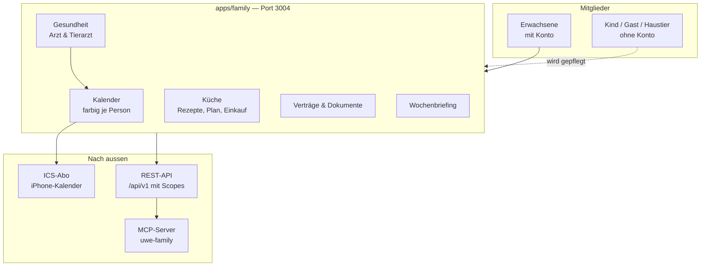

# UWE Family

Family (Port 3004) ist der gemeinsame Haushalts-Bereich: Kalender, Mitglieder, Küche,
Verträge, Dokumente, Gesundheitsakte. Zugang ist ein einziges Häkchen pro E-Mail-Adresse —
`Family`, gesetzt im Command Center. Es gibt keine Rollen und keine Welt-Zuordnung: wer
herein darf, sieht alles, ausser dem privaten Chat der anderen.

## Was Family ausmacht



## Die Bereiche im Einzelnen

| Doku | Thema |
|------|-------|
| [mitglieder.md](mitglieder.md) | Personen mit und ohne Konto, Farben, Zugangsmodell |
| [kalender.md](kalender.md) | Termine je Person, fremde Kalender, iPhone-Abo |
| [api.md](api.md) | Externe API, Scopes, Token, MCP-Server |
| [kochbuch.md](kochbuch.md) | Rezepte, KI-Aufbereitung, 6×4-Zoll-Druck |
| [konto.md](konto.md) | Passwort, Zwei-Faktor, FaceID |

## Wo der Code liegt

| Was | Wo |
|-----|-----|
| Oberfläche und Routen | `apps/family` |
| Haushalts-Domäne | `packages/family-core` |
| Rezepte, Plan, Einkauf | `packages/kitchen` |
| Kalender-Datenzugriff | `packages/database/src/calendar-service.ts` |
| iCal/CalDAV | `packages/calendar` |
| MCP-Server | `packages/mcp/src/tools/family.ts` |
| Daten | `uwe-family.db` (Schema: `packages/database/prisma/family/schema.prisma`, **generiert**) |

Das Family-Schema wird aus dem Haupt-Schema erzeugt. Modelle werden in
`packages/database/prisma/schema.prisma` verfasst, in
`packages/product-contracts/src/prisma-model-boundaries.ts` als `F("family")` markiert und
dann von `scripts/generate-brain-schema-split.mjs` verschoben — nicht von Hand im
Family-Schema editieren.

## Einrichten

```bash
pnpm --filter @uwe/database db:deploy:family
pnpm --filter @uwe/database db:seed
pnpm dev:family
```

Der Seed-Nutzer (`dm@uwe.local` / `uwe-dev`) trägt die Häkchen `Portal` und `Studio`; das
Häkchen `Family` setzt man im Command Center.
