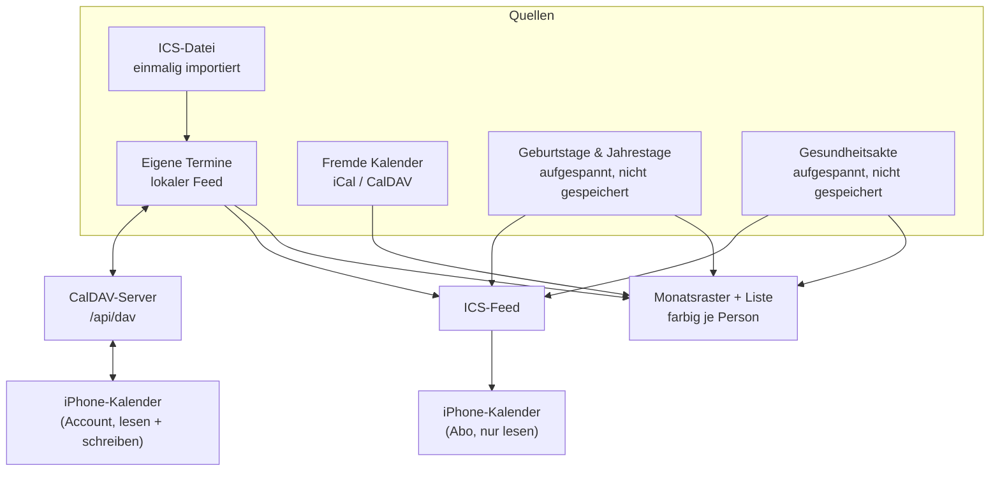

# Kalender

Der Haushalts-Kalender zeigt, **wer** einen Termin hat, nicht nur **dass** einer ist.



## Termine je Person

Ein Termin gehört keiner, einer oder mehreren Personen. Die Zuordnung liegt in einer eigenen
Tabelle (`CalendarEventMember`), nicht als Feld am Termin — ein Familienessen betrifft eben
alle, und die Monatsansicht soll nach Person filtern und einfärben können.

**Termine ohne Zuordnung betreffen den ganzen Haushalt.** Das ist der Zustand aller
Bestandstermine und bleibt gültig; es musste nichts nachgetragen werden.

Externe Termine aus abonnierten Feeds bekommen schlicht keine Zeilen in der Tabelle. Der
CalDAV- und ICS-Abgleich merkt von der ganzen Personenzuordnung nichts.

Der Filter steht in der URL (`/calendar?member=…`), damit ein gefilterter Monat teilbar und
über Vor- und Zurück erreichbar bleibt.

## Standarddauer: eine Stunde

Wer eine Startzeit einträgt, meint fast immer einen Termin **mit** Dauer. Ein Termin ohne
Ende ist im Monatsraster ein Strich statt eines Blocks, und im ICS-Feed fehlt das `DTEND` —
Kalender-Apps machen daraus, was sie wollen.

Deshalb bekommt jeder Termin ohne eigenes Ende **eine Stunde**:

- Im Formular füllt sich das Ende sichtbar mit, sobald der Beginn steht
  (`apps/family/src/components/calendar/EventTimeFields.tsx`).
- Serverseitig entscheidet `resolveEventEnd` (`packages/family-core/src/event-duration.ts`) —
  dieselbe Regel gilt damit für Formular, `POST /api/v1/calendar/events` und das MCP-Tool
  `family_calendar_add_event`.

Es ist eine **Vorbelegung, kein Zwang**: ein mitgegebenes Ende bleibt unangetastet, auch ein
kürzeres, und Nacharbeiten geht immer. Wer beim Bearbeiten das Ende leert, bekommt wieder
die Stunde — ein Termin ohne Ende entsteht in Family nicht aus Versehen.

**Ganztägig bleibt ohne Ende.** Das Häkchen blendet das Ende-Feld aus; den Tag spannt der
ICS-Feed auf (`ics-feed.ts`, `DTEND` ist dort der Folgetag). Eine Stunde wäre hier falsch.

Termine aus fremden Feeds fasst die Regel nicht an — deren Zeiten gehören der Quelle.

## Die Gesundheitsakte im Kalender

Wer unter **Gesundheit** etwas einträgt, muss daraus keinen Termin von Hand bauen: der
Eintrag steht im Monat, sobald er ein Datum trägt. Beide Daten zählen —
`nextDueOn` als „… fällig", `occurredOn` als Notiz, was an dem Tag war.

Wie Geburtstage sind das **keine gespeicherten Termine**, sondern für den gezeigten
Zeitraum aufgespannte Vorkommen (`expandHealthOccurrences`,
`packages/family-core/src/health-calendar.ts`). Der Grund ist derselbe: ein Termin, den
man im Kalender löschen kann, während der Eintrag in der Akte stehen bleibt, wären zwei
Wahrheiten. Geändert und gelöscht wird darum nur in der Akte; die Liste im Kalender
verlinkt dorthin und bietet selbst kein Bearbeiten an.

Der Personenfilter greift auch hier — anders als bei Terminen gibt es keine Akte „ohne
Zuordnung", jeder Eintrag gehört mindestens einer Person. Er darf aber mehreren gehören:
die Grippeimpfung steht dann in Linos **und** in Mimis gefiltertem Monat, mit beiden Namen.

**Das ICS-Abo bleibt bei den Fälligkeiten** — es liest weiterhin `listDueUntil`. Ein
frisch eingerichtetes Abo soll nicht rückwirkend Jahre an Arztbesuchen aufs Telefon
schieben; für einen späteren Umbau nimmt der Aufspanner dafür `includeLogged: false`.

## Fremde Kalender abonnieren

Unter **Kalender → Fremde Kalender** lassen sich iCal-Adressen und CalDAV-Kalender
eintragen: Schule, Verein, Arbeit. Bis zur Ausbaustufe ging das nur über die Kalender-API
von Studio — wer ausschliesslich Family nutzt, kam gar nicht heran.

Abos sind strukturell read-only. Was von aussen kommt, wird hier nicht geändert; eine Änderung
würde beim nächsten Abgleich überschrieben. Schreibbar ist nur der lokale Feed — er lässt sich
auch nicht löschen, sonst wären alle eigenen Termine heimatlos.

Passwörter für CalDAV werden verschlüsselt abgelegt und nie wieder angezeigt.

## ICS-Datei importieren

Unter **Kalender-Import** wandert eine `.ics`-Datei in den Kalender: die Einladung aus der
Mail, der Ferienplan der Schule, der Export aus einem alten Kalender. Abonnieren ginge dafür
nicht — eine Datei hat keine Adresse, die man abgleichen könnte.

**Import und Abo sind zwei verschiedene Dinge**, und das ist der Grund für die eigene Seite:

| | Import (`/calendar/import`) | Abo (`/calendar/feeds`) |
|---|---|---|
| Wie oft | einmalig | laufend abgeglichen |
| Danach | gehört dem Haushalt, änderbar und löschbar | bleibt fremd, schreibgeschützt |
| Quelle ändert sich | UWE merkt nichts | kommt beim nächsten Abgleich mit |

Importierte Termine landen deshalb im **lokalen** Feed als eigene Termine (`kind: personal`)
und stehen im Abo aufs Handy — sie sind nach dem Import nicht mehr von einem von Hand
eingetragenen Termin zu unterscheiden.

**Erst Vorschau, dann Übernahme.** Eine Schuldatei bringt gern hundert Termine mit; was davon
in den Haushalt soll, hakt ein Mensch an. Automatisch geschrieben wird nichts — dasselbe
Prinzip wie beim Kassenbon im Scan-Eingang. In derselben Vorschau lässt sich festlegen, wen
die Termine betreffen; ohne Auswahl betreffen sie den ganzen Haushalt.

Die Vorschau kennt drei Zustände:

- **neu** — steht noch nicht im Kalender,
- **erneut eingelesen** — stammt aus einem früheren Durchgang derselben Datei und wird
  aktualisiert statt verdoppelt,
- **schon im Kalender** — Titel und Beginn gibt es bereits als eigenen Termin. Der bleibt
  unberührt und ist vorab nicht angehakt.

Wiedererkannt wird über die `UID` aus der Datei, abgelegt als `externalUid` mit dem Präfix
`ics-import:`. Das Präfix hält den Namensraum von den aufgespannten Vertrags-Terminen
(`uwe-contract-…`) frei, deren Aufräumen sonst einen Import mitnehmen könnte. Einträge ohne
`UID` bekommen eine aus ihrem Inhalt abgeleitete Kennung — stabil, damit auch eine
handgeschriebene Datei ein zweites Mal eingelesen werden kann.

**Was der Import nicht kann:** Serien. Eine `RRULE` wird nicht aufgespannt, übernommen wird
der erste Termin — die Vorschau schreibt das an den Eintrag, statt es stillschweigend zu tun.
Wiederkehrendes gehört ins Abo oder in den Haushalts-Bereich.

**Die Standarddauer gilt auch hier.** Ein importierter Termin ohne `DTEND` bekommt seine
Stunde (`resolveEventEnd`) — er ist danach ein eigener Haushalts-Termin, kein Gast aus einem
Feed. Ganztägig bleibt ohne Ende, ein `DTEND` aus der Datei bleibt unangetastet.

**Zeitzonen.** `DTSTART;TZID=Europe/Berlin:20260910T180000` wird in den echten Zeitpunkt
umgerechnet, Sommer- wie Winterzeit (`Intl`, keine Bibliothek). Eine Zeitangabe ohne `Z` und
ohne `TZID` hat keine Zone und wird als UTC gelesen — raten wäre schlimmer.

Code: `packages/family-core/src/{ics-import,ics-import-service}.ts` (Fachlogik, gelesen wird
mit `parseIcalEvents` aus `@uwe/calendar`), Routen `apps/family/app/api/calendar/import/`,
Oberfläche `apps/family/src/components/calendar/IcsImport.tsx`.

## Auf dem iPhone abonnieren

Unter **Kalender-Abo** entsteht pro Gerät eine eigene Adresse:

```
https://<family-adresse>/api/calendar/feed/uwecal_….ics
```

In iOS: *Einstellungen → Apps → Kalender → Accounts → Account hinzufügen → Andere →
Kalenderabo hinzufügen.*

Im Abo landen Termine (ein Jahr zurück, zwei nach vorn), Geburtstage und Jahrestage sowie
fällige Einträge der Gesundheitsakte. Ein auf Personen eingeschränktes Abo zeigt nur deren
Termine plus die des ganzen Haushalts. Die Einschränkung darf **mehrere** Personen
umfassen — das Küchen-Tablet für beide Kinder ist ein Abo, nicht zwei. Kein Häkchen heisst
weiterhin: ganzer Haushalt.

### Warum ein eigener Token-Typ

Eine Kalender-App ruft die Adresse **ohne `Authorization`-Header** ab — das Geheimnis muss
also in die URL. Das ist ein anderes Risikoprofil als ein API-Token im Header: die Adresse
steht im Klartext in der Abo-Liste des Geräts.

Deshalb ein eigenes Modell (`FamilyCalendarSubscription`, Präfix `uwecal_`) statt `ApiToken`:

- kann **ausschliesslich Termine lesen**, nichts schreiben, keine anderen Bereiche,
- ist einzeln widerrufbar, ohne andere Zugänge zu berühren,
- wird nur als Hash gespeichert; den Klartext gibt es genau einmal,
- ein unbekannter oder widerrufener Token bekommt **404**, damit die Antwort nicht verrät,
  ob es ihn je gab.

Die Feed-Route trägt darum keinen Sitzungs-Guard und ist an beiden Stellen bewusst
eingetragen, die das prüfen: `FAMILY_PUBLIC_API_ALLOWLIST`
(`packages/security-tests`) und `FAMILY_PUBLIC_ROUTES` (`packages/auth`).

Code: `packages/family-core/src/{subscription-service,ics-feed}.ts`,
`apps/family/app/api/calendar/feed/[token]/route.ts`.

## iPhone-CalDAV-Account (lesen und schreiben)

Das Abo kann nur lesen — iOS-Kalenderabos schreiben prinzipbedingt nie zurück. Für echten
bidirektionalen Sync ist UWE Family selbst der CalDAV-Server: unter **Kalender-Abo** entsteht
ein CalDAV-Zugang, den das iPhone als Account einrichtet (*Einstellungen → Apps → Kalender →
Accounts → Account hinzufügen → Andere → CalDAV-Account*; Server = Family-Adresse,
Benutzername `familie`, Passwort = Token). Termine lassen sich dann direkt in der Kalender-App
anlegen, ändern und löschen — für den ganzen Haushalt, eine Personen-Bindung gibt es hier
bewusst nicht.

Erreichbar ist über CalDAV **ausschliesslich der lokale Feed** — dieselbe Invariante wie in
den Server-Actions: fremde Abos, Geburtstage und die Gesundheitsakte bleiben dem ICS-Abo
vorbehalten, denn was der CalDAV-Client sieht, kann er auch ändern.

### Wie die Teile zusammenspielen

- **Token-Typ `uwedav_`** (Modell `FamilyCalDavAccount`): wie beim Abo nur als Hash
  gespeichert, einzeln widerrufbar — aber mit Schreibrecht, deshalb ein eigener Typ. Der
  Client schickt ihn als HTTP-Basic-Passwort.
- **DAV-Methoden-Proxy** (`deploy/scripts/uwe-dav-proxy.mjs`): Next-Route-Handler kennen
  kein PROPFIND/REPORT. Der Proxy sitzt vor dem Family-Server (Start über
  `deploy/scripts/start-uwe.sh` bzw. Command Center), übersetzt DAV-Methoden auf
  `/api/dav*` in `POST` + Header `x-uwe-dav-method` und strippt diesen Header auf jedem
  eingehenden Request (Spoof-Schutz). Fehlt der Proxy, läuft Family wie bisher — nur ohne
  CalDAV.
- **Protokoll-Logik** in `packages/family-core/src/caldav-{server,collection,account-service}.ts`
  und `packages/calendar/src/dav-xml.ts`; die Route
  `apps/family/app/api/dav/[[...segments]]/route.ts` ist reiner Transport.
  `/.well-known/caldav` leitet die Discovery dorthin um.

### Bekannte Grenzen

- **Serientermine**: das Roh-ICS des iPhones wird verbatim gespeichert und zurückgegeben
  (RRULE bleibt erhalten). Die Family-Ansicht zeigt nur das erste Vorkommen; wer einen
  Serientermin in UWE bearbeitet, verliert die Serienregel.
- **Doppelanzeige**: Abo und CalDAV-Account auf demselben Gerät zeigen Termine doppelt —
  dann einen der beiden Wege für Termine nutzen (Abo bleibt für Geburtstage und Akte).
