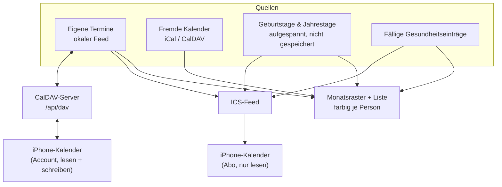

# Kalender

Der Haushalts-Kalender zeigt, **wer** einen Termin hat, nicht nur **dass** einer ist.



## Termine je Person

Ein Termin gehört keiner, einer oder mehreren Personen. Die Zuordnung liegt in einer eigenen
Tabelle (`CalendarEventMember`), nicht als Feld am Termin — ein Familienessen betrifft eben
alle, und die Monatsansicht soll nach Person filtern und einfärben können.

**Termine ohne Zuordnung betreffen den ganzen Haushalt.** Das ist der Zustand aller
Bestandstermine und bleibt gültig; es musste nichts nachgetragen werden.

Externe Termine aus abonnierten Feeds bekommen schlicht keine Zeilen in der Tabelle. Der
CalDAV- und ICS-Abgleich merkt von der ganzen Personenzuordnung nichts.

Der Filter steht in der URL (`/calendar?member=…`), damit ein gefilterter Monat teilbar und
über Vor- und Zurück erreichbar bleibt.

## Fremde Kalender abonnieren

Unter **Kalender → Fremde Kalender** lassen sich iCal-Adressen und CalDAV-Kalender
eintragen: Schule, Verein, Arbeit. Bis zur Ausbaustufe ging das nur über die Kalender-API
von Studio — wer ausschliesslich Family nutzt, kam gar nicht heran.

Abos sind strukturell read-only. Was von aussen kommt, wird hier nicht geändert; eine Änderung
würde beim nächsten Abgleich überschrieben. Schreibbar ist nur der lokale Feed — er lässt sich
auch nicht löschen, sonst wären alle eigenen Termine heimatlos.

Passwörter für CalDAV werden verschlüsselt abgelegt und nie wieder angezeigt.

## Auf dem iPhone abonnieren

Unter **Kalender-Abo** entsteht pro Gerät eine eigene Adresse:

```
https://<family-adresse>/api/calendar/feed/uwecal_….ics
```

In iOS: *Einstellungen → Apps → Kalender → Accounts → Account hinzufügen → Andere →
Kalenderabo hinzufügen.*

Im Abo landen Termine (ein Jahr zurück, zwei nach vorn), Geburtstage und Jahrestage sowie
fällige Einträge der Gesundheitsakte. Ein an eine Person gebundenes Abo zeigt nur deren
Termine plus die des ganzen Haushalts.

### Warum ein eigener Token-Typ

Eine Kalender-App ruft die Adresse **ohne `Authorization`-Header** ab — das Geheimnis muss
also in die URL. Das ist ein anderes Risikoprofil als ein API-Token im Header: die Adresse
steht im Klartext in der Abo-Liste des Geräts.

Deshalb ein eigenes Modell (`FamilyCalendarSubscription`, Präfix `uwecal_`) statt `ApiToken`:

- kann **ausschliesslich Termine lesen**, nichts schreiben, keine anderen Bereiche,
- ist einzeln widerrufbar, ohne andere Zugänge zu berühren,
- wird nur als Hash gespeichert; den Klartext gibt es genau einmal,
- ein unbekannter oder widerrufener Token bekommt **404**, damit die Antwort nicht verrät,
  ob es ihn je gab.

Die Feed-Route trägt darum keinen Sitzungs-Guard und ist an beiden Stellen bewusst
eingetragen, die das prüfen: `FAMILY_PUBLIC_API_ALLOWLIST`
(`packages/security-tests`) und `FAMILY_PUBLIC_ROUTES` (`packages/auth`).

Code: `packages/family-core/src/{subscription-service,ics-feed}.ts`,
`apps/family/app/api/calendar/feed/[token]/route.ts`.

## iPhone-CalDAV-Account (lesen und schreiben)

Das Abo kann nur lesen — iOS-Kalenderabos schreiben prinzipbedingt nie zurück. Für echten
bidirektionalen Sync ist UWE Family selbst der CalDAV-Server: unter **Kalender-Abo** entsteht
ein CalDAV-Zugang, den das iPhone als Account einrichtet (*Einstellungen → Apps → Kalender →
Accounts → Account hinzufügen → Andere → CalDAV-Account*; Server = Family-Adresse,
Benutzername `familie`, Passwort = Token). Termine lassen sich dann direkt in der Kalender-App
anlegen, ändern und löschen — für den ganzen Haushalt, eine Personen-Bindung gibt es hier
bewusst nicht.

Erreichbar ist über CalDAV **ausschliesslich der lokale Feed** — dieselbe Invariante wie in
den Server-Actions: fremde Abos, Geburtstage und die Gesundheitsakte bleiben dem ICS-Abo
vorbehalten, denn was der CalDAV-Client sieht, kann er auch ändern.

### Wie die Teile zusammenspielen

- **Token-Typ `uwedav_`** (Modell `FamilyCalDavAccount`): wie beim Abo nur als Hash
  gespeichert, einzeln widerrufbar — aber mit Schreibrecht, deshalb ein eigener Typ. Der
  Client schickt ihn als HTTP-Basic-Passwort.
- **DAV-Methoden-Proxy** (`deploy/scripts/uwe-dav-proxy.mjs`): Next-Route-Handler kennen
  kein PROPFIND/REPORT. Der Proxy sitzt vor dem Family-Server (Start über
  `deploy/scripts/start-uwe.sh` bzw. Command Center), übersetzt DAV-Methoden auf
  `/api/dav*` in `POST` + Header `x-uwe-dav-method` und strippt diesen Header auf jedem
  eingehenden Request (Spoof-Schutz). Fehlt der Proxy, läuft Family wie bisher — nur ohne
  CalDAV.
- **Protokoll-Logik** in `packages/family-core/src/caldav-{server,collection,account-service}.ts`
  und `packages/calendar/src/dav-xml.ts`; die Route
  `apps/family/app/api/dav/[[...segments]]/route.ts` ist reiner Transport.
  `/.well-known/caldav` leitet die Discovery dorthin um.

### Bekannte Grenzen

- **Serientermine**: das Roh-ICS des iPhones wird verbatim gespeichert und zurückgegeben
  (RRULE bleibt erhalten). Die Family-Ansicht zeigt nur das erste Vorkommen; wer einen
  Serientermin in UWE bearbeitet, verliert die Serienregel.
- **Doppelanzeige**: Abo und CalDAV-Account auf demselben Gerät zeigen Termine doppelt —
  dann einen der beiden Wege für Termine nutzen (Abo bleibt für Geburtstage und Akte).
