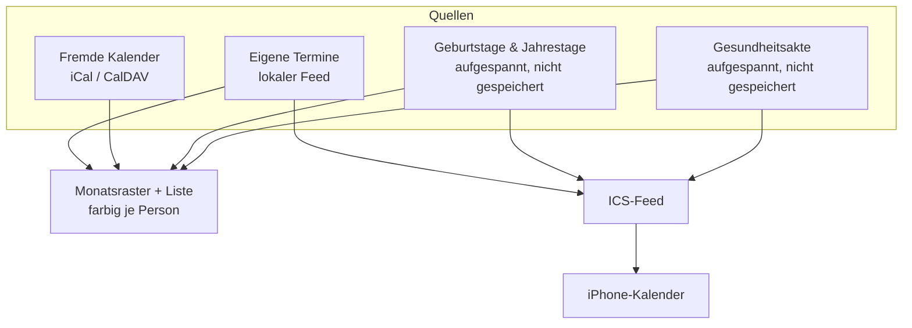

# Kalender

Der Haushalts-Kalender zeigt, **wer** einen Termin hat, nicht nur **dass** einer ist.



## Termine je Person

Ein Termin gehört keiner, einer oder mehreren Personen. Die Zuordnung liegt in einer eigenen
Tabelle (`CalendarEventMember`), nicht als Feld am Termin — ein Familienessen betrifft eben
alle, und die Monatsansicht soll nach Person filtern und einfärben können.

**Termine ohne Zuordnung betreffen den ganzen Haushalt.** Das ist der Zustand aller
Bestandstermine und bleibt gültig; es musste nichts nachgetragen werden.

Externe Termine aus abonnierten Feeds bekommen schlicht keine Zeilen in der Tabelle. Der
CalDAV- und ICS-Abgleich merkt von der ganzen Personenzuordnung nichts.

Der Filter steht in der URL (`/calendar?member=…`), damit ein gefilterter Monat teilbar und
über Vor- und Zurück erreichbar bleibt.

## Standarddauer: eine Stunde

Wer eine Startzeit einträgt, meint fast immer einen Termin **mit** Dauer. Ein Termin ohne
Ende ist im Monatsraster ein Strich statt eines Blocks, und im ICS-Feed fehlt das `DTEND` —
Kalender-Apps machen daraus, was sie wollen.

Deshalb bekommt jeder Termin ohne eigenes Ende **eine Stunde**:

- Im Formular füllt sich das Ende sichtbar mit, sobald der Beginn steht
  (`apps/family/src/components/calendar/EventTimeFields.tsx`).
- Serverseitig entscheidet `resolveEventEnd` (`packages/family-core/src/event-duration.ts`) —
  dieselbe Regel gilt damit für Formular, `POST /api/v1/calendar/events` und das MCP-Tool
  `family_calendar_add_event`.

Es ist eine **Vorbelegung, kein Zwang**: ein mitgegebenes Ende bleibt unangetastet, auch ein
kürzeres, und Nacharbeiten geht immer. Wer beim Bearbeiten das Ende leert, bekommt wieder
die Stunde — ein Termin ohne Ende entsteht in Family nicht aus Versehen.

**Ganztägig bleibt ohne Ende.** Das Häkchen blendet das Ende-Feld aus; den Tag spannt der
ICS-Feed auf (`ics-feed.ts`, `DTEND` ist dort der Folgetag). Eine Stunde wäre hier falsch.

Termine aus fremden Feeds fasst die Regel nicht an — deren Zeiten gehören der Quelle.

## Die Gesundheitsakte im Kalender

Wer unter **Gesundheit** etwas einträgt, muss daraus keinen Termin von Hand bauen: der
Eintrag steht im Monat, sobald er ein Datum trägt. Beide Daten zählen —
`nextDueOn` als „… fällig", `occurredOn` als Notiz, was an dem Tag war.

Wie Geburtstage sind das **keine gespeicherten Termine**, sondern für den gezeigten
Zeitraum aufgespannte Vorkommen (`expandHealthOccurrences`,
`packages/family-core/src/health-calendar.ts`). Der Grund ist derselbe: ein Termin, den
man im Kalender löschen kann, während der Eintrag in der Akte stehen bleibt, wären zwei
Wahrheiten. Geändert und gelöscht wird darum nur in der Akte; die Liste im Kalender
verlinkt dorthin und bietet selbst kein Bearbeiten an.

Der Personenfilter greift auch hier — anders als bei Terminen gibt es keine Akte „ohne
Zuordnung", jeder Eintrag gehört genau einem Mitglied.

**Das ICS-Abo bleibt bei den Fälligkeiten** — es liest weiterhin `listDueUntil`. Ein
frisch eingerichtetes Abo soll nicht rückwirkend Jahre an Arztbesuchen aufs Telefon
schieben; für einen späteren Umbau nimmt der Aufspanner dafür `includeLogged: false`.

## Fremde Kalender abonnieren

Unter **Kalender → Fremde Kalender** lassen sich iCal-Adressen und CalDAV-Kalender
eintragen: Schule, Verein, Arbeit. Bis zur Ausbaustufe ging das nur über die Kalender-API
von Studio — wer ausschliesslich Family nutzt, kam gar nicht heran.

Abos sind bewusst `read_only`. Was von aussen kommt, wird hier nicht geändert; eine Änderung
würde beim nächsten Abgleich überschrieben. Der lokale Feed lässt sich nicht löschen, sonst
wären alle eigenen Termine heimatlos.

Passwörter für CalDAV werden verschlüsselt abgelegt und nie wieder angezeigt.

## Auf dem iPhone abonnieren

Unter **Kalender-Abo** entsteht pro Gerät eine eigene Adresse:

```
https://<family-adresse>/api/calendar/feed/uwecal_….ics
```

In iOS: *Einstellungen → Apps → Kalender → Accounts → Account hinzufügen → Andere →
Kalenderabo hinzufügen.*

Im Abo landen Termine (ein Jahr zurück, zwei nach vorn), Geburtstage und Jahrestage sowie
fällige Einträge der Gesundheitsakte. Ein an eine Person gebundenes Abo zeigt nur deren
Termine plus die des ganzen Haushalts.

### Warum ein eigener Token-Typ

Eine Kalender-App ruft die Adresse **ohne `Authorization`-Header** ab — das Geheimnis muss
also in die URL. Das ist ein anderes Risikoprofil als ein API-Token im Header: die Adresse
steht im Klartext in der Abo-Liste des Geräts.

Deshalb ein eigenes Modell (`FamilyCalendarSubscription`, Präfix `uwecal_`) statt `ApiToken`:

- kann **ausschliesslich Termine lesen**, nichts schreiben, keine anderen Bereiche,
- ist einzeln widerrufbar, ohne andere Zugänge zu berühren,
- wird nur als Hash gespeichert; den Klartext gibt es genau einmal,
- ein unbekannter oder widerrufener Token bekommt **404**, damit die Antwort nicht verrät,
  ob es ihn je gab.

Die Feed-Route trägt darum keinen Sitzungs-Guard und ist an beiden Stellen bewusst
eingetragen, die das prüfen: `FAMILY_PUBLIC_API_ALLOWLIST`
(`packages/security-tests`) und `FAMILY_PUBLIC_ROUTES` (`packages/auth`).

Code: `packages/family-core/src/{subscription-service,ics-feed}.ts`,
`apps/family/app/api/calendar/feed/[token]/route.ts`.
