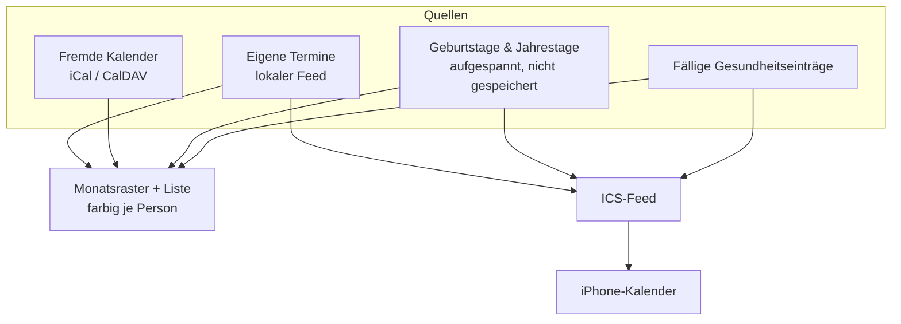

# Kalender

Der Haushalts-Kalender zeigt, **wer** einen Termin hat, nicht nur **dass** einer ist.



## Termine je Person

Ein Termin gehört keiner, einer oder mehreren Personen. Die Zuordnung liegt in einer eigenen
Tabelle (`CalendarEventMember`), nicht als Feld am Termin — ein Familienessen betrifft eben
alle, und die Monatsansicht soll nach Person filtern und einfärben können.

**Termine ohne Zuordnung betreffen den ganzen Haushalt.** Das ist der Zustand aller
Bestandstermine und bleibt gültig; es musste nichts nachgetragen werden.

Externe Termine aus abonnierten Feeds bekommen schlicht keine Zeilen in der Tabelle. Der
CalDAV- und ICS-Abgleich merkt von der ganzen Personenzuordnung nichts.

Der Filter steht in der URL (`/calendar?member=…`), damit ein gefilterter Monat teilbar und
über Vor- und Zurück erreichbar bleibt.

## Fremde Kalender abonnieren

Unter **Kalender → Fremde Kalender** lassen sich iCal-Adressen und CalDAV-Kalender
eintragen: Schule, Verein, Arbeit. Bis zur Ausbaustufe ging das nur über die Kalender-API
von Studio — wer ausschliesslich Family nutzt, kam gar nicht heran.

Abos sind bewusst `read_only`. Was von aussen kommt, wird hier nicht geändert; eine Änderung
würde beim nächsten Abgleich überschrieben. Der lokale Feed lässt sich nicht löschen, sonst
wären alle eigenen Termine heimatlos.

Passwörter für CalDAV werden verschlüsselt abgelegt und nie wieder angezeigt.

## Auf dem iPhone abonnieren

Unter **Kalender-Abo** entsteht pro Gerät eine eigene Adresse:

```
https://<family-adresse>/api/calendar/feed/uwecal_….ics
```

In iOS: *Einstellungen → Apps → Kalender → Accounts → Account hinzufügen → Andere →
Kalenderabo hinzufügen.*

Im Abo landen Termine (ein Jahr zurück, zwei nach vorn), Geburtstage und Jahrestage sowie
fällige Einträge der Gesundheitsakte. Ein auf Personen eingeschränktes Abo zeigt nur deren
Termine plus die des ganzen Haushalts. Die Einschränkung darf **mehrere** Personen
umfassen — das Küchen-Tablet für beide Kinder ist ein Abo, nicht zwei. Kein Häkchen heisst
weiterhin: ganzer Haushalt.

### Warum ein eigener Token-Typ

Eine Kalender-App ruft die Adresse **ohne `Authorization`-Header** ab — das Geheimnis muss
also in die URL. Das ist ein anderes Risikoprofil als ein API-Token im Header: die Adresse
steht im Klartext in der Abo-Liste des Geräts.

Deshalb ein eigenes Modell (`FamilyCalendarSubscription`, Präfix `uwecal_`) statt `ApiToken`:

- kann **ausschliesslich Termine lesen**, nichts schreiben, keine anderen Bereiche,
- ist einzeln widerrufbar, ohne andere Zugänge zu berühren,
- wird nur als Hash gespeichert; den Klartext gibt es genau einmal,
- ein unbekannter oder widerrufener Token bekommt **404**, damit die Antwort nicht verrät,
  ob es ihn je gab.

Die Feed-Route trägt darum keinen Sitzungs-Guard und ist an beiden Stellen bewusst
eingetragen, die das prüfen: `FAMILY_PUBLIC_API_ALLOWLIST`
(`packages/security-tests`) und `FAMILY_PUBLIC_ROUTES` (`packages/auth`).

Code: `packages/family-core/src/{subscription-service,ics-feed}.ts`,
`apps/family/app/api/calendar/feed/[token]/route.ts`.
