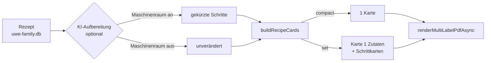

# Kochbuch und Rezeptdruck

Rezepte liegen in `packages/kitchen` und werden in der Küche gepflegt. Neu ist der Weg auf
Papier: **6×4 Zoll**, derselbe Drucker wie für die Etiketten. Wochenplanung,
KI-Wochenvorschlag und Einkauf: [essensplan.md](essensplan.md).



## Zwei Modi, beim Drucken wählbar

| | Kurzfassung (`compact`) | Kartenset (`set`) |
|---|---|---|
| Karten | genau eine | Zutaten + so viele Schrittkarten wie nötig |
| Aufteilung | Zutaten links, Schritte rechts | Karte 1 Zutaten, Folgekarten Schritte |
| Bei langen Rezepten | wird gekürzt | nichts geht verloren |
| Wofür | schnell an den Kühlschrank | zum Durchblättern beim Kochen |

Ein einzelner überlanger Schritt bekommt seine eigene Karte, statt die Aufteilung zum
Stillstand zu bringen.

```
GET /api/kitchen/recipes/<id>/card?mode=compact|set&format=pdf|html
```

## Was bewusst nicht passiert

Die 6×4-Renderer (`renderMultiLabelHtml`, `renderMultiLabelPdfAsync` in
`packages/database/src/label-export.ts`) sind reine Funktionen über `LabelElement[]` — und
sie stehen in der eingefrorenen Grössen-Baseline. Der Rezeptdruck **ruft sie nur auf** und
baut nichts an.

Die `Label`-Tabellen liegen in `uwe.db` und sind `dm_only`; eine Rezeptkarte rührt sie nicht
an. Eine Karte ist ein Ausdruck, kein gespeichertes Etikett.

Code: `packages/kitchen/src/recipe-card-layout.ts`.

## KI-Aufbereitung

Ein Rezept aus dem Netz oder vom Scan ist selten kartentauglich: Vorgeplauder, Werbeblöcke,
dreizeilige Sätze für „Zwiebeln würfeln". Der Knopf **Schritte per KI für die Karte kürzen**
schreibt jeden Arbeitsschritt auf einen knappen Imperativsatz um — ohne Mengen, Zeiten oder
Temperaturen zu verlieren.

Der Aufruf läuft **direkt über die Connector-Queue** (lokale Maschinenraum-Inferenz), nach dem Muster
von `ai-suggest.ts` — kein Cloud-Provider. Ist der Rechner aus, bleibt das Rezept
unverändert und lässt sich trotzdem drucken: ein halb aufbereitetes Rezept wäre schlimmer
als ein unaufbereitetes.

Voraussetzung ist `User.aiAccess` (`canUseEngineAi`), geprüft über `requireFamilyAiActionAuth`.

Code: `packages/kitchen/src/ai-recipe-format.ts`.
