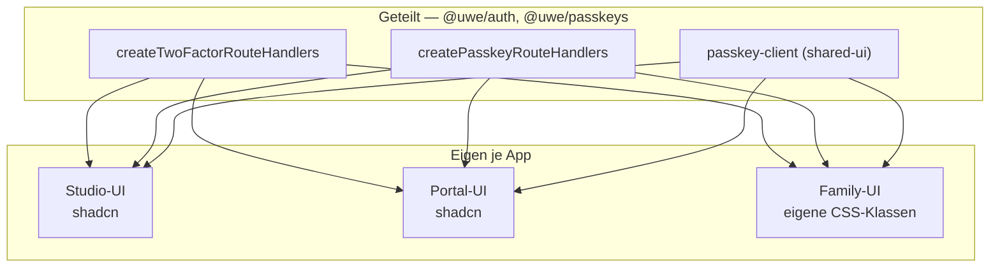

# Konto

Passwort, Zwei-Faktor-Anmeldung und FaceID richtet jede Person **in Family selbst** ein —
unter `/account`.

## Warum es diese Seite gibt

Wer ausschliesslich Family nutzt, konnte sein Konto bisher gar nicht verwalten. Passwort
ändern, 2FA einrichten und einen Passkey hinterlegen ging nur in Portal oder Studio —
Bereiche, die dieselbe Person weder betreten darf noch je sehen sollte. Das war eine
Sackgasse.

## Was geteilt ist und was nicht



Die **Abläufe** sind geteilt: Family bekommt dieselben dünnen Injektoren wie Portal
(`apps/family/src/lib/{two-factor,passkey}-routes.ts`), die den Häkchen-Guard, die Fehlerform
und den Rate-Limit-Präfix hineinreichen.

Die **Oberfläche** nicht, und das mit Absicht: Studio und Portal bauen auf shadcn-Primitives,
Family auf eigenen CSS-Klassen. Diese Primitives nach `@uwe/shared-ui` zu heben, hat das Repo
bereits bewusst verworfen — `scripts/ui-primitive-sync.test.ts` hält fest, das wäre „high
build risk", und friert die Duplikation stattdessen kontrolliert ein.

## Passkeys

Ein Passkey umgeht das Häkchen nicht: `hasAccess: canAccessFamily` ist dieselbe Prüfung wie
im Passwort-Login. Passkeys müssen ausserdem systemweit freigeschaltet sein
(`settings.auth.passkeysEnabled`).

Die Passkey-**Login**-Endpunkte sind bewusst öffentlich — die Anmeldung ist ja gerade das,
was noch fehlt. Sie sind darum im Family-Route-Inventar als delegierend registriert, genau
wie in Portal.

## Routen

```
POST /api/auth/change-password
GET  /api/auth/two-factor              POST /api/auth/two-factor/{setup,activate,disable,verify}
POST /api/auth/passkey/register/{options,verify}
POST /api/auth/passkey/login/{options,verify}
GET  /api/auth/passkey/credentials     DELETE /api/auth/passkey/credentials/<id>
```
