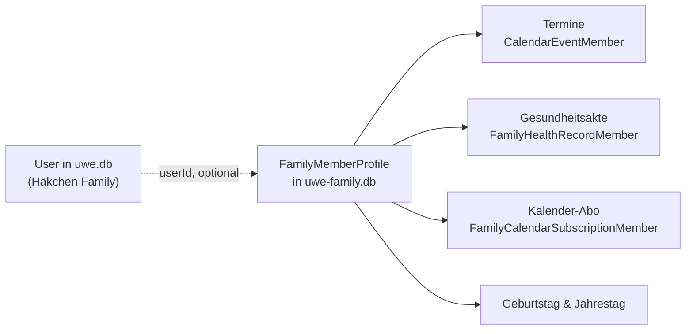

# Mitglieder

Ein Mitglied ist eine **Person im Haushalt** — ein Konto ist optional. Das ist der
Unterschied zu früher: bis zur Ausbaustufe war ein Mitglied an eine Benutzer-ID gebunden,
ein Kleinkind oder eine Katze konnte also gar nicht existieren.

## Überall mehrere

Wo man ein Mitglied hinterlegen kann, dürfen es mehrere sein. Das ist keine Ausnahme für
Termine, sondern die Regel: der Termin betrifft die halbe Familie, die Wurmkur beide
Katzen, das Abo auf dem Küchen-Tablet beide Kinder.

| Wo | Mehrere | Ohne Zuordnung heisst |
|---|---|---|
| Termin (`CalendarEventMember`) | ja | betrifft den ganzen Haushalt |
| Akten-Eintrag (`FamilyHealthRecordMember`) | ja | nicht erlaubt — mindestens eine Person |
| Kalender-Abo (`FamilyCalendarSubscriptionMember`) | ja | zeigt den ganzen Haushalt |

Alle drei liegen als eigene Verknüpfungstabelle vor, keine als `member_id`-Spalte. Das
Setzen ist überall dasselbe: `setMemberLinks` in
`packages/family-core/src/member-links.ts`, in der Oberfläche die Kästchenliste
`MemberChecklist`.

Beim **Löschen** eines Mitglieds räumt die Kaskade nur die Verknüpfungen ab. Was danach
ohne Person dastünde, geht mit: ein Akten-Eintrag ohne Zuordnung gehört niemandem, und ein
auf Personen eingeschränktes Abo würde sonst stillschweigend zu einem für den ganzen
Haushalt. Geteilte Einträge und Abos bleiben mit den übrigen Personen stehen
(`FamilyMemberService.removeMember`).

## Zwei Arten von Mitgliedern

| | Mit Konto | Ohne Konto |
|---|---|---|
| Anmelden | ja | nie |
| Entsteht durch | ersten Besuch | Anlegen auf `/members` |
| Profil pflegt | der Haushalt gemeinsam | der Haushalt gemeinsam |
| Entfernen | wird deaktiviert | wird gelöscht |
| Beispiele | Erwachsene | Kleinkind, Gast, Katze |

Ein Mitglied **mit** Konto wird beim Entfernen nur deaktiviert. Sonst legt der nächste
Besuch es sofort wieder an — und alte Beiträge verlören ihren Namen. Auf `/members` heisst
der Knopf deshalb „Deaktivieren"; „Wieder aktivieren" holt es zurück.

## Bearbeiten darf jeder jeden

Auf `/members` ist **jedes** Mitglied bearbeitbar, nicht nur die ohne Konto. Family kennt
keine Rollen und keine Sichtbarkeitsstufen: Farbe, Geburtstag und Jahrestag stehen im
Kalender aller, also pflegt sie auch der Haushalt gemeinsam. Das eigene Profil steht
zusätzlich oben auf der Seite — derselbe Datensatz, nur der kürzere Weg.

Daraus folgt eine Regel im Dienst: der Anzeigename aus dem Konto ist nur der **Startwert**
beim ersten Besuch. `ensureMemberForUser` schreibt ihn danach nicht mehr zurück — sonst
hätte der nächste Seitenaufruf jede im Haushalt gespeicherte Umbenennung wieder verworfen.

Zugänge ändert das nicht: siehe unten.

## Farben

Jede Person bekommt eine Farbe aus einer Palette von acht, die sich auch als kleiner Punkt
noch unterscheiden lassen. Die Vergabe ist automatisch (nächste freie Farbe) und lässt sich
überschreiben. Ohne gespeicherte Farbe wird eine aus der Kennung abgeleitet — im Kalender
ist nie jemand farblos.

Code: `packages/family-core/src/member-colours.ts`.

## Geburtstage und Jahrestage

Beides liegt am Mitglied und wird **nicht** als Termin gespeichert. Für Kalender, ICS-Feed
und Wochenbriefing werden die Vorkommen im gefragten Zeitraum aufgespannt. Ein Geburtstag
ist kein Kalendereintrag, den man versehentlich löschen können sollte.

Der 29. Februar rutscht in Nicht-Schaltjahren auf den 28. — wie es auch die iOS-Kalender-App
hält. Ein Geburtstag darf nicht drei von vier Jahren fehlen.

Code: `packages/family-core/src/anniversaries.ts`.

## Zugang bleibt getrennt

Diese Seite vergibt **keine Zugänge**. Welche E-Mail-Adresse Family betreten darf,
entscheidet allein das Häkchen im Command Center. Ein Mitglied anzulegen heisst: „diese
Person gehört zum Haushalt" — nicht „diese Person darf sich anmelden".
