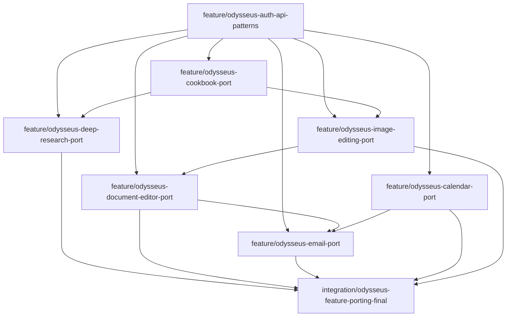

# Feature-Portierungs-Matrix: Odysseus → UWE

**Stand:** 2026-06-18 · **Orchestrator:** initiale Analyse  
**Lizenz:** Odysseus AGPL-3.0 → UWE implementiert nativ neu ([LICENSE.md](./LICENSE.md))

Legende:

| Symbol | Bedeutung |
|--------|-----------|
| ✅ | In UWE vorhanden (Basis) |
| 🔶 | Teilweise / Phase 1 |
| ❌ | Fehlt |
| 🎯 | Soll nativ portiert werden |
| ⛔ | Bewusst nicht übernehmen |

---

## 1. Cookbook / Local Model Management

### Odysseus-Funktionen

| Bereich | Funktionen |
|---------|------------|
| Hardware-Fit | GPU/VRAM-Profiling, Modell-Empfehlungen, HF-Katalog |
| Download | HuggingFace, Ollama, Remote-SSH-Hosts |
| Serve | vLLM, SGLang, llama.cpp, Ollama, Diffusers via tmux/SSH |
| Running | Task-Queue, Portwahl, Scheduled Stop, Diagnose (OOM/Parser) |
| Endpoints | `ModelEndpoint` CRUD, Probe, Auto-Discovery, Auto-Register im Picker |
| UI | Cookbook-Tabs: What Fits, Download, Serve, Running, Deps |

### UWE bereits vorhanden

| Bereich | Status | Evidence |
|---------|--------|----------|
| RTX Agent (Ollama-Proxy) | ✅ | `tools/uwe-rtx-agent/` |
| AI Router (local/cloud) | ✅ | `packages/ai-brain/src/router/` |
| Brain „Cookbook“-Aktionen (7 DnD-Actions) | ✅ | `packages/ai-brain/src/actions.ts` |
| Inference Health | ✅ | `/api/inference/health` |
| Model-Listing | 🔶 | `/api/ai/models` (kein Admin-UI) |
| Deferred Jobs (embedding/reindex) | ✅ | `JobType.embedding`, `reindex` |

### Überschneidungen

- Lokale Inferenz über RTX Agent ≈ Odysseus Serve (nur Ollama, kein vLLM/SGLang)
- Model-Endpoint-Konzept ≈ `RTX_AGENT_URL` + Provider-Keys in Settings
- Brain-Actions ≈ Odysseus Skills/Agent-Presets (aber DnD-spezifisch, code-defined)

### 🎯 Nach UWE portieren

| Priorität | Feature | UWE-Ziel |
|-----------|---------|----------|
| P0 | Hardware-Fit Dashboard | `/admin/status` + `/hardware` erweitern: VRAM, empfohlene Modelle |
| P0 | Ollama Model Admin | RTX Agent: list/pull/delete models; Studio UI unter Settings → AI |
| P1 | Endpoint Registry | Prisma `InferenceEndpoint` (encrypted URL/token), Probe-API |
| P1 | Serve-Status & Diagnose | RTX Agent Health erweitern: Modell geladen?, letzter Fehler |
| P2 | Download-Workflow (Ollama only) | `POST /api/inference/models/pull` — kein HF/vLLM in v1 |
| P3 | Scheduled Stop / Task Queue | Job-System wiederverwenden (`Job` model) |

### ⛔ Bewusst nicht übernehmen

- Remote SSH/tmux Serve auf Windows/Linux-Servern (Homelab-Scope zu groß für v1)
- vLLM/SGLang/llama.cpp Recipe-Manager (Overkill; Ollama-first)
- HuggingFace Gated-Download mit HF-Token (später optional, nicht P0)
- Odysseus Cookbook als separate UI-Seite

### Datenmodelle / Migrationen

```prisma
// Vorschlag — in feature/odysseus-cookbook-port
model InferenceEndpoint {
  id          String   @id @default(cuid())
  name        String
  baseUrl     String
  apiKeyEnc   String?  // Fernet-style via existing secret storage
  provider    String   // ollama | openai_compatible | cloud
  isEnabled   Boolean  @default(true)
  lastProbeAt DateTime?
  probeStatus String?  // ok | unreachable | auth_failed
  cachedModels Json?   // string[]
  createdAt   DateTime @default(now())
  updatedAt   DateTime @updatedAt
}
```

### API-Routen

| Route | Zweck |
|-------|-------|
| `GET/POST/PATCH/DELETE /api/inference/endpoints` | Endpoint CRUD |
| `POST /api/inference/endpoints/[id]/probe` | Health + model list |
| `GET /api/inference/hardware` | GPU/VRAM/RAM (via RTX Agent) |
| `POST /api/inference/models/pull` | Ollama pull |
| `DELETE /api/inference/models/[name]` | Ollama delete |

### UI-Flows

- Settings → AI → Endpoints-Tab
- `/hardware` → „Passt dieses Modell?“-Karte
- `/admin/status` → Inference-Ampel erweitern

### Tests

- `packages/database/src/inference-endpoint-service.test.ts`
- `tools/uwe-rtx-agent/src/models.test.ts` (pull/list/delete)
- `packages/security-tests` — Endpoint-Keys nie in API-Response
- Integration: RTX offline → graceful degradation

---

## 2. Deep Research

### Odysseus-Funktionen

| Bereich | Funktionen |
|---------|------------|
| Engine | Think→Search→Extract→Synthesize Loop (IterResearch) |
| Jobs | Background + SSE Progress, Persistenz, Cancel |
| Library | Archiv, Spin-off, HTML-Report mit Quellen |
| Search | SearXNG, Brave, DuckDuckGo, Tavily, Serper, Google PSE |
| Viz | Synapse-Baum (Suchbaum-Visualisierung) |
| Privacy | Owner-scoped Sessions |

### UWE bereits vorhanden

| Bereich | Status | Evidence |
|---------|--------|----------|
| Brain Store (RAG) | ✅ | `BrainDocument`, `BrainChunk`, embeddings |
| Semantic Search | ✅ | `packages/ai-brain/src/embeddings/search.ts` |
| Context Retrieval für AI | ✅ | `brainRetrieval.ts` |
| AI Runs / Proposals | ✅ | Review-before-apply |
| Life-Brain (local-only) | ✅ | `PersonalBrainDocument` |

### Überschneidungen

- Brain-Embeddings ≈ interne Wissensbasis (kein Web-Search)
- AI Runs ≈ Job-Tracking (aber kein Multi-Step Research)
- Generator ≈ einzelne Prompt-Aktionen, kein Report-Builder

### 🎯 Nach UWE portieren

| Priorität | Feature | UWE-Ziel |
|-----------|---------|----------|
| P0 | Research Run (multi-step) | `ResearchSession` + Job + AI Run Verknüpfung |
| P0 | Quellen-Sammlung | `ResearchSource` mit URL, Snippet, Trust-Level |
| P1 | Report-Generator | Markdown/HTML Report → BrainDocument (Proposal) |
| P1 | Kampagnen-Research Presets | „Regel-Recherche“, „Lore-Recherche“, „NPC-Hintergrund“ |
| P2 | Web Search Provider | SearXNG (self-hosted) + optional Brave API |
| P3 | Synapse-Visualisierung | Einfache Baum-UI (kein 1:1 Odysseus-Clone) |

### ⛔ Bewusst nicht übernehmen

- Ungefilterte Web-Suche mit DM-only Kontext (Privacy-Risiko)
- Auto-Apply von Research-Ergebnissen in Wiki-Kanon
- Cloud-Search-Keys im Frontend
- Odysseus Research Panel als Chat-Sidecar

### Datenmodelle

```prisma
model ResearchSession {
  id          String   @id @default(cuid())
  worldId     String?
  query       String
  status      String   // pending|running|completed|failed|cancelled
  contextMode String   // dnd_brain|life_brain|open_web
  reportMd    String?
  ownerId     String?
  aiRunId     String?
  createdAt   DateTime @default(now())
  updatedAt   DateTime @updatedAt
  sources     ResearchSource[]
}

model ResearchSource {
  id         String @id @default(cuid())
  sessionId  String
  url        String
  title      String?
  snippet    String?
  fetchedAt  DateTime?
  session    ResearchSession @relation(...)
}
```

### API-Routen

| Route | Zweck |
|-------|-------|
| `POST /api/research/start` | Start (respektiert contextMode + visibility) |
| `GET /api/research/[id]/stream` | SSE Progress |
| `POST /api/research/[id]/cancel` | Cancel |
| `GET /api/research` | Library |
| `GET /api/research/[id]/report` | Report (HTML/MD) |
| `POST /api/research/[id]/apply` | → AiProposal (nie direkt Kanon) |

### UI-Flows

- `/worlds/[slug]/research` — Kampagnen-Recherche
- `/life-brain/research` — persönlich, local-only
- Brain-Sidebar: „Recherche starten“ aus Seitenkontext

### Tests

- `packages/ai-brain/src/research/privacy.test.ts` — DM-only nie in Web-Query
- `packages/database/src/research-service.test.ts`
- `packages/security-tests` — keine Secrets in Research-Logs
- Mock-Search-Provider für CI

---

## 3. Dokumenteneditor

### Odysseus-Funktionen

| Bereich | Funktionen |
|---------|------------|
| Editor | Multi-Tab, Syntax-Highlighting, Markdown/HTML/PDF/Code |
| AI Diff | Chunk-wise Accept/Reject |
| Versionen | History, Restore, Archive |
| PDF | Import, Annotate, Export, Sign-and-Reply |
| Library | Import/Export ZIP, AI-Tidy |
| Integration | E-Mail-Attachments → Doc |

### UWE bereits vorhanden

| Bereich | Status | Evidence |
|---------|--------|----------|
| Wiki Pages (20+ Typen) | ✅ | `Page`, `PageType` |
| Content Blocks (13 Typen) | ✅ | `ContentBlock`, `ContentBlockType` |
| Wikilinks / Backlinks | ✅ | `packages/wiki-engine/` |
| Form-Editor (Textarea) | 🔶 | `.../edit/page.tsx` |
| Templates | ✅ | `PageTemplate` |
| Import (Knoteforge) | ✅ | `packages/knoteforge-import/` |
| Undo (DB) | ✅ | `UndoEntry` |
| Handouts | ✅ | PageType + Share + Mail |

### Überschneidungen

- Wiki-Seiten ≈ Odysseus Documents (aber world-scoped + Visibility)
- Content Blocks ≈ strukturierter Editor (ohne WYSIWYG)
- Label Editor ≈ spezialisiertes Dokument-Sub-UI

### 🎯 Nach UWE portieren

| Priorität | Feature | UWE-Ziel |
|-----------|---------|----------|
| P0 | Rich-Text Block Editor | `rich_text` / `gm_note` — TipTap oder Lite |
| P1 | Version History UI | `PageVersion` oder ContentBlock-Versions |
| P1 | AI Diff Apply | Proposal → Block-Diff → Review |
| P2 | Session Notes Mode | Schnell-Editor für `PageType.session` |
| P2 | Export MD/HTML/PDF | Erweitern `static-export` + Handout-PDF |
| P3 | PDF Annotate | Nur wenn Mail-Integration P1 fertig |

### ⛔ Bewusst nicht übernehmen

- Generischer Code-Editor (Python/JS Run) — nicht UWE-Kern
- Odysseus Document Panel neben Chat
- Auto-Tidy ohne Review

### Datenmodelle

```prisma
model PageVersion {
  id        String   @id @default(cuid())
  pageId    String
  version   Int
  snapshot  Json     // blocks + metadata
  createdBy String?
  createdAt DateTime @default(now())
  page      Page     @relation(...)
}
```

### API-Routen

| Route | Zweck |
|-------|-------|
| `GET /api/worlds/[slug]/pages/[id]/versions` | History |
| `POST .../versions/[v]/restore` | Restore → Proposal optional |
| `POST /api/worlds/[slug]/pages/[id]/export` | MD/HTML/PDF |

### UI-Flows

- Seiten-Editor: Block-Toolbar, Preview-Split
- Handout-Editor: Player-safe Preview
- Session Notes: `/worlds/[slug]/sessions/[id]/notes`

### Tests

- `packages/wiki-engine` — Wikilinks nach Rich-Text-Edit
- `packages/database/src/page-version.test.ts`
- `visibility-security.test.ts` — gm_note nie in Portal
- Player-leak-scanner für Export

---

## 4. E-Mail

### Odysseus-Funktionen

| Bereich | Funktionen |
|---------|------------|
| Inbox | Multi-Account IMAP, Ordner, Suche, Flags |
| Outbound | Send, Draft, Schedule, Approval Queue |
| AI | Summarize, AI-Reply, Style Extraction, Urgency |
| OAuth | Gmail |
| Integration | Attachments→Doc, Reminders→Calendar |
| Pollers | Auto-Summarize, Auto-Tag, Calendar Extract |

### UWE bereits vorhanden

| Bereich | Status | Evidence |
|---------|--------|----------|
| SMTP Outbound | ✅ | `packages/mail/` |
| Templates | ✅ | `MailTemplate`, session_recap/handout/share |
| Recipients / Groups | ✅ | `MailRecipient*` |
| Compose UI | ✅ | `/mail`, `/mail/compose` |
| Logs | ✅ | `MailMessageLog` |
| Brain mail_draft Action | ✅ | `packages/ai-brain/src/actions.ts` |
| Job: mail_send | ✅ | `JobType.mail_send` |

### Überschneidungen

- Outbound Compose ≈ Odysseus Send (ohne Inbox)
- Templates ≈ Odysseus Signatures/Templates
- mail_draft Action ≈ AI-Reply (nur Draft, kein IMAP)

### 🎯 Nach UWE portieren

| Priorität | Feature | UWE-Ziel |
|-----------|---------|----------|
| P1 | IMAP Inbox (read-only v1) | `MailAccount` + Sync-Job |
| P1 | Drafts | `MailDraft` model + UI |
| P2 | Scheduled Send | Job-Scheduler (existiert) |
| P2 | AI Summarize Thread | Brain Action, Proposal only |
| P3 | Gmail OAuth | Optional, ENV-gated |
| P3 | Attachment → Asset/Handout | Bridge zu Document Editor |

### ⛔ Bewusst nicht übernehmen

- Auto-Reply ohne DM-Review
- Player-visible Inhalte per Mail versenden ohne Visibility-Check
- Systemweites Spam-AI-Training mit Kampagnen-Secrets
- Odysseus E-Mail als Default-Startseite

### Datenmodelle

```prisma
model MailAccount {
  id           String  @id @default(cuid())
  label        String
  imapHost     String?
  imapPort     Int?
  smtpHost     String
  username     String
  passwordEnc  String
  isDefault    Boolean @default(false)
  ownerId      String?
}

model MailDraft {
  id        String   @id @default(cuid())
  accountId String?
  subject   String
  bodyHtml  String?
  bodyText  String?
  worldId   String?
  status    String   // draft|pending_review|sent
  createdAt DateTime @default(now())
}
```

### API-Routen

| Route | Zweck |
|-------|-------|
| `GET/POST /api/mail/accounts` | Account CRUD (admin) |
| `GET /api/mail/inbox` | IMAP list (cursor pagination) |
| `GET /api/mail/messages/[id]` | Read message |
| `GET/POST /api/mail/drafts` | Drafts |

### UI-Flows

- `/mail` → Inbox-Tab (neben Compose/Logs)
- Session Recap: Inbox → Reply mit Template
- Settings → Mail Accounts (encrypted credentials)

### Tests

- `packages/mail/src/imap.test.ts` (mock)
- `mail-service.test.ts` — passwords never in JSON
- `visibility-security` — handout mail nur player_visible Inhalte
- `packages/security-tests` — SMTP/IMAP creds redacted in logs

---

## 5. Kalender / CalDAV / ICS

### Odysseus-Funktionen

| Bereich | Funktionen |
|---------|------------|
| Views | Month/Week/Year, Drag-Drop |
| CalDAV | Multi-Account, Bidirektional, Tombstones |
| ICS | Import/Export per Calendar |
| NL Parse | Quick-parse für Event-Erstellung |
| Integration | Notes/Email → Events |

### UWE bereits vorhanden

| Bereich | Status | Evidence |
|---------|--------|----------|
| Local Calendar | ✅ | `CalendarFeed`, `CalendarEvent` |
| iCal Import (read-only) | ✅ | `packages/calendar/` |
| CalDAV minimal | 🔶 | Import-only, global `CALDAV_PASSWORD` |
| ICS Export | ✅ | `?export=ics` |
| FamilyWall | ✅ | Feed type `familywall` |
| Sync Job | ✅ | `calendar_sync` |
| List UI | 🔶 | `/calendar` (kein Grid) |

### Überschneidungen

- CalendarEvent ≈ Odysseus Events (mit `worldId`/`sessionId` DnD-Bezug)
- Feed-Sync ≈ Odysseus CalDAV Pull (ohne Write-back)
- GameSession.date ≈ Session-Termine (noch nicht auto-sync)

### 🎯 Nach UWE portieren

| Priorität | Feature | UWE-Ziel |
|-----------|---------|----------|
| P0 | Month/Week Grid UI | `/calendar` mobile-first |
| P1 | Pro-Feed encrypted Password | `CalendarFeed.credentialsEnc` |
| P1 | CalDAV Write-back (lokal) | Tombstone + retry |
| P2 | GameSession ↔ Event Sync | `sessionId` Link automatisch |
| P2 | Reminders | Notification-Job / iCal VALARM |
| P3 | NL Quick-parse | „Nächsten Samstag 19 Uhr Session“ |

### ⛔ Bewusst nicht übernehmen

- UWE als CalDAV-Server hosten
- DM-only Event-Details in öffentliche ICS-Feeds
- Odysseus Calendar als separater Full-Page-App-Modus

### Datenmodelle

```prisma
// Erweiterung CalendarFeed
credentialsEnc String?
syncDirection  String @default("import") // import|bidirectional
lastSyncError  String?

// Erweiterung CalendarEvent
remoteHref     String?
remoteEtag     String?
caldavPending  Boolean @default(false)
```

### API-Routen

| Route | Zweck |
|-------|-------|
| `POST /api/calendar/feeds/[id]/sync` | Manual sync |
| `POST /api/calendar/import` | ICS upload |
| `GET /api/calendar/feeds/[id]/export` | Per-feed ICS |
| `PUT /api/calendar/events/[id]` | Write-back trigger |

### UI-Flows

- `/calendar` Grid + Filter (Session/DnD/Persönlich)
- `/today` — nächste Termine (existiert, erweitern)
- Settings → Integrationen → CalDAV-Accounts

### Tests

- `packages/calendar/src/ical.test.ts` (erweitern)
- `calendar-service.test.ts` (neu)
- SSRF-Tests für CalDAV URLs
- Visibility: dm_only Sessions nicht in public export

---

## 6. Image Editing / Gallery

### Odysseus-Funktionen

| Bereich | Funktionen |
|---------|------------|
| Gallery | Alben, Tags, Favorites, EXIF, Dedupe |
| Canvas Editor | Layers, Crop, Lasso, Clone, Adjustments |
| AI | Inpaint, Upscale, Remove-BG, Style Transfer |
| Drafts | Server-persisted `EditorDraft` |
| Batch | AI-Tag-Batch, ZIP Download |

### UWE bereits vorhanden

| Bereich | Status | Evidence |
|---------|--------|----------|
| Image Studio (Jobs) | ✅ | `packages/image-studio/` |
| Projects/Versions | ✅ | `ImageStudioProject`, `ImageStudioVersion` |
| Asset Library | ✅ | `/worlds/[slug]/assets` |
| Upload Security | ✅ | `packages/assets/` |
| RTX Image API | ❌ | `POST /v1/images` nicht implementiert |
| Canvas UI | ❌ | Phase 2 in docs |
| Gallery Blocks | 🔶 | Block type existiert, kein Renderer |

### Überschneidungen

- ImageStudio ≈ Odysseus AI Image Ops (Job-basiert)
- Assets ≈ Gallery (ohne Alben/Tags)
- Workshop `imageGallery` ≈ einfache Galerie

### 🎯 Nach UWE portieren

| Priorität | Feature | UWE-Ziel |
|-----------|---------|----------|
| P0 | RTX `POST /v1/images` | `tools/uwe-rtx-agent` |
| P0 | Gallery Block Renderer | Portal + Studio Preview |
| P1 | Canvas Editor (basic) | Crop, Rotate, Annotate für Handouts |
| P1 | Editor Drafts | `ImageEditorDraft` (layers JSON) |
| P2 | AI Inpaint UI | Mask zeichnen → Job |
| P2 | Alben/Tags auf Assets | `AssetTag`, `AssetAlbum` |
| P3 | Style Variants für NPCs | Generator-Integration |

### ⛔ Bewusst nicht übernehmen

- Vollständiger Photoshop-Klon
- DM-only NPC-Bilder an Cloud-Inpaint senden (ohne Policy)
- Odysseus Gallery als globale App

### Datenmodelle

```prisma
model ImageEditorDraft {
  id          String   @id @default(cuid())
  assetId     String?
  projectId   String?
  layersJson  Json
  thumbnailId String?
  ownerId     String?
  updatedAt   DateTime @updatedAt
}

model AssetTag {
  id      String @id @default(cuid())
  assetId String
  label   String
  source  String // manual|ai
}
```

### API-Routen

| Route | Zweck |
|-------|-------|
| `POST /api/image-studio/edit` | Canvas save |
| `GET/PUT /api/image-studio/drafts/[id]` | Draft CRUD |
| `POST /api/assets/[id]/tags` | Tagging |
| RTX: `POST /v1/images` | generate/edit/inpaint |

### UI-Flows

- `/image-studio/[projectId]/edit` — Canvas
- Asset Library → „Bearbeiten“ / „Varianten“
- Seiten-Editor: Bild-Block → Image Studio

### Tests

- `packages/image-studio/src/index.test.ts` (erweitern)
- `packages/assets/src/upload-security.test.ts`
- AI-Policy: cloud inpaint blocked when `dm_only`
- RTX agent integration test

---

## 7. Auth / API Tokens / Webhooks / Admin Gates

### Odysseus-Funktionen

| Bereich | Funktionen |
|---------|------------|
| Auth | Multi-User, bcrypt, Sessions, TOTP 2FA |
| Privileges | Per-Feature Flags (`can_use_research`, …) |
| API Tokens | Scoped `ody_*` Bearer, Profiles |
| Webhooks | Outgoing HMAC, Events (chat.completed, …) |
| Admin | Token CRUD, Webhook CRUD, Danger Zone Wipe |
| Internal | Loopback token für Agent HTTP |

### UWE bereits vorhanden

| Bereich | Status | Evidence |
|---------|--------|----------|
| Session Auth | ✅ | `packages/auth/` |
| Roles (owner/admin/dm/player) | ✅ | `UserRole`, `WorldMembership` |
| Studio Login | ✅ | `/login`, `/setup` |
| STUDIO_API_TOKEN (global) | 🔶 | ENV-only, keine CRUD |
| CSRF + Rate Limits | ✅ | `packages/security/` |
| Route Policy (deny-default) | ✅ | `route-policy.ts` |
| Audit Log | ✅ | `AuditLog`, `/admin/audit-log` |
| Security Dashboard | ✅ | `/admin/security` |
| 2FA | ❌ | |
| Webhooks | ❌ | |
| Per-User API Tokens | ❌ | |

### Überschneidungen

- STUDIO_API_TOKEN ≈ Odysseus API Token (aber global, nicht scoped)
- WorldMembership ≈ Odysseus owner-scoping (andere Granularität)
- Admin Security ≈ Odysseus Admin Gates (ohne Feature-Privileges)

### 🎯 Nach UWE portieren

| Priorität | Feature | UWE-Ziel |
|-----------|---------|----------|
| P0 | Scoped API Tokens | `ApiToken` model, hashed, prefix `uwe_` |
| P1 | Webhooks (outgoing) | `Webhook` + HMAC + SSRF guard |
| P1 | Token Admin UI | `/admin/security` → Tokens-Tab |
| P2 | TOTP 2FA (admin) | Optional für owner/admin |
| P2 | Feature Privileges | `User.privilegesJson` oder Role-Matrix erweitern |
| P3 | Incoming Webhook Receivers | z. B. `POST /api/hooks/[token]` für n8n |

### ⛔ Bewusst nicht übernehmen

- Odysseus Open Signup
- Danger Zone Wipe ohne Backup-Gate
- Internal Tool Loopback ohne Network-Boundary-Check
- Bearer Token für Player Portal (Session-only)

### Datenmodelle

```prisma
model ApiToken {
  id          String    @id @default(cuid())
  name        String
  tokenHash   String
  tokenPrefix String    // uwe_xxxx
  scopes      Json      // string[]
  userId      String
  lastUsedAt  DateTime?
  expiresAt   DateTime?
  createdAt   DateTime  @default(now())
}

model Webhook {
  id            String   @id @default(cuid())
  url           String
  secretEnc     String
  events        Json     // string[]
  isEnabled     Boolean  @default(true)
  lastStatus    String?
  lastDelivered DateTime?
  createdAt     DateTime @default(now())
}
```

### API-Routen

| Route | Zweck |
|-------|-------|
| `GET/POST /api/admin/tokens` | Token CRUD |
| `DELETE /api/admin/tokens/[id]` | Revoke |
| `GET/POST /api/admin/webhooks` | Webhook CRUD |
| `POST /api/admin/webhooks/[id]/test` | Test delivery |
| Middleware | Bearer `uwe_*` parallel zu Session |

### UI-Flows

- `/admin/security` → API Tokens, Webhooks
- `/settings` → 2FA Setup (P2)
- Token-Erstellung: einmalig Plaintext anzeigen

### Tests

- `packages/security-tests/route-authz.test.ts` (erweitern)
- `packages/auth/src/api-token.test.ts`
- Webhook SSRF + HMAC verification
- Token scopes: `research:read` ≠ `admin:*`

---

## Merge-Reihenfolge (Abhängigkeiten)



1. **Auth/API** zuerst (Tokens, Webhooks — Fundament für externe Integrationen)
2. **Cookbook** (Inference-Endpunkte für Research + Image)
3. **Document Editor** + **Image Editing** (parallel nach Auth)
4. **Calendar** + **Email** (parallel, Email profitiert von Document)
5. **Deep Research** (nach Cookbook + Auth)
6. **Integration PR** zuletzt

---

## Gesamt-Definition of Done

- [ ] Alle 7 Feature-PRs merged oder bewusst deferiert
- [ ] `pnpm quality` grün auf `integration/odysseus-feature-porting-final`
- [ ] FEATURE_PORTING_MATRIX.md Status aktualisiert
- [ ] Keine AGPL-Code-Kopie
- [ ] `packages/security-tests` ohne Regression
- [ ] Player-leak-scanner grün
- [ ] DM-only Invarianten dokumentiert pro Feature
- [ ] Docs in `docs/odysseus-feature-porting/` vollständig
